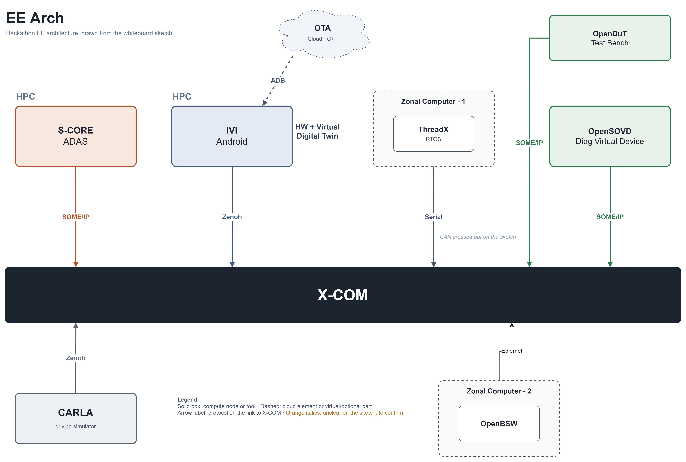

# Thinking CAPs

> **Open-Source at the Core. Cyber-Physical by Design. AI-Powered. Software-Defined.**

## Who We Are

Thinking CAPs is a multidisciplinary automotive software team combining expertise in:

- Software-defined vehicle architecture
- Cyber-physical systems
- Embedded and vehicle software
- Diagnostics and middleware
- Simulation and virtual engineering
- Software automation
- Testing and open-source integration

Our goal is to show how open-source SDV projects, simulation assets, physical platforms, and development automation can be assembled into a representative environment for modern vehicle software engineering.

## Team Roster

| Name | Role | GitHub Handle | Contribution |
|---|---|---|---|
| Jefferson Nascimento | System Architect, AI Engineer | [jnsagai](https://github.com/jnsagai) | System architecture; S-CORE Dark Software Factory; S-CORE chatbot; ThreadX ECU; OpenBSW ECU |
| Bruno Campos | Software Engineer | [bruno](github.com/campos1796) | S-CORE application; OTA feature; IVI HPC; X-Verse communication layer |
| Yasser | Software Engineer | [yasser](https://github.com/yasser2026-spec)  | OpenSOVD; automated AI code review; solution documentation |
| Puru | Software Engineer | [puru](https://github.com/EP1991)  | OpenSOVD; CDA; diagnostics dashboard |
| Siva | Test Engineer | [siva](https://github.com/siveshvar) | openDuT; OpenSOVD |

## Responsibilities

Roles are assigned by work package, but the team maintains collective responsibility for integration and demonstration readiness.

### Solution Architecture and Coordination

**Owner:** Jefferson

- Maintain the end-to-end system architecture and demonstration sequence.
- Coordinate work packages and integration decisions.
- Ensure alignment between X-Verse, S-CORE, SOME/IP, OpenSOVD, and optional Eclipse projects.
- Maintain the product storyline and final presentation.
- Control scope and prioritize the minimum viable demonstration.

### OpenSOVD and Diagnostic Integration

**Owner:** Purushotham

- Implement and validate the diagnostic integration path.
- Develop or refine the Rust-based adapter and diagnostic providers.
- Integrate the fault-injection mechanism with the vehicle-control path.
- Document the OpenSOVD environment and startup procedure.
- Support contribution packaging and upstream issue alignment.

### S-CORE Application and X-Verse Adaptation

**Owner:** Bruno

- Maintain the S-CORE cruise-control application.
- Implement vehicle-speed fault behaviour and DTC logic.
- Integrate the application with the SOME/IP gateway.
- Verify that invalid speed information causes cruise control to transition to a safe disabled state.
- Support end-to-end communication and application testing.

### Dashboard and Demonstration Experience

**Owner:** Yasser

- Provide a simple audience-facing dashboard.
- Expose cruise-control status, selected vehicle data, and diagnostic state.
- Provide fault-injection controls where feasible.
- Support architecture documentation and presentation material.
- Ensure the technical flow is understandable during the demonstration.
- Boardbring activity support and test via openDuT MXCHIP HW

### Deployment and Test Orchestration

**Owner:** Sivakumar

- Investigate and integrate openDUT where feasible.
- Support repeatable deployment and test execution.
- Define a virtual or simulated device-under-test path if physical hardware is unavailable.
- Maintain a fallback test-runner or CI-based scenario.
- Support environment bring-up and demonstration recovery.

## Challenge Alignment

### Selected Challenge

**Freestyle Track: Integration and Feature Development**

### Hackathon Objective

Leverage and integrate open-source SDV projects to address complex challenges in modern vehicle software development.

Our solution aligns with the challenge through four complementary dimensions:

1. **Integration:** Connect multiple Eclipse SDV projects, Capgemini Engineering open-source assets, simulation environments, and physical or virtual ECUs.
2. **Automation:** Apply an automated software factory and local engineering assistant to real S-CORE development tasks.
3. **Contribution:** Investigate open issues, implement improvements, and deliver fixes at a contribution-ready level.
4. **Extension:** Introduce reusable capabilities that can add value to the existing Eclipse SDV ecosystem.

The team selected the Freestyle Track with an integration and feature-development focus during the preparation phase.

## Hackathon Scope

### First Priority: Core Scope

#### Cyber-Physical SDV Blueprint

Create a representative cyber-physical blueprint integrating:

- Eclipse SDV projects
- X-Verse simulation assets
- Virtual ECUs
- Physical ECUs where feasible
- Vehicle communication middleware
- Diagnostics
- Deployment and test orchestration
- User interfaces and dashboards

The blueprint will provide an integrated environment for developing, running, diagnosing, and validating software-defined vehicle functions.

The primary demonstration will use a fault-aware cruise-control scenario in which:

1. X-Verse executes a virtual driving scenario.
2. An S-CORE application controls the cruise-control function. With the sovd_adapter feature implementation, we bridge the S-CORE diagnostic framework and the OpenSOVD gateway, enabling standardized vehicle diagnostics over REST/HTTP.
3. A controlled fault is introduced into the vehicle-speed path.
4. The application detects the invalid signal.
5. Cruise control transitions to a safe disabled state.
6. The diagnostic state is exposed through OpenSOVD.
7. The fault and application state are displayed to the user.
8. Test and deployment assets validate the scenario.

This extends the previously agreed S-CORE, OpenSOVD, X-Verse, and fault-injection demonstration.

PR and issue links we are going to address
  Diagnostics #16 (sovd_adapter)
  Target: https://github.com/eclipse-score/inc_diagnostics
  https://github.com/eclipse-score/inc_diagnostics/pull/6
  CDA 543
  Target: https://github.com/eclipse-opensovd/classic-diagnostic-adapter

#### Dark Software Factory and Local Engineering Assistant

Advance automotive software development automation through two complementary capabilities.

##### S-CORE Software Factory

Use a dark factory, multi-agent development workflow to address selected small-to-medium-complexity S-CORE issues.

The workflow will cover:
- Issue and requirement analysis
- Implementation planning
- Code generation or modification
- Build execution
- Deterministic testing
- Static and security analysis where applicable
- Repair loops
- Evidence collection
- Traceability
- Human review and approval

##### S-CORE Local Bot Assistant

Use a local engineering assistant to:
- Navigate S-CORE documentation
- Locate relevant architectural information
- Support repository exploration
- Accelerate issue investigation
- Provide traceable responses based on available project documentation

Generated code must pass deterministic checks and human review.

#### Open-Source Contributions

Navigate open issues and bugs in Eclipse SDV repositories to accomplish the following.

##### A. Identify Contribution Opportunities

Select features, bugs, or integration gaps that Thinking CAPs can address during the event.

Selection criteria:

- Relevance to the blueprint
- Achievable scope
- Value to the Eclipse community
- Technical feasibility
- Testability
- Potential for upstream acceptance

##### B. Introduce Value-Adding Assets

Assess how the following assets could extend the Eclipse SDV ecosystem:

- X-Verse
- S-CORE Software Factory
- S-CORE documentation bot
- OTA Manager
- Simulation integration wrappers
- Communication bridges

##### C. Deliver Contribution-Ready Improvements

Target the highest practical maturity level within the event:

- Clearly defined problem
- Maintainable implementation
- Buildable code
- Documented design
- Automated or reproducible tests
- Reviewed changes
- Respected licensing and contribution requirements
- Pull request or patch prepared for upstream review

“Ready to merge” is the quality ambition. Actual merging remains subject to the respective project maintainers and governance processes.

### Second Priority: Best-Effort Extensions

Once the integrated baseline is stable, the team may extend the blueprint with the following capabilities.

#### New Physical ECU Integration

Introduce a physical or representative zonal ECU based on:

- Eclipse ThreadX
- Eclipse OpenBSW

Associated X-Verse wrappers and communication bridges will connect the device to the wider blueprint.

#### Jakarta-Based OTA Backend

Adapt the Java-based OTA backend to the Jakarta framework and connect it to the OTA Manager workflow.

#### Safety Evaluation Kit

Propose a Safety Evaluation Kit for the S-CORE Software Factory, focused on:

- Structured safety-impact assessment
- Evidence collection
- Validation gates
- Traceability
- Human approval
- Explicit identification of limitations

This will be presented as an engineering concept or demonstrator, not as formal functional-safety certification.

#### AutoSD Deployment

Deploy selected blueprint components in an AutoSD environment. Initial candidates include:

- OpenSOVD services
- Diagnostic adapters
- Integration services
- Dashboard backend
- Deployment and test utilities

AutoSD will remain an extension until the core demonstration is stable.

## Core Solution Idea

### Solution Title

**Thinking CAPs Open SDV Blueprint**

**A cyber-physical environment for development, diagnostics, automation, and shift-left validation**

### Problem Statement

Modern vehicle software development involves multiple projects, middleware technologies, virtual environments, physical devices, and specialized engineering tools.

Even when individual components work independently, teams still face difficulties with:

- Cross-project interoperability
- Reproducible environments
- Early testing without physical hardware
- Application-to-diagnostics integration
- Deployment across virtual and physical targets
- Efficient navigation of large repositories
- Converting open issues into tested contributions
- Maintaining quality when AI-assisted development is applied

### Proposed Solution

Thinking CAPs will assemble a reusable cyber-physical blueprint that connects open-source SDV technologies with X-Verse and engineering automation.



```text
Simulation and Scenario Execution
              |
           X-Verse
              |
   Communication and Wrappers
   Zenoh | SOME/IP | Serial2CAN
              |
      Vehicle Software Layer
       S-CORE | ThreadX
              |
 Application and Fault Management
       Cruise Control | DTC
              |
   Software-Oriented Diagnostics
           OpenSOVD
              |
 Deployment and Test Orchestration
        openDUT | AutoSD
              |
 Dashboard | Bot | Software Factory
```

This is the target architecture for the plan. Individual extensions will only be added after the core integration flow is stable.

### Main Demonstration Story

#### Phase 1: Develop and Run

- X-Verse runs a virtual vehicle.
- S-CORE hosts the cruise-control application.
- Zenoh and SOME/IP connect the simulated vehicle and application environment.
- The dashboard displays relevant vehicle and application states.

#### Phase 2: Inject and Detect a Fault

- X-Verse or a dedicated injector introduces a vehicle-speed fault.
- The S-CORE application detects missing or invalid speed information.
- Cruise control transitions to a safe disabled state.
- The diagnostic logic qualifies and records the fault.

#### Phase 3: Diagnose

- OpenSOVD exposes the diagnostic state.
- The dashboard or diagnostic client retrieves the fault.
- The user sees the relationship between the injected condition, application response, and diagnostic result.

#### Phase 4: Validate

- openDUT or an equivalent automated path executes the scenario.
- Test evidence confirms the expected behaviour.
- Logs and results are stored with the solution artifacts.

#### Phase 5: Improve

- The Software Factory addresses a selected S-CORE issue.
- The local bot assists with documentation and repository navigation.
- Human reviewers verify all proposed changes.
- Contribution-ready artifacts are prepared.

## Projects and Assets Involved

### Eclipse and Open-Source Projects

#### Core Projects

- Eclipse S-CORE
- Eclipse OpenSOVD
- Eclipse openDUT
- Eclipse Zenoh
- Eclipse ThreadX
- Eclipse OpenBSW
- Eclipse AutoSD
- Jakarta

#### Extension Projects and Technologies

- Java
- CARLA
- Android Automotive OS

A project will only be claimed as part of the implemented solution when it is meaningfully used through code, configuration, deployment, integration, testing, or demonstration.

### Capgemini Engineering Assets

- X-Verse
- S-CORE Software Factory
- S-CORE documentation bot
- Fabro Dashboard
- OTA Manager
- X-Verse integration wrappers
- X-COM communication bridges
- AAOS Instrument Cluster Application

The plan distinguishes between:

- Assets available before the event
- Assets modified during the event
- Newly created integrations
- Upstream Eclipse contributions
- Best-effort experimental extensions

## Development Baseline and Event Work

### Pre-Work Baseline

The following technologies and developments form the starting baseline:

- Standard CARLA repository
- Standard Eclipse SDV project repositories
- S-CORE
- OpenSOVD
- openDUT
- ThreadX
- OpenBSW
- Zenoh
- X-Verse Lite baseline
- First draft of the S-CORE Software Factory
- AAOS IVI application
- C++ OTA Manager
- Existing cruise-control integration
- Initial architecture and setup documentation

Pre-existing work will be identified transparently and will not be presented as development completed during the event.

### Event Development

#### Core Blueprint

- Integrate Eclipse SDV projects with X-Verse.
- Stabilize the cyber-physical blueprint.
- Document the architecture and deployment.
- Establish reproducible startup and test procedures.

#### Simulation and Fault Injection

- Implement or improve X-Verse fault injection.
- Connect the injector to the S-CORE application.
- Validate safe cruise-control deactivation.
- Expose the resulting diagnostic state through OpenSOVD.

#### Software Automation

- Enhance the S-CORE Software Factory.
- Apply it to selected S-CORE issues.
- Collect proven-in-use evidence.
- Demonstrate deterministic validation and human review.
- Improve the local S-CORE documentation bot.

#### Physical and Virtual Device Representation

- Integrate a ThreadX-based zonal-computer representation.
- Add OpenBSW as a best-effort physical ECU representation.
- Connect virtual or physical devices to the blueprint.

#### X-Verse Integrations

- Create or enhance simulation wrappers.
- Implement the X-COM Serial2CAN bridge.
- Connect new components without destabilizing the baseline.

#### OTA Extension

- Explore a Java implementation of the OTA Manager.
- Adapt the backend to Jakarta as a best-effort extension.

#### Open-Source Contributions

- Investigate open issues.
- Implement selected fixes or features.
- Add tests and documentation.
- Conduct peer review.
- Prepare issues, patches, or pull requests for maintainers.

## How We Work

### Lightweight Development Process

The team will use an integration-first, evidence-driven process.

#### Workstreams

1. Blueprint architecture and interfaces
2. S-CORE applications and diagnostics
3. OpenSOVD integration
4. X-Verse simulation and communication
5. Software Factory and bot
6. Device and hardware integration
7. Deployment, testing, and contributions

```text
Select
  ↓
Specify
  ↓
Design
  ↓
Implement
  ↓
Build
  ↓
Test
  ↓
Review
  ↓
Integrate
  ↓
Demonstrate
  ↓
Document
```

Each work item must have:

- A named owner
- Declared input and expected output
- Acceptance criteria
- Dependencies
- Evidence of testing
- Current status
- Integration target

### Progress Tracking

The team will use a lightweight board with:

- Backlog
- Selected
- In Progress
- In Review
- Integration
- Blocked
- Done

Prioritization will consider:

- Contribution value
- Blueprint relevance
- Implementation effort
- Integration risk
- Demonstration impact
- Available evidence
- Dependency on external maintainers or hardware

The shared GitHub repository will be the source of truth for code, architecture, documentation, scripts, testing evidence, and integration status.

## Quality Control

### Quality Principles

The team will prioritize:

1. Working integration over isolated feature quantity.
2. Reproducibility over machine-specific success.
3. Deterministic verification over unverified AI output.
4. Reviewable contributions over experimental patches.
5. Clear evidence over unsupported claims.
6. A stable baseline over uncontrolled scope expansion.

### Testing Strategy

#### Component Tests

Each component must be independently executable or testable.

#### Interface Tests

Connected components must be validated using controlled messages, mocks, or reference examples.

#### Integration Tests

The complete chain must be tested from simulated input to application response and diagnostic output.

#### Regression Tests

The known-good baseline must be rerun after critical integration changes.

#### Demonstration Tests

The team must verify that the complete scenario can be reproduced using the documented setup and startup sequence.

#### Contribution Tests

Proposed upstream changes should include, where applicable:

- Successful compilation
- Automated tests
- Static checks
- Interface validation
- Regression evidence
- Documentation
- Known limitations

### Code Review

- Critical changes require review by at least one additional team member.
- Interface changes require review from both affected workstreams.
- AI-generated or AI-modified code requires explicit human review.
- Experimental changes remain separate from the stable demonstration baseline.
- Upstream fixes should follow the target project’s contribution conventions.

### Document and Configuration Management

The repository will contain:

- Solution plan
- Architecture diagrams
- Root README
- Component-level setup instructions
- Test instructions
- Evidence
- Known limitations
- Contribution records
- Third-party and licensing information where applicable

Dependencies and working configurations should be pinned where practical. A known-good baseline will be clearly identified and protected.

## Team Communication

### Communication Channels

- Slack and Teams for immediate coordination
- GitHub issues for technical tasks and blockers
- Pull requests for review and integration
- Repository documentation for stable information
- A lightweight decision log for architectural choices

### Checkpoints

Each checkpoint will answer:

1. What is working?
2. What changed?
3. What is blocked?
4. Has the baseline been affected?
5. What evidence was produced?
6. What is the next highest-value task?
7. Should any best-effort item be stopped?

### Blocker Reporting

A blocker report must state:

- Affected component
- Observed behaviour
- Available evidence
- Affected dependency
- Help required
- Fallback option
- Scope impact

## Decision Making

### Decision Principles

Decisions will be made in the following order:

1. Protect the working blueprint.
2. Preserve safe application behaviour.
3. Maintain reproducibility.
4. Maximize ecosystem and contribution value.
5. Add optional technologies only when they provide demonstrable value.

### Resolving Design Disagreements

When alternatives compete:

1. Describe the options.
2. Identify architectural and interface impacts.
3. Compare integration risk.
4. Use a small technical experiment where practical.
5. Prefer the simplest option that satisfies the objective.
6. Record the decision and rationale.
7. Escalate unresolved scope decisions to the team lead.

### Time-Boxing and Fallback

If an item threatens the core solution:

1. Preserve the last known-good version.
2. Isolate the experiment.
3. Use the simpler fallback path.
4. Record the limitation.
5. Continue the end-to-end integration.
6. Return to the item only after the baseline is stable.

## Scope Priorities

### Must Have

- Cyber-physical blueprint architecture
- X-Verse virtual vehicle
- S-CORE cruise-control application
- Zenoh and SOME/IP communication
- Controlled fault injection
- Safe cruise-control deactivation
- OpenSOVD diagnostic visibility
- Lightweight dashboard or client
- Reproducible setup
- Test evidence
- Architecture and interface documentation

### Should Have

- Enhanced S-CORE Software Factory
- Proven-in-use automation evidence
- S-CORE documentation bot
- openDUT test execution
- X-Verse simulation wrappers
- Selected Eclipse issue fixes
- Contribution-ready patches or pull requests

### Could Have

- ThreadX zonal-computer representation
- Serial2CAN X-COM bridge
- AutoSD deployment
- OpenBSW physical ECU integration
- Jakarta-based OTA backend
- Safety Evaluation Kit concept

### Out of Core Scope

The following items must not block the core demonstration:

- Formal safety certification
- Production-ready OTA deployment
- Complete physical vehicle integration
- Integration of every listed Eclipse project
- Upstream acceptance or merging during the event
- Production maturity of the complete blueprint

## Definition of Success

The hackathon will be successful if Thinking CAPs can demonstrate:

- A functional cyber-physical SDV blueprint
- Meaningful integration of multiple Eclipse SDV projects
- A virtual vehicle running an S-CORE function
- Controlled fault injection
- Safe application behaviour
- Diagnostic visibility through OpenSOVD
- Repeatable deployment and validation
- Practical use of the Software Factory on a real issue
- Useful results from the local documentation bot
- Documented architecture and interfaces
- Tested, reviewed, and contribution-ready improvements
- Transparent separation between pre-existing work and event development
