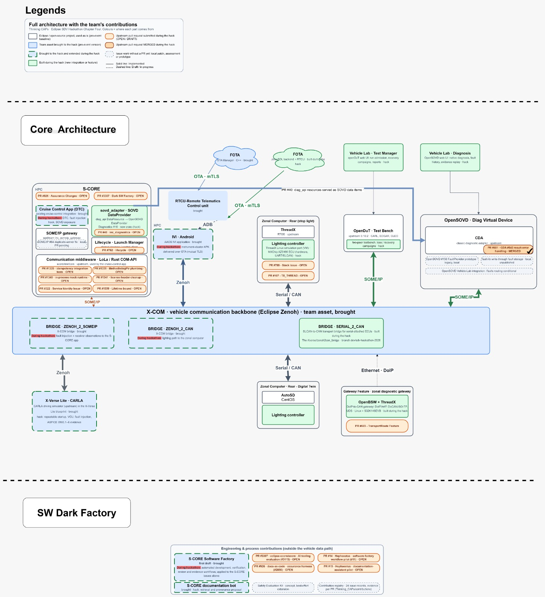

<!--
  Eclipse SDV Hackathon 2026 (Chapter Four) · Thinking CAPs · demo architecture with contributions
  Developed mainly with Claude (Anthropic), model Claude Fable 5.1.
  Created: 2026-10-07 · Latest version: 2026-10-08
-->
# Thinking CAPs – Demo architecture and contributions



*Figure 1 – `System_Architecture_contributions.drawio`. Colours: white = Eclipse project used as is · blue = brought to the hackathon · blue with green dashed border = brought and extended during the hackathon · green = built during the hackathon · orange chip = upstream pull request (dark orange with tick = merged) · grey dashed chip = issue work without a PR yet. Solid line = implemented, dashed line = in progress.*

---

## 1. Architecture overview

The vehicle is split into high-performance computers (HPC), a zonal computer, a diagnostic virtual device
and a test bench, all connected through the **X-COM** communication backbone (Eclipse Zenoh). Four paths run over it:

1. **Vehicle-control path**: CARLA drives, the X-Verse VCU publishes vehicle data on Zenoh, the
   ZENOH_2_SOMEIP bridge carries it into the S-CORE cruise-control application over SOME/IP.
2. **Diagnostic path**: the cruise-control application publishes its diagnostic resources through the
   `sovd_adapter` crate (PR #40) as OpenSOVD data items; the OpenSOVD diagnostic virtual device also reads
   the classic ECU through the CDA (PR #601); the Vehicle Lab Diagnosis UI shows the result.
3. **Lighting path**: vehicle status travels over ZENOH_2_CAN and Serial / CAN to the ThreadX zonal
   controller, which returns brake and reverse-light decisions; serial-attached ECUs join through SERIAL_2_CAN.
4. **Test and update paths**: openDuT manages the two-peer test bench and the loss / recovery campaigns from
   the Vehicle Lab Test Manager; the two FOTA back ends update the RTCU over mutual TLS, and the RTCU
   deploys to the IVI over ADB.

---

## 2. What we brought to the hackathon (pre-event baseline)

### 2.1 Eclipse and open-source projects used as is (white boxes)

| Block | Project | Role in the demo |
| --- | --- | --- |
| S-CORE · SOME/IP gateway | Eclipse S-CORE (`inc_someip_gateway`) | SOME/IP access of the cruise-control application to the backbone |
| S-CORE · Lifecycle · Launch Manager | Eclipse S-CORE (`lifecycle`) | Daemon / control-client communication configuration |
| S-CORE · Communication middleware · LoLa / Rust COM-API | Eclipse S-CORE (`communication`) | Communication middleware used by the cruise-control application |
| ThreadX · RTOS | Eclipse ThreadX | Real-time kernel of the zonal lighting controller |
| OpenDuT · Test Bench | Eclipse openDuT 0.10.2 (CARL, EDGAR, CLEO) | Managed test bench network |
| OpenSOVD · Diag Virtual Device and CDA | Eclipse OpenSOVD core, classic diagnostic adapter | SOVD server of the vehicle; reads the classic ECU |
| X-Verse Lite · CARLA (simulator inside) | CARLA | Driving simulator |
| X-COM (transport inside) | Eclipse Zenoh | Pub/sub transport of the backbone |

### 2.2 Team assets brought in their pre-event version (blue boxes)

| Block | Asset | Pre-event version |
| --- | --- | --- |
| X-COM · vehicle communication backbone | X-COM communication bridges | Team backbone over Eclipse Zenoh |
| BRIDGE · ZENOH_2_SOMEIP, BRIDGE · ZENOH_2_CAN | X-COM bridges | Existing bridges (extended, see section 3) |
| X-Verse Lite · CARLA | X-Verse Lite blueprint | Standard X-Verse Lite version (extended, see section 3) |
| Cruise Control App (DTC) | Existing cruise-control integration | S-CORE cruise-control ECU / bridge integration (extended, see section 3) |
| IVI · Android | AAOS IVI application | Existing Android Automotive OS infotainment application (extended, see section 3) |
| FOTA (left cloud) | OTA Manager | Existing C++ implementation |
| RTCU · Remote Telematics Control Unit | Telematics unit of the update chain | Receives updates over mutual TLS, deploys to the IVI over ADB |
| S-CORE Software Factory | Software factory | First draft release (extended, see section 3) |
| S-CORE documentation bot | Documentation bot | Existing local assistant (extended, see section 3) |

---

## 3. Brought to the hackathon and extended during it (blue boxes with a green dashed border)

| Block | Pre-event part | During hackathon |
| --- | --- | --- |
| **Cruise Control App (DTC)** | existing cruise-control integration | DTC handling, fault-injection hook, exposure of the diagnostic state over SOVD (through `sovd_adapter`, PR #40) |
| **IVI · Android** | AAOS IVI application | instrument-cluster APK delivered over OTA with mutual TLS |
| **BRIDGE · ZENOH_2_SOMEIP** | X-COM bridge | fault injection and receiver observations carried to the S-CORE application |
| **BRIDGE · ZENOH_2_CAN** | X-COM bridge | lighting path to the zonal computer |
| **X-Verse Lite · CARLA** | CARLA in the X-Verse Lite blueprint | repeatable startup, the VCU, fault injection, ASPICE SWE.1–SWE.6 evidence |
| **S-CORE Software Factory** | first draft | automated development, verification, review and evidence workflows, applied to the S-CORE issues of section 5 |
| **S-CORE documentation bot** | existing bot | retrieval and provenance proposal (S-CORE #2850, PR #926) |

---

## 4. Built during the hackathon (green boxes)

| Block | What it is | Where |
| --- | --- | --- |
| **sovd_adapter · SOVD DataProvider** | New Rust crate bridging a `diag_api` `DataResource` to an OpenSOVD `DataProvider`: S-CORE diagnostic resources become SOVD data items (Diagnostics #16, PR #40) | HPC · S-CORE |
| **FOTA (right cloud)** | Java EOL backend of the update chain; delivers the cluster APK to the RTCU over mutual TLS (Jakarta EE adaptation planned) | Cloud |
| **Vehicle Lab · Test Manager** | openDuT web UI: run admission, recovery campaigns, reports | above OpenDuT |
| **Vehicle Lab · Diagnosis** | OpenSOVD web UI: native diagnosis, fault history, evidence replay | above OpenSOVD |
| **Lighting controller** | ThreadX Linux simulation port (VM) and the MXChip AZ3166 lighting ECU (hardware, UART/SLCAN) | Zonal Computer · Rear |
| **two-peer testbench, loss / recovery campaigns** | openDuT 0.10.2 deployment with communication-loss, recovery and cleanup campaigns | inside OpenDuT |
| **BRIDGE · SERIAL_2_CAN** | SLCAN-to-CAN transport bridge for serial-attached ECUs (`The-Xverse/zenoh2can_bridge`, branch `dev/sdv-hackathon-2026`) | X-COM |
| **OpenBSW + ThreadX** | DoIP-to-CAN zonal diagnostic gateway: DoIP/lwIP, DoCAN/ISO-TP, UDS, on Linux and S32K148EVB (Ethernet · DoIP link in progress) | Gateway Feature |

---

## 5. Our contributions with a pull request (orange chips)

All eleven pull requests were opened during the event (6–7 October 2026). Status as on GitHub, 8 October 2026.

| # | Upstream repository | PR | Issue | Title (as on GitHub) | Status | How it was produced | Block |
| --- | --- | --- | --- | --- | --- | --- | --- |
| 1 | [eclipse-score/inc_diagnostics](https://github.com/eclipse-score/inc_diagnostics) | [#40](https://github.com/eclipse-score/inc_diagnostics/pull/40) | [Diagnostics #16](https://github.com/eclipse-score/inc_diagnostics/issues/16) | feat(sovd_adapter): expose diag_api::DataResource as opensovd_core::DataProvider | **OPEN** | manual coding + AI-assisted | S-CORE · sovd_adapter |
| 2 | [eclipse-opensovd/classic-diagnostic-adapter](https://github.com/eclipse-opensovd/classic-diagnostic-adapter) | [#601](https://github.com/eclipse-opensovd/classic-diagnostic-adapter/pull/601) | [CDA #543](https://github.com/eclipse-opensovd/classic-diagnostic-adapter/issues/543) | refactor(cda-main): return Result instead of Option in mdd.rs | **MERGED ✓** | manual coding, no AI | OpenSOVD · CDA |
| 3 | [eclipse-score/communication](https://github.com/eclipse-score/communication) | [#1335](https://github.com/eclipse-score/communication/pull/1335) | [Communication #1167](https://github.com/eclipse-score/communication/issues/1167) | test: add dedicated integration coverage for idempotent COM APIs | **OPEN** | AI-generated (software factory), human-reviewed | S-CORE · Communication |
| 4 | eclipse-score/communication | [#1339](https://github.com/eclipse-score/communication/pull/1339) | [Communication #781](https://github.com/eclipse-score/communication/issues/781) | Implement lifetime-bound MethodInArgPtr ABI owner | **DRAFT** | AI-generated (software factory), human-reviewed | S-CORE · Communication |
| 5 | eclipse-score/communication | [#1340](https://github.com/eclipse-score/communication/pull/1340) | [Communication #490](https://github.com/eclipse-score/communication/issues/490) | Implement isolated Rust COM mock runtime | **DRAFT** | AI-generated (software factory), human-reviewed | S-CORE · Communication |
| 6 | eclipse-score/communication | [#1341](https://github.com/eclipse-score/communication/pull/1341) | repository hygiene | chore: add license headers across repository code | **OPEN** | AI-generated (software factory), human-reviewed | S-CORE · Communication |
| 7 | [eclipse-score/lifecycle](https://github.com/eclipse-score/lifecycle) | [#762](https://github.com/eclipse-score/lifecycle/pull/762) | [Lifecycle #704](https://github.com/eclipse-score/lifecycle/issues/704) | refactor: Deduplicate LmControl communication configuration | **OPEN** | AI-generated (software factory), human-reviewed | S-CORE · Lifecycle |
| 8 | [eclipse-score/score](https://github.com/eclipse-score/score) | [#3307](https://github.com/eclipse-score/score/pull/3307) | [S-CORE #3115](https://github.com/eclipse-score/score/issues/3115) | docs: Complete AI tooling evaluation and selection for S-CORE | **OPEN** | AI-generated (software factory), human-reviewed | Aspice Dark Factory |
| 9 | [eclipse-score/docs-as-code](https://github.com/eclipse-score/docs-as-code) | [#926](https://github.com/eclipse-score/docs-as-code/pull/926) | [S-CORE #2850](https://github.com/eclipse-score/score/issues/2850) | Evaluate assurance changes with native gates and structured traces | **DRAFT** | AI-generated (software factory), human-reviewed | Aspice Dark Factory |
| 10 | [eclipse-hephaestus/hephaestus](https://github.com/eclipse-hephaestus/hephaestus) | [#14](https://github.com/eclipse-hephaestus/hephaestus/pull/14) | [Hephaestus #11](https://github.com/eclipse-hephaestus/hephaestus/issues/11) | Propose s-core_sw_fabric engineering workflow pilot | **OPEN** | AI-generated (software factory), human-reviewed | Aspice Dark Factory |
| 11 | eclipse-hephaestus/hephaestus | [#15](https://github.com/eclipse-hephaestus/hephaestus/pull/15) | documentation assistant | Propose S-CORE Docs Assistant documentation pilot | **OPEN** | AI-generated (software factory), human-reviewed | Aspice Dark Factory |

Totals: **11 pull requests** across 6 Eclipse repositories: 1 merged, 7 open, 3 draft.
PR #601 was coded by hand without AI; PR #40 combines manual coding with AI assistance; the other nine were
produced with the AI-based S-CORE Software Factory workflow and reviewed by the team.

---

## 6. Aspice Dark Factory (engineering and process contributions)

| Element | Origin | Content |
| --- | --- | --- |
| **S-CORE Software Factory** | brought (first draft), extended during the hackathon | automated development, verification, review and evidence workflows, applied to the S-CORE issues of section 5 |
| **PR #3307** · eclipse-score/score · AI tooling evaluation (#3115) | hack | OPEN |
| **PR #926** · docs-as-code · assurance harness (#2850) | hack | DRAFT |
| **PR #14** · Hephaestus · software-factory workflow pilot (#11) | hack | OPEN |
| **PR #15** · Hephaestus · documentation-assistant pilot | hack | OPEN |
| **S-CORE documentation bot** | brought, extended during the hackathon | retrieval and provenance proposal for the docs-as-code harness |
| Safety Evaluation Kit | concept | safety-impact, evidence and approval gates; best-effort extension |
| Contribution registry | hack | 24 issue records with evidence per PR in `Thinking_CAPs/contributions` |

---

## 7. Run the end-to-end demonstration

The whole demonstration (CARLA vehicle, Zenoh VCU, SOME/IP bridge, S-CORE cruise-control ECU with its
SOVD diagnostics, OTA vECU, Android cluster, OpenSOVD vECU with the SOVD Adapter Console, and the ThreadX
lighting ECU on the AZ3166 board or its AutoSD digital twin) starts and stops with one command,
`run_autoverse.py`, from the X-Verse workspace **autoverse**.

### 7.1 Access through X-Verse

The vehicle components live in the X-Verse organisation on GitHub:
**[https://github.com/The-Xverse](https://github.com/The-Xverse)**. The workspace repository
`The-Xverse/autoverse` (branch `dev/sdv-hackathon-2026`) holds the launcher, the setup script and the
hackathon ECUs (`external_hackathon_ecus/`: ThreadX, its AutoSD digital twin, the OpenSOVD vECU, the SOVD
Adapter Console and the Demo Console). Its manifest `autoverse.repos` lists one X-Verse repository per
component (S-CORE ECU, VCU, bridges, OTA vECU, Android Cuttlefish, …), each on its
`dev/sdv-hackathon-2026` branch, and `setup.sh` clones them with `vcs import`.

These repositories are **private**. Everyone who is a member of The-Xverse organisation (or has been
given access to its repositories) can run the demonstration:

1. Ask an X-Verse organisation owner to add your GitHub account to
   [The-Xverse](https://github.com/The-Xverse) (or to the repositories you need).
2. Add an SSH key to your GitHub account (`ssh -T git@github.com` must greet you): all X-Verse
   repositories are cloned over SSH (`git@github.com:The-Xverse/...`).
3. Use either entry point below; both give the same workspace.

| Entry point | Where the workspace lives |
| --- | --- |
| **Thinking_CAPs** (this repository) | `demo/X-Verse` is an exact copy of autoverse `dev/sdv-hackathon-2026`; `setup.sh` links it to `~/autoverse` |
| **autoverse** directly | your own clone at `~/autoverse` |

### 7.2 Prerequisites

- Ubuntu 22.04 or later, a user with `sudo`, an NVIDIA GPU for the CARLA server, and hardware
  virtualisation (`/dev/kvm`) for Android Cuttlefish.
- Internet access for the first setup (CARLA, container images, component builds; about 1 h once).
- Optional: the MXChip AZ3166 board for the physical ThreadX lighting ECU. Without it the launcher
  starts the AutoSD digital twin instead.

### 7.3 Set up once

```bash
# Entry point A: Thinking_CAPs
git clone git@github.com:Eclipse-SDV-Hackathon-Chapter-Four/Thinking_CAPs.git ~/Thinking_CAPs
~/Thinking_CAPs/demo/X-Verse/setup.sh --carla --cuttlefish --threadx

# Entry point B: autoverse directly
git clone -b dev/sdv-hackathon-2026 git@github.com:The-Xverse/autoverse.git ~/autoverse
~/autoverse/setup.sh --carla --cuttlefish --threadx
```

`setup.sh` installs the host tools and Docker, imports every component from X-Verse, installs CARLA
(`--carla`), prepares Android Cuttlefish (`--cuttlefish`) and the AZ3166 board access (`--threadx`), builds
S-CORE and its diagnostics server, builds the OpenSOVD vECU and the ThreadX twin images, and loads the
`vcan` kernel module. If it adds you to the `docker` group, log out and in once, then run it again.

### 7.4 Run

```bash
cd ~/autoverse
python3 run_autoverse.py --enable-camera-display --vcu-zenoh
# with the AZ3166 board plugged in (serial port access):
sg dialout -c "python3 run_autoverse.py --enable-camera-display --vcu-zenoh"
```

The launcher starts, in order: the Zenoh router (if none answers on port 7447), the CARLA server, the
ThreadX lighting ECU (board, else its AutoSD twin), the VCU, the Zenoh–SOME/IP bridge, the S-CORE ECU,
the OTA vECU, the OpenSOVD vECU, Vehicle Manual Control, the CARLA client and Android Cuttlefish. All ten
containers are up after about one minute.

| What | Where |
| --- | --- |
| Drive | Vehicle Manual Control window: `W`/`S` throttle and brake, `C` cruise control, `Q` reverse, `I` withhold the speed signal (fault) |
| SOVD Adapter Console | http://localhost:8080 (opens automatically) |
| S-CORE SOVD diagnostics | http://localhost:7691/sovd/v1/components/cruise_control/data |
| OTA EOL console | https://localhost:9444 (self-signed certificate) |
| Android cluster (Cuttlefish) | https://localhost:8443 (self-signed certificate) |

On a new Android container, install the cluster app over the air once: in the EOL console upload
`vecu/aaos_cuttlefish/apk/digital-cluster-app-debug.apk` and push it to `PC-CUTTLEFISH-01`.

**Scenario.** Accelerate above 10 km/h and press `C`: cruise control engages. Press `I`: the vehicle
speed is no longer published, the S-CORE ECU cancels cruise control and reports DTC
`CC.LostCommunication` over SOVD, the console qualifies U0104 and the classic DTC appears through the CDA.
Press `I` again: the signal returns and the DTCs heal. Brake or reverse: the lighting ECU switches the
vehicle's lights.

**Stop** with `Ctrl+C` in the launcher's terminal: it stops every component in reverse order.

### 7.5 Verify

```bash
cd ~/autoverse
python3 aspice/tools/e2e_check.py                     # 16 integration checks (nothing injected into the vehicle)
python3 aspice/tools/generate_report.py --qualify     # ASPICE report, also drives the scenario automatically
```

The report (`aspice/report/README.md`) traces 7 system and 15 software requirements to 30 test cases.

---

## 8. Process oriented to the ASPICE model

The team works along the Automotive SPICE software engineering processes (SWE.1–SWE.6), with
the supporting processes kept lightweight for a hackathon. The work products are demonstration evidence,
not an assessed capability level. The end-to-end package lives in the X-Verse workspace,
[`demo/X-Verse/aspice`](demo/X-Verse/aspice/README.md); its report
([`aspice/report/README.md`](demo/X-Verse/aspice/report/README.md)) is generated from the running system.

| ASPICE process | How we apply it | Work products and evidence |
| --- | --- | --- |
| SWE.1 Software requirements analysis | System requirements (SYS-01..07) from the use case, refined into software requirements (SWR-01..15), each derived from a SYS and allocated to an element | [system](demo/X-Verse/aspice/swe1-requirements/system-requirements.md), [software](demo/X-Verse/aspice/swe1-requirements/software-requirements.md) requirements |
| SWE.2 Software architectural design | Elements, interfaces (IF-01..13) and allocation rationale; PlantUML views (context, components, DTC and OTA sequences) | [architecture.md](demo/X-Verse/aspice/swe2-architecture/architecture.md) |
| SWE.3 Software detailed design and construction | Unit-level design: Zenoh keys, SOME/IP events, SOVD resources, OTA units, OpenSOVD vECU, ThreadX mapping | [detailed-design.md](demo/X-Verse/aspice/swe3-detailed-design/detailed-design.md) |
| SWE.4 Software unit verification | Unit suites executed by the generator: launcher, SOME/IP payload conversion, S-CORE cruise control, PR #16 `sovd_adapter`, OTA backend, SOVD Adapter Console, ThreadX | [unit-verification.md](demo/X-Verse/aspice/swe4-unit-verification/unit-verification.md) |
| SWE.5 Software integration and integration test | 16 black-box interface checks against the running system (`tools/e2e_check.py`) | [integration-test.md](demo/X-Verse/aspice/swe5-integration-test/integration-test.md) |
| SWE.6 Software qualification test | Scenario tests of the system requirements, driven automatically through Vehicle Manual Control's scripted input (`tools/qualification_check.py`); no case is accepted from a witness statement | [qualification-test.md](demo/X-Verse/aspice/swe6-qualification-test/qualification-test.md) |
| Traceability (SWE.1–SWE.6) | Bidirectional: SYS → SWR → element → test case → result, checked on every report run; a gap fails the run | [report](demo/X-Verse/aspice/report/README.md), `summary.json` |
| SUP.8 Configuration management | One X-Verse repository per component on its `dev/sdv-hackathon-2026` branch, selected by `autoverse.repos` and imported with `vcs import`; upstream dependencies pinned by commit (inc_diagnostics PR #40 `d388985`, opensovd-core `29e806f`, CDA `c1a5d8b`, ThreadX and the Zenoh2CAN bridge in `dependencies.lock.json`); `demo/X-Verse` changes only through `contributions/shared/scripts/sync-xverse.sh` | `demo/X-Verse/autoverse.repos`, sync commits with an `X-Verse-Source` trailer |
| SUP.9 Problem resolution | Defects found by the tests are recorded with cause and decision (fixed, or known and out of scope) | "Known defect" in [qualification-test.md](demo/X-Verse/aspice/swe6-qualification-test/qualification-test.md), defects in the [package README](demo/X-Verse/aspice/README.md) |
| SUP.10 Change request management / review | Every change is a reviewed commit with its rationale; AI-generated changes (Software Factory, section 6) are human-reviewed before a pull request | commit history, [contributions](contributions/) |

Component-level ASPICE packages follow the same layout: the ThreadX AZ3166 ECU
([`external_hackathon_ecus/ThreadX/az3166/aspice`](demo/X-Verse/external_hackathon_ecus/ThreadX/az3166/aspice/README.md)),
the OpenBSW gateway ([`contributions/eclipse-openbsw/OpenBSW/aspice`](contributions/eclipse-openbsw/OpenBSW/aspice/)), and, in their X-Verse repositories, the OTA vECU
(`vecu/ota/aspice`) and the Serial2CAN bridge (`bridges/can/serial2can-bridge/aspice`).

Working rules derived from it:

1. A change starts from a requirement (or adds one) and names the elements it touches.
2. Tests at the right level come with the change; the report is regenerated
   (`python3 aspice/tools/generate_report.py --qualify` in the workspace) and must show no traceability gap.
3. A verdict comes from a tool run on the system, recorded with its date; recorded results are marked as such.
4. A defect found on the way is recorded with its cause and the decision, even when it is not fixed.

---

## 9. Who we are

Thinking CAPs is a multidisciplinary automotive software team combining expertise in:

- Software-defined vehicle architecture
- Cyber-physical systems
- Embedded and vehicle software
- Diagnostics and middleware
- Simulation and virtual engineering
- Software automation
- Testing and open-source integration

Our goal is to show how open-source SDV projects, simulation assets, physical platforms, and development automation can be assembled into a representative environment for modern vehicle software engineering.

---

## 10. Team roster

| Name | Role | GitHub Handle | Contribution |
|---|---|---|---|
| Jefferson Nascimento | System Architect, AI Engineer | [jnsagai](https://github.com/jnsagai) | System architecture; S-CORE Dark Software Factory; S-CORE chatbot; ThreadX ECU; OpenBSW ECU |
| Bruno Campos | Software Engineer | [bruno](https://github.com/campos1796) | S-CORE application; OTA feature; IVI HPC; X-Verse communication layer |
| Yasser | Software Engineer | [yasser](https://github.com/yasser2026-spec)  | OpenSOVD; automated AI code review; solution documentation |
| Puru | Software Engineer | [puru](https://github.com/EP1991)  | OpenSOVD; CDA; diagnostics dashboard |
| Siva | Test Engineer | [siva](https://github.com/siveshvar) | openDuT; OpenSOVD |

---

## 11. Responsibilities

Roles are assigned by work package, but the team maintains collective responsibility for integration and demonstration readiness.

### Solution Architecture and Coordination

**Owner:** Jefferson

- Maintain the end-to-end system architecture and demonstration sequence.
- Coordinate work packages and integration decisions.
- Ensure alignment between X-Verse, S-CORE, SOME/IP, OpenSOVD, and optional Eclipse projects.
- Maintain the product storyline and final presentation.
- Control scope and prioritize the minimum viable demonstration.

### OpenSOVD and Diagnostic Integration

**Owner:** Purushotham

- Implement and validate the diagnostic integration path.
- Develop or refine the Rust-based adapter and diagnostic providers.
- Integrate the fault-injection mechanism with the vehicle-control path.
- Document the OpenSOVD environment and startup procedure.
- Support contribution packaging and upstream issue alignment.

### S-CORE Application and X-Verse Adaptation

**Owner:** Bruno

- Maintain the S-CORE cruise-control application.
- Implement vehicle-speed fault behaviour and DTC logic.
- Integrate the application with the SOME/IP gateway.
- Verify that invalid speed information causes cruise control to transition to a safe disabled state.
- Support end-to-end communication and application testing.

### Dashboard and Demonstration Experience

**Owner:** Yasser

- Provide a simple audience-facing dashboard.
- Expose cruise-control status, selected vehicle data, and diagnostic state.
- Provide fault-injection controls where feasible.
- Support architecture documentation and presentation material.
- Ensure the technical flow is understandable during the demonstration.
- Boardbring activity support and test via openDuT MXCHIP HW

### Deployment and Test Orchestration

**Owner:** Sivakumar

- Investigate and integrate openDUT where feasible.
- Support repeatable deployment and test execution.
- Define a virtual or simulated device-under-test path if physical hardware is unavailable.
- Maintain a fallback test-runner or CI-based scenario.
- Support environment bring-up and demonstration recovery.

---

## 12. Challenge alignment

### Selected Challenge

**Freestyle Track: Integration and Feature Development**

### Hackathon Objective

Leverage and integrate open-source SDV projects to address complex challenges in modern vehicle software development.

Our solution aligns with the challenge through four complementary dimensions:

1. **Integration:** Connect multiple Eclipse SDV projects, Capgemini Engineering open-source assets, simulation environments, and physical or virtual ECUs.
2. **Automation:** Apply an automated software factory and local engineering assistant to real S-CORE development tasks.
3. **Contribution:** Investigate open issues, implement improvements, and deliver fixes at a contribution-ready level.
4. **Extension:** Introduce reusable capabilities that can add value to the existing Eclipse SDV ecosystem.

The team selected the Freestyle Track with an integration and feature-development focus during the preparation phase.

---

## 13. Repository contribution guidance and license

See [CONTRIBUTING.md](CONTRIBUTING.md) for contribution and review expectations.
Repository code is covered by [Apache-2.0](LICENSE); upstream dependencies and
retained third-party artifacts keep their own licenses and notices.

The repository navigation and folder guide were prepared with assistance from
OpenAI Codex.
