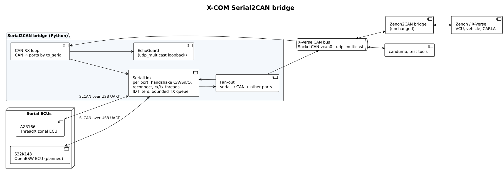

# Serial2CAN Bridge (X-COM)

## Overview

This bridge connects **serial-attached ECUs** to an **X-Verse CAN bus**, in
both directions. It belongs to the X-COM communication layer, next to the
Zenoh↔CAN, Zenoh↔SOME/IP and Zenoh↔ROS 2 bridges.

Each serial port is a CAN node that speaks the Lawicell **SLCAN** protocol.
One example is the ThreadX zonal lighting ECU on the MXChip AZ3166 board,
which has no CAN transceiver and exchanges CAN frames over its USB UART. The
bridge puts all configured ECUs on one python-can bus. The rest of X-Verse
then sees them as ordinary CAN nodes:

- the unchanged Zenoh2CAN bridge, and through it the VCU, the virtual vehicle and CARLA
- `candump` and test tools



| Feature | Behaviour |
| --- | --- |
| Many ECUs | Any number of serial ports share one bus. A frame from one ECU goes to the CAN bus *and* to the other serial ports, as on a real shared bus. |
| Direction filters | Per port, `to_serial` and `from_serial` (`id` / `mask` / `extended`). Only the frames an ECU needs cross its UART. A 115200-baud link carries about 500 frames/s. |
| Handshake | On connect: `C`, `V` (version), `Sn` (nominal bitrate), `O`. A state frame the ECU sends right after opening is forwarded. |
| Hot-plug | A lost or unplugged device is detected (`EIO`/`SerialException`), and the bridge reconnects and repeats the handshake every `reconnect_s`. Device paths may be globs, for example `/dev/serial/by-id/...STLink_*-if02`. |
| Back-pressure | Bounded per-port transmit queue. The CAN receive loop never blocks on a slow UART. Drops are counted. |
| Safe shutdown | On SIGINT/SIGTERM each ECU receives `C` (close channel), so it can enter its safe state. The AZ3166 switches its lamps off. |
| Echo suppression | `udp_multicast` loops a sender's own frames back. The bridge drops exactly one echo per frame it sent, so frames don't bounce back to their ECU. It is on by default for `udp_multicast`. |
| Statistics | Every `stats_interval_s` a JSON log line reports per-port counters (frames each way, filtered, dropped, ACK/BELL, malformed, connects/disconnects). |

---

## Quick Start

### 1. Install dependencies

```bash
cd X-Verse/bridges/serial2can
python3 -m venv .venv
.venv/bin/pip install -r requirements.txt   # python-can 4.2.2, same as the Zenoh2CAN bridge
```

Your user needs access to the serial device (the `dialout` or `plugdev` group).

### 2. Choose the CAN bus

| Bus | Config | When |
| --- | --- | --- |
| SocketCAN `vcan0` | [config/az3166-vcan0.json](config/az3166-vcan0.json) | Standard X-Verse setup. `vcan0` must exist; the launcher creates it with `sudo` if needed. |
| `udp_multicast` `239.74.163.2` | [config/az3166-udp-multicast.json](config/az3166-udp-multicast.json) | No root. All processes on the host using the same multicast group share the bus. |

### 3. Run

```bash
# vcan0 (creates the interface with sudo if missing, like the Zenoh2CAN launcher)
python3 launch/bridge_launch.py config/az3166-vcan0.json

# or rootless
.venv/bin/python src/serial2can_bridge.py config/az3166-udp-multicast.json

# override a device path without editing the config
.venv/bin/python src/serial2can_bridge.py config/az3166-udp-multicast.json \
  --device az3166-threadx-zonal=/dev/ttyACM1 --log-level DEBUG
```

### 4. Connect X-Verse

Run the **unchanged** Zenoh2CAN bridge on the same bus. For the AZ3166
lighting ECU, generate its profile with
[`ThreadX/scripts/configure_bridge.py`](../../../ThreadX/scripts/configure_bridge.py):

```bash
cd ThreadX
# vcan0
.venv/bin/python scripts/configure_bridge.py --interface vcan0 --output build/bridge.json
# or udp_multicast
.venv/bin/python scripts/configure_bridge.py --bus-type udp_multicast --interface 239.74.163.2 \
  --output build/bridge.json
.venv/bin/python ~/autoverse/bridges/can/can-zenoh-bridge-python/src/bridge.py build/bridge.json
```

Then start X-Verse as usual:

```bash
python3 run_autoverse.py --enable-camera-display --vcu-zenoh
```

Brake and reverse in Vehicle Manual Control now reach the ECU and come back to
the CARLA vehicle's lamps.

---

## Configuration

```json
{
  "can": { "interface": "udp_multicast", "channel": "239.74.163.2" },
  "serial_ports": [
    {
      "name": "az3166-threadx-zonal",
      "device": "/dev/serial/by-id/usb-STMicroelectronics_STM32_STLink_*-if02",
      "baudrate": 115200,
      "can_bitrate": 500000,
      "to_serial":   [{ "id": "0x1F1", "mask": "0x7FF", "extended": false }],
      "from_serial": [{ "id": "0x1F4", "mask": "0x7FE", "extended": false }],
      "tx_queue": 256,
      "reconnect_s": 2.0,
      "close_on_exit": true
    }
  ],
  "stats_interval_s": 30,
  "echo_window_s": 1.0
}
```

- **`can`.** These options pass to `can.Bus()`. `interface` and `channel`
  are required. `bitrate` is ignored for SocketCAN, where the OS configures
  it. `suppress_own_echo` overrides the per-interface default.
- **`serial_ports[]`.** `name` and `device` are required.
  - `device` may be a glob; the first match is used.
  - `can_bitrate` must be one of the Lawicell `S0`–`S8` rates. It is nominal
    for UART-simulated ECUs.
  - A missing or empty filter list passes all frames. A filter entry matches
    when `(frame_id & mask) == (id & mask)`; `extended` limits it to one
    identifier format.

[config/multi-ecu-example.json](config/multi-ecu-example.json) shows two ECUs
on one `vcan0`: the AZ3166 and an S32K148 OpenBSW ECU. It is an untested
example; the S32K firmware must speak SLCAN.

## Protocol

The device side is Lawicell SLCAN: `t`/`T`/`r`/`R` frame lines with upper-case
hex, ending in CR. The bridge accepts lower-case hex and an optional 4-digit
timestamp. Device replies `z`/`Z` (accepted), CR (ok) and BELL (error) are
counted, not required. Error frames and CAN FD frames can't be represented in
SLCAN and are not forwarded.

---

## Testing

### Software (no hardware, no root)

```bash
.venv/bin/pip install -r requirements-dev.txt
PYTHONPATH= PYTEST_DISABLE_PLUGIN_AUTOLOAD=1 .venv/bin/python -m pytest -q tests
```

Clearing `PYTHONPATH` and disabling plugin autoload keeps ROS 2 pytest plugins
from leaking in. The suite has 302 tests:

- **`tests/test_slcan.py`** covers the codec: all 256 status bytes round-trip;
  exact standard, extended and remote encodings; 15 malformed lines;
  unsupported frames; stream splitting across chunks; overlong lines; the ID
  filter; and the echo guard.
- **`tests/test_bridge.py`** runs the bridge against **simulated SLCAN ECUs on
  Linux pseudo-terminals**. It covers:
  - the handshake order
  - both directions with filters
  - serial-to-serial fan-out
  - extended and remote frames
  - unplug/replug reconnection with a fresh handshake
  - `C` sent on shutdown
  - echo suppression on `udp_multicast`
- **`tests/test_units.py`** covers configuration and queueing decisions.
- **`tests/test_robustness.py`** covers unusable or late devices, CAN and
  serial failures, unencodable frames, and the CLI lifecycle.

ASPICE SWE.1–SWE.6 evidence and an HTML report are in [aspice/](aspice/README.md).

### Hardware

```bash
.venv/bin/python tests/hardware_check.py --output runs/hw-$(date +%s)
```

The check uses the AZ3166 with the ThreadX lighting firmware on the rootless
bus:

- the ECU's state report on open
- all 256 status bytes (median 4.9 ms round trip through the bridge)
- heartbeat forwarding (0.994 s)
- the `to_serial` filter
- clean shutdown with `C`
- the ECU's lamps-off state afterwards

**Recorded evidence:**

- [Hardware check](evidence/hardware-check/results.json): 6/6 checks passed.
- [Live X-Verse + CARLA](evidence/xverse-carla/results.json): the full
  `run_autoverse.py` stack, driven by Manual Control keys, passed six
  brake/reverse steps. The path was VCU → Zenoh2CAN (`udp_multicast`) →
  **Serial2CAN** → AZ3166 → back → CARLA light state 8 / 0 / 64 / 72 / 64 / 0,
  with [camera frames](evidence/xverse-carla/images/).

## Limitations

- **Not tested here:** SocketCAN `vcan0` (creating it needs root) and the
  multi-ECU example (no second SLCAN firmware). The `vcan0` path uses the
  same python-can calls as the `udp_multicast` path, which was tested.
- **No error, CAN FD or bit timing:** SLCAN cannot carry CAN error frames or
  CAN FD, and the bridge does not emulate bit timing or arbitration between
  the serial ECUs.
- **Shared `udp_multicast` ports:** on Linux every socket bound to the same
  UDP port receives all multicast groups joined on the host. Separate buses on
  one machine therefore need different `"port"` values in the `can` section,
  not just different groups.
- **Echo suppression:** a byte-identical frame from another node that arrives
  while an echo is still outstanding (≤ `echo_window_s`) would be dropped
  once. This applies only on looping buses such as `udp_multicast`.
