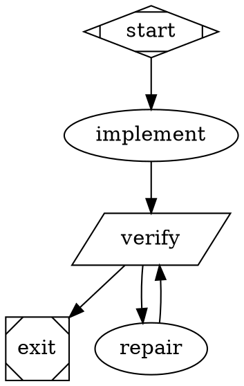

# Fabro execution notes for ThreadX #744

The implemented workflow is `workflow/workflow.toml` with a 23-node, 26-edge graph and eight tool-using Codex CLI agent prompts. Fabro command stages invoke `driver.py agent <role>` to run each fresh Codex process; this avoids the native Fabro catalog limitation while honoring the exact requested model. Actual installed CLI validation passed with zero diagnostics. Agents perform issue/dependency planning, source and native test implementation, independent technical review, independent Eclipse/IP review, bounded repair, PR writing, and companion documentation authoring/review. Deterministic commands admit the task, freeze its complete patch, verify it, gate review hashes, publish a draft, inspect remote checks, and export the contribution artifacts.

## Supported syntax and runtime behavior

- The CLI binary is `/home/jefferson/.fabro/bin/fabro`, version `0.362.0-nightly.0` (`a192bce`, 2026-09-20).
- An ordinary `box`/default node is an agent with built-in shell, file read/write/search and provider-specific edit tools. A `tab` node is one tool-free model call and cannot implement or inspect files by itself.
- External prompts use `prompt="@prompts/name.md"` relative to the graph. TOML inputs bind `{{ inputs.name }}` templates. Native agent registration must include every referenced prompt. The final CLI-backed graph intentionally has no engine prompt node: include all eight prompts in registration and in the immutable runner bundle.
- Shell gates use `shape=parallelogram`, `script`, `timeout`, and `max_retries=0`. Scripts must propagate real failing exits; shell source does not implicitly enable `errexit`/`pipefail`.
- `graph [on_failure="exit"]` stops failed stages. Each recoverable command overrides `on_failure="route"`, has a success-conditioned edge, and an unconditional repair fallback. The installed validator rejects nodes whose outgoing edges are all conditional, even if success and failure are both covered.
- `max_visits=3` bounds the repair node. Every repair returns to a fresh freeze, native verification, and both independent reviews. Frozen patch hashes in review and verification records must match the current source before publication.
- Reviews run sequentially in separate fresh Codex CLI processes, with their own output files and prompts forbidding source, test, verification, and gate mutations. A deterministic gate verifies their JSON verdicts and snapshot hashes. This independent role separation is backed by hash checks; Local does not enforce per-agent filesystem isolation.
- The Local `folder` target executes in place. It has no Fabro Git checkpoints; retry retains files, and fork/rewind are unavailable. It needs an existing canonical server directory.
- `[run.clone] enabled=false` and `[run.run_branch] enabled=false, push=false` avoid platform-owned clones, branches and pushes. The workflow driver owns its explicit issue branch and publication.
- Local environments reject automatic `[run.pull_request] enabled=true`. This workflow explicitly disables it and uses the driver's controlled publisher after snapshot gates.
- Monitor records actual GitHub/Eclipse checks and human/maintainer blockers. Export must retain those blockers rather than claim that a successful local workflow means upstream is ready to merge. A published draft remains a draft pending the required human review and remote requirements.

## Model and provider selection

The user's explicit model choice is Codex Sol 6.1 High. The workflow records `gpt-6.1-sol`, provider `openai-codex`, reasoning effort `high`, and an empty fallback chain. The server's native model catalog/credentials do not offer this model: setting only its name leaves an inherited DeepSeek provider pin and fails the model probe. The final workflow therefore uses command stages to invoke the installed Codex CLI with the exact model and high reasoning setting, using the existing Codex login. No native Fabro model node runs and no fallback model is authorized.

The final command-only workflow passed offline validation with zero diagnostics and existing-server live preflight with `ok=true`; it correctly skips the native LLM probe. Preflight reports an expected empty-native-fallback warning, which does not imply that another model runs. The driver's actual Codex capability probe and execution traces, not this command-only preflight, must establish the requested model works. Preserve actual model/provider/session identity in assistance evidence. Do not guess identity from generic branding.

## Storage and target

Source, builds, logs, and evidence belong on mounted loop4 at:

```
/media/jefferson/11c42dee-73a3-4c2b-ab42-a0440011d9e0/threadx-contributions/744/
```

The intended folder target is its `source` directory. Evidence is its sibling `evidence` directory. Reviewable exported material belongs in this repository's `contributions/threadx-744/artifacts` directory.

Engine persistence is server-owned: `[server.storage].root` / `fabro server start --storage-dir` determine SQLite, engine logs, objects, and run scratch. There is no supported `[run.storage]` setting. Server stanzas inside workflow TOML are schema-valid but inert. The existing server at `http://127.0.0.1:32276/api/v1` stores engine state in `/home/jefferson/.fabro/storage` on the home filesystem; its TMPDIR is already on loop4. To put engine persistence on loop4 as well, run a separate dedicated ThreadX server with a separate config/port/socket and loop4 storage. Each inference session uses the configured Codex CLI login. This installed server also required an OpenAI Codex credential record when creating a run pinned to that provider; the dedicated vault received only the current short-lived access token, without a refresh token. Credentials remain outside repository artifacts and are never printed. Do not relocate or modify existing runs/configuration merely for this task.

## Registration and launch

The dedicated controller uses REST on port 32277 and reads the bearer credential
privately from loop4 storage. The installed MCP connection targets the unrelated
server on port 32276, so it is not used to control these runs.

```bash
python3 contributions/threadx-744/workflow/fabro_control.py register
python3 contributions/threadx-744/workflow/fabro_control.py launch
python3 contributions/threadx-744/workflow/fabro_control.py status
```

Registration uses `workflow.fabro` as the entrypoint. The adjacent TOML supplies
run configuration; this installed REST API rejects TOML as an entrypoint.
The package contains the graph, configuration, driver, all eight prompts,
Dockerfile, regression design and execution manifest.

The controller copies executable inputs to a content-addressed, read-only bundle
under loop4 `threadx-contributions/executions/<sha256>`. It rewrites each registered
graph command to execute that bundle's driver. Every invocation verifies the
manifest against the directory digest and every file. The image is pinned by its
immutable image ID. Verification and agent invocation records capture the runner
hash; the review gate rejects another runner or image. Workspace changes after
registration therefore do not change an existing run.

A fresh full launch requires clean upstream kernel/documentation checkouts.
Recovery modes `verify`, `validated`, `resume`, `publish` and `monitor` enter at explicit stages and
still enforce frozen hashes, exact runner/image binding and current reviews.

## Small valid gate-and-repair pattern



Primary evidence: local Fabro source documentation at `/home/jefferson/fabro/docs/public/execution/run-configuration.mdx`, `execution/environments.mdx`, `workflows/stages-and-nodes.mdx`, `workflows/transitions.mdx`, `agents/prompts.mdx`, `agents/tools.mdx`, `agents/permissions.mdx`, and `administration/server-configuration.mdx`; installed CLI validation and live preflight. No credentials are printed or included in repository artifacts.

## Human review and recovery

The final full graph includes kernel and documentation author/reviewer roles, deterministic native and Antora checks, and a genuine Fabro human gate. It uses `shape=hexagon`, `question_type="freeform"`, `review_target=true`, a seven-day timeout, no default choice, and no automatic answer. `prepare-human-review` exports an actual served dossier at http://127.0.0.1:32278/review.html and sets runtime `review_target`. The gate's answer reaches the receipt validator through `stdin_source="human.gate.human_provenance.answer"`. The default gate accepts a typed current digest and ECA email; the conversation adapter described below accepts the original separate human agreement/email messages. `auto-approved` is invalid in either path. The publisher independently rechecks the receipt against both current patch digests.

The dedicated server serializes runs (`max_concurrent_runs=1`). The companion preparation run executes separately for this recovery; the full graph runs those stages sequentially within one run. Failed/timed-out attempts stay in artifacts/attempts. Recovery graphs explicitly reuse only matching measured evidence. Registered command paths point to immutable loop4 bundles; invocation and verification records capture the actual driver hash. The registered workflow version and execution-binding.json identify the exact bundle.

`launch monitor` starts a four-node reassessment run for already published PRs. It checks exact kernel/documentation heads, current human receipt, final-head ECA and required/applicable CI, and actual upstream approvals. A blocked run exports blockers and fails honestly; a later reassessment can succeed once external requirements are met. No merge is performed.

## License headers and snapshot renewal

The deterministic header audit runs at freeze, native verification and
publication. All 28 authored/modified contribution files pass its preparation
policy; the report records 12 original-source provenance exemptions separately.
ThreadX files retain MIT notices, while local workflow code uses this
repository's Apache-2.0 license. New AI-authored files include CC0-1.0 disclosure.
Canonical upstream human-reviewed wording is required at publication, together
with the actual consent receipt; the preparation audit does not certify either.

Freezing archives and removes prior PR text, review requests, readiness results
and exported mirrors before the next verification. Even an identical patch can
have different test outcomes, so its earlier passing prose cannot be reused as
the result of a later failed run. Genuine human-consent receipts are preserved
and separately checked against the current patch and finalized headers.
All 67 workflow tests passed, including missing-header rejection, absent/failed
license checks, and stale-draft retirement with consent retention.

The conversation receipt adapter also supports actual agreement and ECA email
sent as two messages. It verifies the existing native human question, both
dossier hashes and the reviewed immutable execution bundle, then invokes that
runner's review gate before saving the original user texts. It neither invents
a typed `REVIEWED` response nor publishes. After recording the receipt, recovery
finalizes only the authorized canonical header wording and starts fresh native
verification/reviews. Its tests reject automatic or ambiguous agreement,
malformed email, changed patch/documentation scope and an unrelated question.

Publication clears Fabro-provided `GIT_AUTHOR_*` and `GIT_COMMITTER_*` name/email overrides before executing the unchanged driver. The driver configures each contribution checkout from the admitted human identity and confirmed ECA email, verifies the effective identity, and checks the actual committed author email. The `publish` recovery graph repeats all publication gates against the existing frozen patches and independent review records. It creates no new agent review or test claims.

Publication and monitoring prepend the loop4 tools directory to PATH. Its official GitHub CLI archive is checksum-verified; `github-cli-runtime.json` records its version and digest. The system CLI (2.4.0) lacks the `headRefOid` JSON field required to verify final PR heads. The existing GitHub login is used through checkout-local credential helpers; no credential is stored in the contribution artifacts.

The compatible fork command uses `gh repo fork <repository> --clone=false`; current CLI rejects `--remote` when an explicit repository is supplied. The final reusable driver includes this correction. Current published patch verification and monitoring still execute the original immutable driver recorded in `monitor-execution-binding.json`; the compatibility edit makes no new native-test claim.

The reusable monitor also queries workflow runs at the exact published commit. GitHub can report `action_required` there while omitting jobs from the PR check rollup; these runs now appear as explicit readiness blockers. The current PR retained seven such runs, all awaiting external action.

For these published PRs, `launch monitor` reuses the saved immutable monitor version and checks every bundle digest plus its measured driver identity before starting. Later reusable workflow corrections cannot silently replace the runner responsible for published-patch evidence.
