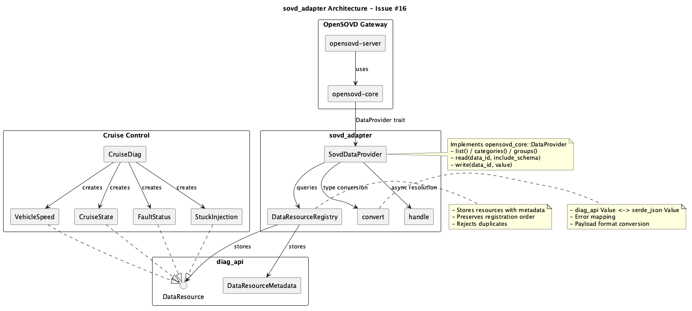
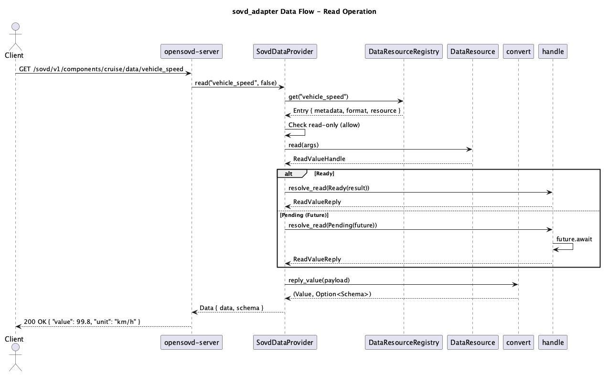

# SWE.2 Software Architecture

| Document ID | INC-DIAG-16-SWE2-ARCH |
|-------------|----------------------|
| Issue | #16 |
| Component | sovd_adapter |
| Date | 2026-10-07 |

---

## 1. Overview

The `sovd_adapter` provides a bridge between S-CORE diagnostic resources (`diag_api::DataResource`) and the OpenSOVD gateway (`opensovd_core::DataProvider`).

---

## 2. Component Description

### 2.1 SovdDataProvider

**Purpose:** Implements `opensovd_core::DataProvider` trait

**Responsibilities:**
- Serve resource listings with filtering
- Dispatch read/write requests to underlying resources
- Handle async resolution of read/write handles

**Interfaces:**
- `DataProvider::list(filter) -> Vec<Metadata>`
- `DataProvider::read(id, include_schema) -> Data`
- `DataProvider::write(id, value) -> ()`

### 2.2 DataResourceRegistry

**Purpose:** Store and manage registered resources

**Responsibilities:**
- Store resources with their metadata
- Preserve registration order
- Detect duplicate/empty IDs
- Provide lookup by ID

**Data Structures:**
- `IndexMap<String, Entry>` - ordered map of resources

### 2.3 convert Module

**Purpose:** Type conversions between crate boundaries

**Responsibilities:**
- `diag_json::Value` <-> `serde_json::Value`
- `DataResourceMetadata` -> `Metadata`
- `diag_api::Error` -> `DataError`
- Payload format handling (JSON/UTF8/Binary)

### 2.4 handle Module

**Purpose:** Async handle resolution

**Responsibilities:**
- Resolve `ReadValueHandle::Ready` synchronously
- Await `ReadValueHandle::Pending` futures
- Same for `WriteValueHandle`

---

## 3. Data Flow

### 3.1 Read Operation

1. Client sends REST request to gateway
2. Gateway calls `DataProvider::read()`
3. Provider looks up resource in registry
4. Provider calls `DataResource::read()` under lock
5. Lock released, handle awaited
6. Reply converted and returned

### 3.2 Write Operation

1. Client sends REST request with JSON body
2. Gateway calls `DataProvider::write()`
3. Provider checks read-only flag
4. Provider converts JSON to `RequestMessagePayload`
5. Provider calls `DataResource::write()` under lock
6. Lock released, handle awaited
7. Success/error returned

---

## 4. Interfaces

### 4.1 External Interfaces

| Interface | Type | Description |
|-----------|------|-------------|
| `opensovd_core::DataProvider` | Trait | Gateway data provider interface |
| `diag_api::DataResource` | Trait | Diagnostic resource interface |

### 4.2 Internal Interfaces

| Interface | Type | Description |
|-----------|------|-------------|
| `DataResourceRegistry::register()` | Method | Register a resource |
| `DataResourceRegistry::get()` | Method | Lookup by ID |
| `convert::metadata()` | Function | Convert metadata |
| `handle::resolve_read()` | Function | Resolve read handle |

---

## 5. Design Decisions

### 5.1 Mutex for Write Support

**Decision:** Resources are stored behind `Mutex<Box<dyn DataResource>>`

**Rationale:** `DataResource::write()` takes `&mut self`, but `DataProvider` methods take `&self`. The mutex provides interior mutability.

**Constraint:** Lock is never held across `.await` to prevent deadlocks.

### 5.2 IndexMap for Order Preservation

**Decision:** Use `IndexMap` instead of `HashMap`

**Rationale:** Resource listing order should match registration order for predictable API responses.

### 5.3 Separate serde_json Crates

**Decision:** Use `diag_json` alias for diag_api's serde_json

**Rationale:** opensovd_core and diag_api have different serde_json versions. JSON is converted via string serialization at the boundary.

---

*Prepared by: EP1991 | Thinking_CAPs | Eclipse SDV Hackathon Chapter 4 2026*
