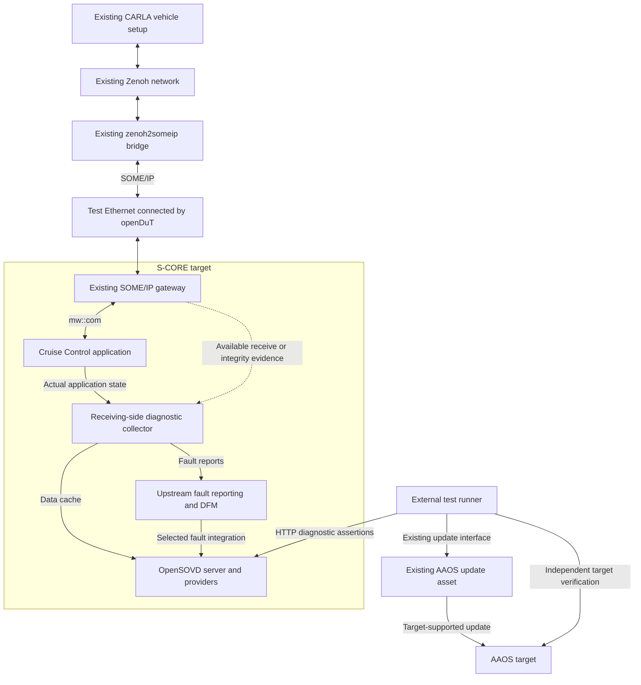

# Eclipse SDV Hackathon — Spec Kit / Codex Implementation Brief

**Version:** 1.0  
**Prepared:** 4 October 2026  
**Target:** Eclipse SDV Hackathon Chapter Four, Freestyle / HackFest Track (Track 2)  
**Working title:** Open Vehicle Lifecycle — Drive, Diagnose, Update, Verify  
**Team assumption:** Five contributors  
**Purpose:** Turn the agreed strategy into an incremental, evidence-driven implementation using GitHub Spec Kit in Codex.

This is an implementation specification and execution brief, not a statement that the proposed integrations already work. Public-source findings below were inspected on 4 October 2026; the combined stack was not built or executed during that review. Codex must establish the actual baseline and recheck upstream status before implementation.

## 1. Executive decision

Keep the existing Cruise Control use case and the working S-CORE / CARLA setup. Reuse the existing X-Verse `zenoh2someip` bridge **without implementing new X-Verse features**.

Add the following around the baseline:

1. A small receiving-side diagnostic adapter for the S-CORE application.
2. OpenSOVD diagnostic data and, where the selected upstream implementation supports it, native fault resources.
3. An openDuT-connected Ethernet testbench.
4. A separate, reproducible diagnostic and regression test runner.
5. Invocation of the existing AAOS FOTA asset, followed by independent verification of the installed version and behaviour.
6. One bounded, reviewable contribution to an existing Eclipse SDV project need.

The narrative is **drive → disturb → diagnose → update → verify**. The technical result is a reusable integration with evidence, not a collection of project logos.

E2E protection, native OpenSOVD update orchestration and native VIPER execution are conditional work packages. They must not all become prerequisites for the core demonstration.

## 2. Authority, inputs and superseded assumptions

### 2.1 Inputs to provide in the implementation workspace

- This brief.
- `SDV_Hackathon_Winning_Strategy.md`, the original strategy.
- `Cruise_Control.drawio`, the current user-supplied architecture.
- Paths or repository URLs for the existing bridge, working S-CORE deployment and AAOS FOTA asset.
- Existing build/run commands, configurations and any known-good revision identifiers.

The architecture contains S-CORE ADAS and fusion vECUs, a VCU, Zephyr BCM, AAOS IVI/digital cluster, CARLA, Zenoh, SOME/IP/CAN bridges and orchestration. Treat that diagram as architectural context. It does not establish that every depicted component is currently used or verified.

Preserve the existing control return path. Do not convert Cruise Control into a diagnostics-only mock to make integration easier. If the application is not available in the execution environment, implement against an explicit fixture and record the resulting verification gap.

### 2.2 Decisions that supersede the original strategy

| Original assumption | Current decision |
|---|---|
| New X-Verse scenarios/injection features are part of delivery | No new X-Verse feature development; reuse the existing bridge and available baseline |
| Gateway E2E is necessarily the first deliverable | First establish observable integration; E2E remains a bounded conditional contribution |
| DFM-lite must be implemented | Evaluate and reuse upstream `fault-lib` / `dfm_lib` first |
| openDuT is a late bonus | Include meaningful openDuT networking in the planned demonstration |
| Container Executor is the default openDuT execution mechanism | Do not default to an unmaintained mechanism; external runner first, validated VIPER integration optionally |
| OpenSOVD fault/update resource names imply implementation availability | Verify the selected branch, router, providers and tests |
| AAOS FOTA automatically updates S-CORE | Determine the real update target; do not assume portability of the updater |
| CDA/legacy diagnostics belong in the main pitch | Include only if already working and essentially free to demonstrate |
| Four minutes is the only presentation format | Prepare an eight-minute technical interview and a final pitch within the published ten-minute cap |
| Strategy confidence can be quantified as 0.96 | Use measured readiness and explicit dependencies; do not invent a winning probability |

Where this brief conflicts with the original strategy, follow this brief and the user's later instructions. Preserve upstream repository requirements when contributing to those repositories.

## 3. Success criteria and scope

### 3.1 Committed delivery

- The existing vehicle function runs with its existing bridge and pinned configuration.
- A diagnostic client reads actual receiving-side state through OpenSOVD.
- A controlled interruption of the selected SOME/IP flow produces a correctly attributed communication timeout.
- Restoring traffic produces the specified recovery behaviour without erasing historical evidence unintentionally.
- openDuT meaningfully connects the test endpoints, with recorded configuration and traffic evidence.
- A runner executes the campaign, checks expected results and records reproducible evidence.
- The existing AAOS update asset is integrated after its capabilities are inspected; a version change and the intended behavioural change are verified.
- One upstream contribution or maintainer-coordinated reusable artifact is reviewable, with tests and a continuation path.

### 3.2 Conditional scope

| Feature | Admission condition |
|---|---|
| Native OpenSOVD `/faults` | Maintainer-coordinated implementation available or a bounded accepted contribution slice |
| Native OpenSOVD `/updates` | PR/branch validated; target-specific update adapter understood |
| Gateway E2E profile/check and consumer metadata | Maintainer-agreed scope, appropriate reference implementation/specification, stable insertion point |
| VIPER-managed execution | Exact CARL/EDGAR build, feature flags, runtime and results path proven |
| Automatic rollback demo | Existing updater and target actually support it; recovery tested |
| CDA, physical ECU extensions | Existing integration works without displacing the core work |

### 3.3 Exclusions

- No redesign of X-Verse, new X-Verse injector, new simulation platform or bridge rewrite.
- No new general-purpose OTA backend or generic cross-platform flashing framework.
- No migration of the working S-CORE IPC implementation solely to adopt an open PR.
- No requirement to run EDGAR inside the S-CORE container.
- No new AutoSD, ThreadX, Java/Jakarta or additional middleware solely to collect bonuses.
- No complete AUTOSAR E2E library or broad gateway redesign.
- No assertion of ASIL certification, production readiness or complete vehicle safety validation.
- No LLM in the runtime acceptance, update activation or test-verdict path.
- No external comments, messages, invitations, PR publication or repository creation without authorization for that action. Prepare reviewable local artifacts first; use existing authorization when provided.

## 4. Why the story fits Eclipse SDV and its rubric

Eclipse SDV emphasizes reusable, modular, interoperable vehicle software and open collaboration across development, deployment and operations. This scenario makes the benefit visible through an existing vehicle function and an observable software change.

| Criterion | Weight | Evidence to deliver |
|---|---:|---|
| Contribution value | 25% | Real project issue advanced by a reviewable patch, PR or reusable integration artifact |
| Technical quality and maturity | 25% | Bounded implementation, regression tests, documented interfaces and limitations |
| Ecosystem impact | 20% | Meaningful S-CORE, OpenSOVD and openDuT interaction |
| Reusability and maintainability | 10% | Pinned dependencies, reproducible setup and a second-person reproduction |
| Pitch and handover clarity | 8% | Clear changes, links, tests, limitations and next steps |
| Community benefit and continuation | 7% | Named reuse scenario and maintainer/project continuation path |
| Contribution focus and initiative | 5% | Existing upstream need materially advanced |

The published bonus for meaningful openDuT use is +0.10 on the five-point scale. Each listed bonus technology adds +0.10, with a maximum +0.40 and final score capped at 5.00. Improving a 25%-weighted criterion by one point adds +0.25. Protect contribution quality before adding technology breadth.

A merge during the event is desirable, not a guaranteed deliverable. Commit to reviewability and a strong handover. Slides alone do not establish technical completion.

## 5. Upstream readiness snapshot and implementation consequences

Recheck the linked source and issue state at project start. Record source URL, commit SHA, observed state, observation date and the decision taken. An open issue is evidence of work to investigate, not proof that every possible branch lacks an implementation.

| Capability / work item | Observed 4 October 2026 | Decision |
|---|---|---|
| S-CORE SOME/IP gateway | `gatewayd`, `someipd`, serializer/configuration and integration-test infrastructure exist | Reuse known-working baseline |
| Gateway CRC/E2E, issue #289 | Open | Optional implementation; not configuration-only |
| Gateway IPC migration, PR #291 | Open and unmerged | Do not make migration a prerequisite |
| OpenSOVD entity discovery and data providers | Implemented in `opensovd-core` | Use for minimum diagnostic integration |
| OpenSOVD bulk-data | Wired in the inspected server router | Upload capability does not itself install an update |
| OpenSOVD native faults, issue #156 | Open, assigned to `akshaim`; inspected main router has no faults routes | Coordinate; distinguish from library query support |
| OpenSOVD `fault-lib` / `dfm_lib` | Reporter, processing, storage and `SovdFaultManager` code exist | Evaluate reuse before any DFM-lite |
| OpenSOVD update issue #195 / PR #196 | Issue and PR open, PR unmerged | Evaluate only if native update API enters selected scope |
| openDuT release | Latest published release returned by GitHub was v0.10.2 | Release candidate for networking validation, not proof of all development features |
| openDuT #547 | S-CORE-container support remains open | Deploy EDGAR on separate Linux peer hosts/VMs |
| openDuT #575 | Older Executor described as unmaintained and proposed for removal | Avoid new dependency by default |
| openDuT #578 | Integrated VIPER container setup/documentation remains open | Prove exact build and prerequisites before use |
| openDuT #576 | EDGAR-to-CARL TestRunReport transfer remains open | Preserve accessible artifacts independently |
| openDuT #427 | CDA integration into VIPER remains open | Native OpenSOVD HTTP testing does not require CDA |

Specific source snapshots inspected during planning:

- `eclipse-score/inc_someip_gateway` tree: `f8a196c3b16d5172d898394ab99b0ed81346d63d`.
- `eclipse-opensovd/opensovd-core` tree: `e25fa30d1bdcb6726e3b4c4ec5d683b783e7c1af`.
- `eclipse-opensovd/fault-lib` tree: `12dac502616701734f90a61edca1326ae2ac6506`.
- `eclipse-opendut/opendut` main tree: `a2447d876905d3293577f360af877229ca989017`.

These are inspection references, not a tested compatible bill of materials. Select the implementation pins after compatibility testing. Do not replace the user's working revisions with these snapshots automatically.

## 6. Target architecture

### 6.1 Logical topology



The diagram is logical: EDGAR/CARL are not new SOME/IP application proxies. Retain the baseline's command return path and real process boundaries. The fault integration arrow is implemented only when its provider/routes contract is available.

### 6.2 Deployment

| Location | Responsibility |
|---|---|
| Simulation host | Existing CARLA, Zenoh and bridge |
| Peer A | EDGAR with a dedicated DUT-facing Ethernet attachment to the bridge endpoint |
| S-CORE target host | Gateway, Cruise Control, diagnostic integration and OpenSOVD, subject to supported local IPC boundaries |
| Peer B | EDGAR with a dedicated DUT-facing attachment to S-CORE |
| Management host | CARL, LEA/CLEO, external runner and evidence collection; services may share a suitable machine |
| AAOS host/target | Existing update client and AAOS image/application |

EDGAR may run on adjacent Linux machines or VMs; it need not run in the ECU image. For virtual endpoints choose the appropriate TAP, veth or VM interface arrangement after inspection. Do not assume host loopback traffic automatically traverses the openDuT network.

Keep the management/diagnostic route reachable during the selected SOME/IP interruption. If diagnostics also traverse the interrupted link, loss of HTTP connectivity cannot be counted as evidence of a correctly reported application fault.

### 6.3 Exact integration boundaries

1. **Bridge boundary:** no source changes. Adjust external deployment/network configuration only as needed and retain a baseline configuration.
2. **S-CORE observation boundary:** read consumer-side state through existing interfaces. Add minimal instrumentation if necessary and document it as new work.
3. **Language boundary:** prefer the supported native interface. If C++ collection and Rust diagnostics must interact, define a small explicit local IPC contract; do not invent a supported Rust `mw::com` binding.
4. **Diagnostic boundary:** providers expose a timestamped cache and fault-manager queries. HTTP reads do not block the control loop.
5. **Testbench boundary:** openDuT connects endpoints; runner/injector implements test semantics.
6. **Update boundary:** the existing asset performs installation; the adapter invokes it and verifies outcome.

## 7. Diagnostic and fault contracts

### 7.1 Proposed local observation model

Define and version the integration's own observation contract. This is not an upstream OpenSOVD JSON schema or a replacement for `mw::com` types.

| Field | Meaning |
|---|---|
| `schema_version` | Local contract version |
| `source_instance` | Actual observed process/service instance |
| `sample_id` | Available sequence/correlation identifier; explicitly absent if unavailable |
| `received_at_monotonic_ns` | Receiving-side timestamp and documented clock domain |
| `last_accepted_at_monotonic_ns` | Last consumer-accepted sample, if observable |
| `vehicle_speed` / `unit` | Actual received value and explicit unit |
| `target_speed` / `unit` | Application target and unit |
| `cc_state` | Actual state mapped from the inspected application |
| `integrity_result` | Native result mapped with provenance, or `not_available` |
| `freshness_state` | Local assessment with configured threshold and source |
| `software_identity` | Observed version/build identity |

Do not report nominal integrity when no integrity checking exists. Do not synthesize a controller disengagement from an observer's timeout. Distinguish observed state, derived assessment and unavailable data.

Use monotonic time for live host/network watchdogs unless a different clock contract is deliberately selected. CARLA simulation time and wall/monotonic time are distinct; a paused simulation must not accidentally invalidate timing results. Cross-host latency claims require clock synchronization with known uncertainty or measurements within one clock domain.

### 7.2 Fault ownership

| Identifier | Meaning | Owner / trigger |
|---|---|---|
| F1 `CC.SpeedInputInvalid` | Function has identified invalid speed input | Actual function report; only if available |
| F1-prime `CC.SpeedInputObserver` | Independent observer finds implausibility | Observer, explicitly labelled as such |
| F2 `CC.LostCommunication` | Selected communication stream absent beyond budget | Receiving-side watchdog |
| F3 `CC.CommunicationIntegrityFailed` | Received protected sample fails selected integrity policy | Real E2E result and consumer policy; conditional |

Keep last-received and last-accepted timestamps separate. Continuous invalid samples must not refresh the accepted-data age. Equally, lack of accepted samples must not automatically be labelled complete transport silence. Allow evidence of related faults without inventing a physically certain root cause; a timeout can arise from several causes.

Configure startup grace, timeout, debounce and recovery policy before acceptance testing. Establish values from the actual publishing period, scheduling and measured baseline jitter; do not inherit invented numeric deadlines from this brief.

Separate communication recovery from re-engaging Cruise Control. Follow the existing control policy, including any requirement for a new driver request.

### 7.3 OpenSOVD mapping

- Model the S-CORE host as a component and Cruise Control as an application where consistent with the pinned implementation.
- Implement data providers for state, versions and freshness using the actual APIs.
- Follow discovery links and the configured base/version path; do not hard-code speculative URLs.
- Reuse `fault-lib` reporter/catalog and `dfm_lib` processing/storage where buildable and compatible.
- Verify iceoryx2/process/container prerequisites rather than assuming the fault IPC is identical to S-CORE application IPC.
- Map `SovdFaultManager` data into the selected HTTP faults implementation. Library-level query support is not HTTP resource availability.
- Test list/detail, status and snapshot semantics for the selected supported subset. Fault clear is optional unless explicitly selected and implemented.
- If native faults are unavailable, expose diagnostic information under the implemented `data` resource with clear limitations. This fallback does not satisfy a native-fault acceptance criterion.
- DFM-lite is permitted only after a recorded concrete upstream blocker. Keep it behind the selected contract and label its limitations; do not silently rebuild upstream lifecycle logic.

## 8. openDuT and test execution

### 8.1 Networking first

Create a reproducible two-peer configuration. Prove interface attachment, discovery/subscription and bidirectional SOME/IP traffic. Confirm that the intended traffic actually uses the openDuT-connected path using packet evidence or equivalent observations; peers merely appearing online is insufficient.

Validate endpoint IPs, advertised SOME/IP-SD addresses, multicast where used, interface binding, routing, MTU and firewall rules for this setup. Keep these as deployment checks rather than a broad network redesign. A successful ping alone is not sufficient.

### 8.2 Default runner

Use a standalone script or container on the management/test host. It should:

1. Verify prerequisites and capture revisions/configuration hashes.
2. Check the deployed cluster and diagnostic endpoint readiness.
3. Run baseline assertions.
4. Invoke a narrowly scoped external fault action.
5. Assert timeout and recovery through actual diagnostics.
6. Invoke the existing update interface when selected.
7. Verify target version/behaviour and repeat regression assertions.
8. Restore test-owned network/process changes even on failure.
9. Produce machine-readable results, logs and a concise human report.

A separately launched runner is a valid baseline. Describe this honestly as testing over an openDuT-connected testbench, not execution by openDuT.

### 8.3 Optional VIPER

VIPER is the preferred direction to evaluate for native openDuT execution, subject to a successful spike. Pin CARL/EDGAR revisions, VIPER feature flags, runtime and container prerequisites. Read the actual supported test API; do not assume arbitrary CPython packages work in RustPython.

Keep the test assertions reusable outside VIPER. Wrap a proven runner where supported instead of porting all logic prematurely. Account for open report transport work; store results on a mounted/accessible path or explicit artifact sink until central retrieval is proven.

The older Executor/WebDAV flow is not the default. If a maintainer recommends an already validated pinned deployment, record that exception, its limitations and the chosen execution trigger. Do not assume its `/results/.results_ready` behaviour also applies to VIPER.

### 8.4 Failure injection without X-Verse development

Start with absence of communication. Use a test-owned process control or narrowly scoped traffic filter on the selected SOME/IP flow. Preserve diagnostic/management access. Capture the action and verify that traffic really ceased.

Make setup/cleanup idempotent and avoid broad firewall flushes, stopping unrelated services, or disconnecting shared venue infrastructure. If a manual action is used during the demo, record it as manual, with an observed timestamp; do not report it as automated injection.

## 9. AAOS update integration

### 9.1 Mandatory discovery before implementation

Inspect the existing asset and record:

- Repository/path, revision, target and currently working invocation.
- Whether it updates an AAOS system image, Android application, or a different ECU.
- Supported package format and compatibility checks.
- Existing authenticity/integrity verification; preserve it.
- Staging, activation/reboot, health and failure reporting.
- Rollback or manual recovery capability actually implemented.
- Independent installed-version query and a measurable before/after behaviour.
- Real update duration and rehearsal constraints.

Do not assume Android system-update support supplies a S-CORE/Linux updater. Call an APK deployment an application OTA update; reserve system OTA/FOTA wording for the corresponding target change.

### 9.2 Recommended visible improvement

When the existing asset targets AAOS, prefer an improved Cruise Control diagnostic display:

- Version A displays the actual Cruise Control state and existing unavailable indication.
- Version B additionally presents a diagnostic reason obtained through the implemented OpenSOVD integration.
- Both versions preserve the existing control policy.
- Replay the same fault after the update and verify the diagnosis is displayed correctly.

This is a proposed change, not a claim about the current cluster. If the asset's available update cannot support it economically, choose another real, small, measurable change and record the decision.

Updating the display does not repair the underlying communication failure or update the S-CORE controller. A hardware or injected communication fault must remain detectable after the update.

### 9.3 Local updater adapter

Define a target-specific adapter with operations equivalent to inspect target, stage package, activate, observe outcome and query installed identity. These are local concepts; bind them to the existing asset rather than inventing a public API.

Persist an update correlation ID, target identity, expected source/target versions, package digest, observed progress and terminal outcome. Do not infer success from process exit or download completion alone.

Separate staging from activation. For the demo, activation requires fresh evidence that the simulated vehicle is stationary, Cruise Control is disengaged and maintenance is authorized. Unknown or stale preconditions block activation. Recheck immediately before activation; define what happens if preconditions change. Missing park/maintenance signals require an explicit operator-controlled maintenance procedure, not a fabricated vehicle state.

Demonstrate recovery or rollback only when supported and tested. Never disable signature checks or boot protections to make the demo pass.

### 9.4 Native OpenSOVD updates

Default: invoke the existing updater directly from the runner and expose available diagnostic/version evidence independently.

Conditional: integrate the update provider/resource from issue #195 / PR #196 after review and branch validation. Coordinate with its author; focus on a target adapter, example, tests or documentation rather than duplicating the feature. Bulk-data upload is not update activation.

## 10. Optional E2E contribution

Admit only after the core chain works and the maintainer agrees the scope.

- One event, one agreed profile/provider slice and one insertion point.
- Receiving-side verification first; a test publisher may supply protected data.
- Preserve association between payload, sample identity and integrity metadata.
- Keep consumer state-machine and acceptance decisions consistent with S-CORE architecture.
- Include valid, corrupted and repeated samples plus startup/recovery behaviour applicable to the profile.
- Use independent known-answer vectors or a suitable reference; do not rely only on a producer/checker pair that can share the same bug.
- Treat counter discontinuities according to the profile and configured tolerance, not an unconditional fault rule.
- Corrupt after E2E protection and preserve valid transport delivery. Otherwise the demonstration may exercise packet loss instead of payload-integrity failure.
- Mark the protected segment. Protection generated by the bridge does not establish correctness of the preceding Zenoh/CARLA path.
- A CRC-valid implausible value is a useful distinction between functional plausibility and communication integrity.
- If implementation requires changing the existing bridge source, use an external test publisher/fixture or defer the feature; do not expand X-Verse scope implicitly.

E2E supplies evidence for acceptance; it is not cryptographic authentication or proof that a value is physically safe. Do not claim ASIL certification from a CRC feature or an ASIL-tagged requirement.

## 11. Spec Kit workflow in Codex

### 11.1 Installation and version awareness

Use the installed Spec Kit integration if it already exists. Inspect its version, local instructions and generated skills before changing setup. Do not overwrite `.specify`, `.agents`, `AGENTS.md` or user-customized templates.

The official documentation inspected on 4 October 2026 identifies the Codex integration key as `codex`, uses `.agents/skills`, and invokes skills as `$speckit-<command>`.

For a new project only, the documented CLI setup pattern is:

```bash
uv tool install specify-cli
specify init sdv-hackathon-integration --integration codex
cd sdv-hackathon-integration
```

Use an approved/pinned CLI version for reproducibility and verify the installed CLI help. The above is a documented setup example, not an instruction to create another repository when the user already supplies a destination. Python requirements for Spec Kit can differ from the existing bridge runtime; use a separate tooling environment rather than upgrading the bridge's Python environment.

The following are **Codex chat skill invocations, not shell commands**:

```text
$speckit-constitution
$speckit-specify
$speckit-plan
$speckit-tasks
$speckit-implement
$speckit-converge
```

The documented flow is constitution once, then specify → plan → tasks → implement → converge per feature. Use clarification/analysis/checklist skills when present and useful. Older installations may expose different names or omit convergence; follow the installed version and record the equivalent evidence review, rather than inventing commands or forcing migration.

### 11.2 Constitution requirements

Capture the following project principles:

1. Preserve the working vehicle baseline and existing bridge source.
2. Separate existing assets, integration changes and upstream contributions.
3. Develop one verifiable vertical slice at a time.
4. Prefer reusable upstream implementations over parallel replacements.
5. Keep control, diagnostics, test infrastructure and update responsibilities explicit.
6. Bind every result to actual source, target identity and provenance.
7. Pin executable dependencies and document reproducible setup.
8. Test failure and recovery paths relevant to the selected scope.
9. Missing observations produce unknown/blocked results, never fabricated passes.
10. Follow upstream contribution, license and engineering requirements for the affected repository.
11. Prepared work is declared and event claims identify the actual event-time delta.
12. Use deterministic assertions and explicit update preconditions.

### 11.3 Repository organization

Use the user-selected integration repository; if none is supplied, propose the working name `sdv-hackathon-integration` and prepare locally without publishing it. Keep upstream patches in their own checkouts/branches. Do not move the integration project into X-Verse or turn this task into a software-factory project.

Suggested paths (adapt to the existing repository):

| Path | Purpose |
|---|---|
| `.specify/memory/constitution.md` | Spec Kit principles |
| `specs/<feature>/` | Generated specification, plan, research, contracts, tasks and evidence references |
| `docs/implementation-brief.md` | This brief copied into the implementation repository |
| `docs/baseline.md` | Existing system, revisions, commands and demonstrated behaviour |
| `docs/upstream-status.md` | Dated source/issue audit and decisions |
| `docs/decisions/` | Short architecture decision records |
| `docs/interfaces.md` | Actual application, diagnostic, network and updater contracts |
| `docs/prepared-work.md` | Prepared assets and event-time contribution inventory |
| `docs/demo-runbook.md` | Live sequence and fallbacks |
| `docs/handover.md` | Contribution links, limitations and next steps |
| `config/dependencies.lock.yaml` | Validated revisions, image digests and tool versions |
| `OpenDut/config/testbench/` | openDuT and endpoint configuration, without secrets |
| `OpenSOVD/integration/diagnostics/` | Collector/provider integration code |
| `integration/update/` | Adapter to existing AAOS asset |
| `tests/campaigns/` | Reusable runner and scenario definitions |
| `scripts/` | Setup, preflight, run and cleanup entry points |
| `evidence/<run-id>/` | Reports, manifest, observations and selected logs |

Keep large images, CARLA assets, update payloads and secrets out of Git. Document acquisition and pin references. Archive large evidence through the team's approved artifact mechanism.

## 12. Feature backlog and ordering

Each feature must have a specification with user stories and acceptance scenarios, a plan containing source-based decisions, executable tasks and a completion report. Do not implement the entire backlog as one giant Spec Kit feature.

| Feature | Priority | Deliverable | Dependencies |
|---|---|---|---|
| F001 — Baseline and compatibility audit | P0 | Working baseline manifest, upstream matrix, scope decisions and first smoke run | Input repositories/access |
| F002 — S-CORE diagnostic data | P0 | Receiver collector, timestamped cache and OpenSOVD data provider | F001 |
| F003 — openDuT testbench | P0 | Validated two-peer networking and connectivity evidence | F001 |
| F004 — Fault lifecycle and exposure | P0; native resource conditional | Timeout/recovery monitor, reused DFM and selected HTTP mapping | F002; #156 readiness for native faults |
| F005 — Repeatable campaign and evidence | P0 | Baseline, interruption, recovery and assertions over deployed setup | F002–F004; can scaffold against fixtures earlier |
| F006 — Existing AAOS update and regression | P0 goal after asset discovery | Real update invocation, installed-version check, before/after verification | F001 asset audit, F005 |
| F007 — Selected upstream feature extension | P1, choose one | Native updates example, E2E slice or VIPER integration | Proven core, maintainer-aligned scope |
| F008 — Reproduction and judging handover | P0 | Second-person run, final evidence, pitch and contribution packet | Selected completed features |

F004's first useful increment is actual fault reporting/storage and truthful data exposure. Native `/faults` is a distinct acceptance milestone; a data-only fallback must be labelled partial with respect to that milestone.

F006 remains a committed integration goal, but if the asset cannot be accessed or run, mark it blocked and complete other features. Do not replace a real update with a mock and declare completion.

### F001 — Tasks and exit criteria

- Read local `AGENTS.md` and project instructions.
- Inspect Git state and avoid overwriting unrelated work.
- Inventory bridge, S-CORE, OpenSOVD, openDuT, AAOS and update asset revisions.
- Run the provided existing baseline before changing code.
- Identify actual signals/state transitions and the target's execution model.
- Refresh relevant issues/PRs and inspect implementation, not just descriptions.
- Identify the primary upstream contribution and coordinate ownership when authorized.
- Record compatibility pins and resolve the implementation-critical unknowns in section 18.
- Exit: a reproducible baseline or a precise environment blocker, plus a bounded plan with truthful scope.

### F002 — Tasks and exit criteria

- Implement the smallest supported receiving-side state collector.
- Define source identity, units, freshness and unavailable-data behaviour.
- Implement data providers and discovery mapping in the pinned OpenSOVD API.
- Verify values change with the real application's inputs/state.
- Verify diagnostics being absent/slow does not block the control loop.
- Exit: a client reads actual state and can distinguish stale/unavailable data.

### F003 — Tasks and exit criteria

- Provision/configure two EDGAR peers outside the S-CORE image.
- Deploy the selected cluster and bind the actual DUT-facing interfaces.
- Verify discovery, subscription and both traffic directions needed by the use case.
- Capture evidence that the selected path uses openDuT connectivity.
- Verify testbench teardown/redeployment and management reachability.
- Exit: same existing bridge/application protocol exchange succeeds on the deployed topology.

### F004 — Tasks and exit criteria

- Build/run a minimal upstream reporter/DFM example to establish reuse feasibility.
- Add the Cruise Control fault catalog and receiving-side timeout monitor.
- Define startup, debounce, persistence and recovery semantics.
- Integrate selected fault queries into OpenSOVD and document supported subset.
- Coordinate #156 example/tests/provider work; do not duplicate its owner.
- Exit: actual report → stored lifecycle → diagnostic query is tested, with native/fallback status explicit.

### F005 — Tasks and exit criteria

- Implement named scenarios with declared preconditions and expected outcomes.
- Add external flow interruption with reliable cleanup.
- Capture independent injection and receiving-side evidence.
- Produce machine-readable verdicts and a versioned run manifest.
- Fail nonzero on assertion failure; distinguish blocked/skipped from passed.
- Exit: another team member repeats the same campaign and interprets its evidence.

### F006 — Tasks and exit criteria

- Inspect existing asset; classify image/application/external-ECU update correctly.
- Select the smallest genuine visible change.
- Implement precondition checking and existing-asset invocation.
- Verify installation identity independently after reconnect/reboot.
- Replay baseline and fault scenario against the updated target.
- Exercise one practical failure or denied-activation path within asset support.
- Exit: genuine version transition and before/after evidence; recovery capability stated accurately.

### F007 — Selection criteria

Choose the smallest extension that advances an existing need without destabilizing F001–F006. Reuse the same runner, evidence and interfaces. Record why the other extensions were deferred. Do not claim a feature complete based on a design document alone.

### F008 — Tasks and exit criteria

- Freeze the chosen versions and scripts.
- Reproduce from a clean documented setup on a second suitable environment/person.
- Prepare maintainer-facing patch/PR description and continuation issues as authorized.
- Rehearse technical and final presentations.
- Record a stable full run and prepare labelled fallbacks.
- Exit: evidence, handover and claims match actual implementation.

## 13. Requirements and traceability

Use these IDs as seed requirements; split or refine through Spec Kit without losing traceability. P0 means required for the selected core; conditional requirements apply only when their feature is admitted.

| ID | Requirement | Verification |
|---|---|---|
| REQ-001 | The integration shall preserve the existing bridge source and baseline behaviour. | Baseline comparison and repository diff |
| REQ-002 | Diagnostic state shall identify its actual receiving-side source and units. | Provider/collector contract tests and live sample comparison |
| REQ-003 | Unknown or stale observations shall remain distinguishable from healthy values. | Stale/startup tests |
| REQ-004 | HTTP diagnostics shall not synchronously block the control path. | Slow/unavailable diagnostic-service test |
| REQ-005 | The selected flow shall traverse the configured openDuT testbench. | Interface/traffic evidence |
| REQ-006 | The timeout monitor shall use a documented clock and configured threshold. | Boundary and live interruption tests |
| REQ-007 | Recovery shall follow the declared policy without falsely implying automatic Cruise Control re-engagement. | Restore-traffic and application-state assertions |
| REQ-008 | Fault evidence shall retain identity, source, lifecycle and supported snapshot data. | Reporter/DFM/query integration test |
| REQ-009 | Native fault claims shall require implemented and tested native resource routes. | Discovery, list/detail and status tests; conditional |
| REQ-010 | Each campaign shall record revisions, configuration, scenario, observations and verdict. | Evidence-manifest validation |
| REQ-011 | Failed, blocked and skipped checks shall not be reported as passed. | Runner result/exit-code tests |
| REQ-012 | Injection cleanup shall restore only test-owned changes on success or failure. | Failure-path cleanup test |
| REQ-013 | Activation shall be denied when required vehicle/maintenance conditions are false or unknown. | Update-precondition tests |
| REQ-014 | An update shall be marked successful only after independent target identity and selected health/behaviour checks. | Real update regression |
| REQ-015 | Existing package verification shall remain enabled. | Updater integration review and supported negative test |
| REQ-016 | A run shall label real, mocked, prepared and event-created components. | Manifest and handover review |
| REQ-017 | A second contributor shall reproduce the documented core campaign. | Reproduction record |
| REQ-018 | E2E metadata shall remain associated with the corresponding sample. | Conditional integrity/association tests |
| REQ-019 | Repeated or invalid samples shall not refresh accepted-data freshness incorrectly. | Conditional sequence and stale-data tests |
| REQ-020 | Native update claims shall use the tested update resource and actual target adapter. | Conditional API-to-installation test |
| REQ-021 | Native VIPER execution claims shall include real execution and accessible results from the selected build. | Conditional VIPER smoke/campaign test |
| REQ-022 | Upstream contributions shall reference a real need, changed code/artifacts and reproducible validation. | Contribution packet review |

Maintain a compact mapping: requirement → feature/task → implementation path → test → run/artifact. Use upstream required formats in upstream patches; avoid generating a full certification dossier for this prototype.

## 14. Verification campaign

| Test | Scenario | Expected outcome |
|---|---|---|
| T01 | Nominal published state | OpenSOVD reflects actual state; no false active communication fault |
| T02 | Startup before first sample | Initial/unknown state; timeout behaviour follows startup policy |
| T03 | Selected SOME/IP stream stopped | Receiving-side timeout after configured budget; diagnostics remain reachable |
| T04 | Traffic restored | Freshness and active fault recover as specified; history retained per policy |
| T05 | OpenSOVD slow/unavailable | Control path remains functional; runner records diagnostic failure |
| T06 | Collector disconnected while upstream publisher runs | No false healthy receiver status from Zenoh-only observations |
| T07 | Injector or runner fails mid-test | Scoped cleanup executes; no unrelated connectivity changes |
| T08 | Stale/false maintenance conditions | Activation denied with explicit reason |
| T09 | Valid real AAOS update | Target identity changes; selected behaviour and regression checks pass |
| T10 | Supported update failure/denial | No false success; documented recovery/status available |
| T11 | Fault manager restart, if persistence selected | Stored evidence behaviour matches configured persistence |
| T12 | Reproduction by another contributor | Core setup and campaign reproducible from instructions |
| T13 | Native fault resource | Correct discovery/list/detail/status mapping; conditional |
| T14 | E2E corruption with valid transport | Actual integrity failure and correct sample handling; conditional |
| T15 | Repeated sample | Profile-appropriate verdict and freshness behaviour; conditional |
| T16 | CRC-valid implausible value | Functional plausibility distinct from communication integrity; conditional |
| T17 | Native OpenSOVD update invocation | Real target update via selected provider; conditional |
| T18 | Native VIPER campaign | Actual peer execution with usable result artifacts; conditional |

Before running timing acceptance tests, record publishing period, timeout, startup grace, recovery policy, polling period, observation jitter and clock domain. Assert timing against those declared budgets. Report detection, application reaction and diagnostic visibility separately. Polling latency is not the detector's intrinsic latency.

Use component and contract tests for meaningful new logic and integration tests for boundary risks. Do not add tests that merely mirror trivial implementation. Run affected upstream mandatory gates for upstream changes. GPU-dependent CARLA tests can be a documented local/integration gate; do not mark a skipped GPU campaign as a CI pass for end-to-end functionality.

## 15. Evidence and deliverable format

Each `evidence/<run-id>/` should contain, as applicable:

- `manifest.json`: revisions, image digests, target identities, configuration hashes, scenario/seed, clocks, environment and implementation mode.
- `results.json` and/or `junit.xml`: assertions with passed/failed/blocked/skipped outcomes.
- `timeline.jsonl`: run ID, event ID, source, clock domain, timestamp and observation provenance.
- Diagnostic request/response records and fault snapshots.
- Selected packet captures or equivalent interface evidence, scoped to test traffic.
- Update invocation outcome, package digest, before/after identity and health checks.
- `summary.md`: short human interpretation and limitations.

Treat this as an integration-owned artifact contract. Do not pretend it is an Eclipse standard schema. Redact credentials and unrelated traffic; use environment-variable references for secrets.

Distinguish four claims in every result: code exists, component tests passed, real integration ran, and another person reproduced it. Only mark the level actually achieved.

## 16. Contribution plan and team ownership

### Primary recommendation

Prefer the S-CORE-to-OpenSOVD diagnostic/fault integration as the initial contribution because it directly enables the accepted story. Coordinate a narrow slice of #156 and its mock/example/test expectations with the assignee. Reuse existing DFM functionality.

If that work is already covered or unavailable, evaluate the AAOS update adapter/example and tests around #195/#196. Retain the fault-data integration fallback with accurate claims. E2E remains a valuable separate contribution if its interfaces and scope are ready.

Do not race existing owners or create duplicate issues solely for scoring. Local draft proposals can be prepared without sending messages. Public issue/PR actions follow the user's authorization.

### Five-person allocation

| Owner | Primary artifact |
|---|---|
| 1 — Integration/architecture | Baseline manifest, bridge setup, interface decisions and demo coordination |
| 2 — S-CORE | Receiving-side collector, application observations, optional E2E slice |
| 3 — OpenSOVD | Providers, fault-manager integration, upstream patch/tests |
| 4 — Test infrastructure | openDuT deployment, campaign runner and evidence |
| 5 — AAOS/FOTA and handover | Existing updater adapter, before/after checks and reproduction documentation |

Parallel team work is appropriate after contracts are agreed. This document does not require Codex to spawn additional agents; use the available execution mode and explicit team authorization.

## 17. Delivery gates, event preparation and fallbacks

### Gate A — Baseline established

Exit with a pinned working function and actual interfaces. If inputs are unavailable, document blockers and proceed only with independent work whose assumptions are explicit.

### Gate B — First vertical slice

Actual receiving-side state is readable through OpenSOVD; selected traffic crosses the openDuT setup. Keep diagnostics separate from the interrupted traffic path.

### Gate C — Fault and recovery

One controlled communication-loss test, actual fault evidence and documented recovery run reproducibly. Native-fault status is explicit.

### Gate D — Update and regression

Actual AAOS update, independent installed-version verification and repeated checks succeed. If the update path is blocked, report it as incomplete rather than substitute a fake update.

### Gate E — Optional extension

Start at most one major optional extension once Gates B/C are stable and the update path is understood. Stop the extension if it threatens the contribution, reproduction or rehearsal.

### Gate F — Handover

Second-person reproduction, frozen pins, reviewable contribution, accurate demo claims and recorded fallback are complete.

### Event rules and deadlines

The event repository lists 6–8 October 2026. The published guide requires track choice on Day 1 and a Solution Plan by Day 1 at 18:00. Prepared work must be declared to the HackMC by the end of Day 1. Its timetable lists Day 3 at 08:00 for code freeze and 11:00 for final slides. The technical interview is eight minutes; the final pitch cap is ten minutes plus five minutes Q&A.

Confirm the assigned interview time: the guide contains inconsistent interview windows. Interpret event times as venue-local unless organizers state otherwise. The guide also describes hackathon-time creation rules; inventory prepared assets and establish eligibility with organizers rather than assuming declaration makes every prepared deliverable eligible.

Separate preparation/environment setup from event-created implementation. Record the start revision and actual event-time delta. Do not backdate work or imply reused assets were created during the event.

### Fallback ladder

| Level | Mode | Claims preserved |
|---|---|---|
| L3 | Existing CARLA/bridge, real S-CORE, openDuT, diagnostics and real AAOS update | Full selected story |
| L2 | Team-owned lightweight SOME/IP publisher, real gateway/consumer/diagnostics and testbench | Core communication and diagnostic contribution; no full vehicle-simulation claim |
| L1 | Direct local test network or local fixture with actual diagnostic components | Component/limited integration evidence; explicitly reduced openDuT/vehicle claims |
| L0 | Recording and archived logs of the first stable full run | Historical evidence, not a live demonstration |

When E2E is selected, prefer L2 because it preserves the actual protected path. A direct `mw::com` publisher does not demonstrate gateway E2E. If the update is pre-staged for timing, disclose that fact and distinguish transfer from activation; do not imply an entire image downloaded live.

### Presentation choreography

- Technical interview: approximately one minute contribution/context, three minutes failure/recovery demo, two minutes code/test evidence, two minutes questions.
- Final pitch: concise problem, running vehicle, failure/diagnosis, real update, repeated verification, community handover. Stay within the confirmed cap.
- Have the detailed architecture available for questions; use a simplified functional view on stage.
- Explain exactly what changed during the event and which work another contributor can use next week.

## 18. Unknowns to resolve without inventing answers

| Unknown | Required action | Blocks |
|---|---|---|
| Integration repository/destination | Inspect provided workspace; use a local working project if no remote is selected | Remote publication, not local planning |
| Existing bridge and S-CORE revision | Inspect working checkout and run commands | Baseline compatibility |
| Native receiving-side API/state availability | Inspect application source and deployed binaries/configuration | Accurate diagnostic collector |
| AAOS asset target and supported operations | Inspect asset and demonstrate current update procedure | Update adapter and real FOTA acceptance |
| Selected OpenSOVD faults branch | Recheck #156 and coordinate with owner when authorized | Native `/faults` completion |
| Fault-library compatibility | Build/run selected reporter/DFM example | Reuse decision |
| openDuT deployment resources | Inspect host/VM/network capabilities | Real connected testbench |
| VIPER execution readiness | Timeboxed exact-build spike | Optional native execution |
| E2E scope and provider | Agree with maintainers; verify source/spec and licensing | Optional integrity contribution |
| Event-time eligible work | Check guide and organizer clarification | Submission claims |

Resolve unknowns from source/configuration first. Ask only questions whose answers materially change implementation and cannot be found. Continue independent work while a dependency is unresolved. Do not treat every design choice as an approval checkpoint.

## 19. Ready-to-use Codex kickoff prompt

Paste the following into Codex in the intended local project workspace. Attach or copy this brief and the two reference files first.

```text
Use docs/implementation-brief.md (the Eclipse SDV Hackathon Spec Kit / Codex
Implementation Brief) as the controlling implementation brief. If the file is
still named SDV_Hackathon_Spec_Kit_Codex_Implementation_Brief.md, read it under
that name first and place a project copy at docs/implementation-brief.md.

Our objective is a reproducible Cruise Control demonstration: drive, disturb,
diagnose, update and verify. Reuse the existing zenoh2someip bridge without
implementing new X-Verse features. Preserve the existing CARLA/S-CORE control
baseline and reuse the existing AAOS update asset after inspecting its actual
capabilities. Integrate OpenSOVD diagnostics and openDuT networking around it.

First read AGENTS.md and all applicable repository instructions, inspect Git
state, locate the supplied reference architecture and existing code, and inspect
the installed Spec Kit version/integration. Do not overwrite existing setup or
unrelated work. Use the actual installed Codex Spec Kit skills; current upstream
uses $speckit-* names. Do not execute skill names as shell commands.

Use Spec Kit incrementally. Establish the constitution and the overall backlog,
then specify/plan/task/implement/verify F001 before starting F002. Do not put the
whole roadmap into one feature. Use the installed convergence or equivalent
evidence review after each implemented feature. Keep progress, decisions,
requirements traceability and blockers in repository artifacts.

Recheck upstream issues and actual source before relying on capabilities:
S-CORE gateway #289 and PR #291; OpenSOVD core #156 and #195/PR #196;
openDuT #547, #575, #578, #576 and #427. Existing source snapshots in the brief
are observations, not a proven compatible stack. Preserve our working pins.

Prefer upstream fault-lib/dfm_lib over implementing DFM-lite. Native faults and
updates require real supported routes/providers. A data-only diagnostic fallback
must be identified as such. Start openDuT with EDGAR outside the S-CORE image
and a separately runnable test campaign. Do not make VIPER, a new E2E feature,
or native OpenSOVD update orchestration simultaneous core dependencies.

For FOTA, identify whether the existing asset updates an AAOS system image,
an application, or another ECU. Preserve package validation and target recovery.
Do not mark an update successful until installed version and selected health/
behaviour are independently verified. Deny activation when maintenance
preconditions are false, stale or unknown.

Implement authorized local work autonomously with meaningful tests. Inspect
before asking questions, continue independent tasks when blocked, and never
fabricate APIs, data, test results, version transitions or maintainer approval.
Record prepared versus event-created work and respect the event's eligibility
rules; outside the permitted development window, complete preparation and
specifications without misrepresenting new implementation as event work.

Keep contributions small and maintainers' ownership explicit. Prepare patches,
PR descriptions and issue proposals locally. Do not send messages, publish a
repository, submit external comments/PRs or merge without authorization for the
specific action. Do not require repeated approval for ordinary reversible local
implementation already authorized.

Begin now with F001: inventory the baseline, verify actual interfaces and update
asset, refresh upstream readiness, establish the constitution and feature backlog,
and run the available baseline smoke test. Report verified facts, remaining
blockers and the next executable feature, with exact artifact/test evidence.
```

### Per-feature prompt pattern

Use the installed skill syntax. For example, in current Codex skills mode:

```text
$speckit-specify Implement F002 from docs/implementation-brief.md: expose actual
S-CORE receiving-side Cruise Control state through OpenSOVD, preserving the
existing bridge and control behaviour. Include stale/unknown state and source
provenance. Native faults and E2E remain outside this feature.
```

```text
$speckit-plan Use the audited baseline and actual supported interfaces. Define
the smallest receiver collector, timestamped cache and OpenSOVD data provider.
Record language/IPC decisions, dependency pins and tests. Do not assume APIs
from feature proposals are already implemented.
```

```text
$speckit-tasks
```

```text
$speckit-implement
```

```text
$speckit-converge
```

Review generated artifacts against the brief between stages. Repeat for the next selected feature; do not regenerate correct specifications unnecessarily. If the installed version lacks a named skill, use its documented equivalent and record the substitution.

## 20. Definition of done

- [ ] Actual baseline and dependency pins recorded.
- [ ] Existing bridge source unchanged.
- [ ] Spec Kit constitution and selected feature artifacts complete.
- [ ] Actual receiver-side diagnostics visible through OpenSOVD.
- [ ] openDuT-connected traffic path demonstrated.
- [ ] Timeout and recovery campaign reproducible with cleanup.
- [ ] Fault-library reuse tested or a specific blocker/fallback documented.
- [ ] Native versus data-only fault exposure stated accurately.
- [ ] Existing AAOS update asset classified and integrated.
- [ ] Real before/after identity and behavioural verification captured.
- [ ] Update preconditions and supported recovery exercised.
- [ ] Optional features have independent acceptance evidence or are marked deferred.
- [ ] Requirements, tests and evidence are traceable.
- [ ] Second-person reproduction completed.
- [ ] Prepared assets and event-time changes declared.
- [ ] Reviewable contribution packet and continuation plan available.
- [ ] Live demonstration, fallback recording and handover agree with actual results.

## 21. Primary references

The dated readiness findings above should be refreshed at implementation time. Use actual source and repository instructions over an older README, issue description or this snapshot when they differ.

### Event and mission

- [Eclipse SDV Working Group charter](https://www.eclipse.org/collaborations/working-groups/sdv/charter/)
- [Hackathon repository and schedule](https://github.com/Eclipse-SDV-Hackathon-Chapter-Four/.github/blob/main/profile/README.md)
- [Evaluation forms](https://github.com/Eclipse-SDV-Hackathon-Chapter-Four/.github/blob/main/profile/Eclipse_SDV_Hackathon_2026_EvaluationForms.pdf)
- [Hackathon guide](https://github.com/Eclipse-SDV-Hackathon-Chapter-Four/.github/blob/main/profile/Eclipse_Hackathon_Guide_Book.pdf)

### S-CORE

- [SOME/IP gateway repository](https://github.com/eclipse-score/inc_someip_gateway)
- [CRC/E2E issue #289](https://github.com/eclipse-score/inc_someip_gateway/issues/289)
- [IPC binding PR #291](https://github.com/eclipse-score/inc_someip_gateway/pull/291)
- [Gateway architecture and E2E responsibilities](https://eclipse-score.github.io/score/main/features/communication/some_ip_gateway/architecture/index.html)
- [Published gateway requirements](https://eclipse-score.github.io/reference_integration/main/process_methods_tools/score_platform/features/communication/some_ip_gateway/requirements/index.html)

### OpenSOVD

- [Core architecture](https://github.com/eclipse-opensovd/opensovd-core/blob/main/docs/architecture.md)
- [Server routes](https://github.com/eclipse-opensovd/opensovd-core/blob/main/opensovd-server/src/routes/mod.rs)
- [Fault library and DFM](https://github.com/eclipse-opensovd/fault-lib)
- [SovdFaultManager implementation](https://github.com/eclipse-opensovd/fault-lib/blob/main/src/dfm_lib/src/sovd_fault_manager.rs)
- [Native faults issue #156](https://github.com/eclipse-opensovd/opensovd-core/issues/156)
- [Update resource issue #195](https://github.com/eclipse-opensovd/opensovd-core/issues/195)
- [Update implementation PR #196](https://github.com/eclipse-opensovd/opensovd-core/pull/196)

### openDuT

- [Repository](https://github.com/eclipse-opendut/opendut)
- [Release v0.10.2](https://github.com/eclipse-opendut/opendut/releases/tag/v0.10.2)
- [User manual](https://opendut.eclipse.dev/book/user-manual/index.html)
- [Hardware setup](https://opendut.eclipse.dev/book/user-manual/hardware-setup.html)
- [VIPER architecture](https://github.com/eclipse-opendut/opendut/blob/main/doc/src/architecture/viper/index.md)
- [S-CORE image support #547](https://github.com/eclipse-opendut/opendut/issues/547)
- [Executor removal #575](https://github.com/eclipse-opendut/opendut/issues/575)
- [VIPER container execution #578](https://github.com/eclipse-opendut/opendut/issues/578)
- [Report transfer #576](https://github.com/eclipse-opendut/opendut/issues/576)
- [CDA integration #427](https://github.com/eclipse-opendut/opendut/issues/427)

### Spec Kit and Android updates

- [Spec Kit README](https://github.com/github/spec-kit/blob/main/README.md)
- [Spec Kit Codex integration and invocation syntax](https://github.com/github/spec-kit/blob/main/docs/reference/integrations.md)
- [Android system-update documentation](https://source.android.com/docs/core/ota/ab) — follow the target version's actual update architecture, including Virtual A/B where applicable.

