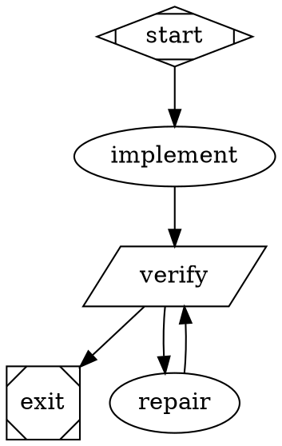

# Fabro execution notes for ThreadX #744

The implemented workflow is `workflow/workflow.toml` with a 15-node, 17-edge graph and six tool-using Codex CLI agent prompts. Fabro command stages invoke `driver.py agent <role>` to run each fresh Codex process; this avoids the native Fabro catalog limitation while honoring the exact requested model. Actual installed CLI validation passed with zero diagnostics. Agents perform issue/dependency planning, source and native test implementation, independent technical review, independent Eclipse/IP review, bounded repair, and PR writing. Deterministic commands admit the task, freeze its complete patch, verify it, gate review hashes, publish a draft, inspect remote checks, and export the contribution artifacts.

## Supported syntax and runtime behavior

- The CLI binary is `/home/jefferson/.fabro/bin/fabro`, version `0.362.0-nightly.0` (`a192bce`, 2026-09-20).
- An ordinary `box`/default node is an agent with built-in shell, file read/write/search and provider-specific edit tools. A `tab` node is one tool-free model call and cannot implement or inspect files by itself.
- External prompts use `prompt="@prompts/name.md"` relative to the graph. TOML inputs bind `{{ inputs.name }}` templates. Native agent registration must include every referenced prompt. The final CLI-backed graph intentionally has no engine prompt node: include the six prompt files explicitly in registration and make them readable by driver.py on the server.
- Shell gates use `shape=parallelogram`, `script`, `timeout`, and `max_retries=0`. Scripts must propagate real failing exits; shell source does not implicitly enable `errexit`/`pipefail`.
- `graph [on_failure="exit"]` stops failed stages. Each recoverable command overrides `on_failure="route"`, has a success-conditioned edge, and an unconditional repair fallback. The installed validator rejects nodes whose outgoing edges are all conditional, even if success and failure are both covered.
- `max_visits=3` bounds the repair node. Every repair returns to a fresh freeze, native verification, and both independent reviews. Frozen patch hashes in review and verification records must match the current source before publication.
- Reviews run sequentially in separate fresh Codex CLI processes, with their own output files and prompts forbidding source, test, verification, and gate mutations. A deterministic gate verifies their JSON verdicts and snapshot hashes. This independent role separation is backed by hash checks; Local does not enforce per-agent filesystem isolation.
- The Local `folder` target executes in place. It has no Fabro Git checkpoints; retry retains files, and fork/rewind are unavailable. It needs an existing canonical server directory.
- `[run.clone] enabled=false` and `[run.run_branch] enabled=false, push=false` avoid platform-owned clones, branches and pushes. The workflow driver owns its explicit issue branch and publication.
- Local environments reject automatic `[run.pull_request] enabled=true`. This workflow explicitly disables it and uses the driver's controlled publisher after snapshot gates.
- Monitor records actual GitHub/Eclipse checks and human/maintainer blockers. Export must retain those blockers rather than claim that a successful local workflow means upstream is ready to merge. A published draft remains a draft pending the required human review and remote requirements.

## Model and provider selection

The user's explicit model choice is Codex Sol 6.1 High. The workflow records `gpt-6.1-sol`, provider `openai-codex`, reasoning effort `high`, and an empty fallback chain. The server's native model catalog/credentials do not offer this model: setting only its name leaves an inherited DeepSeek provider pin and fails the model probe. The final workflow therefore uses command stages to invoke the installed Codex CLI with the exact model and high reasoning setting, using the existing Codex login. No native Fabro model node runs and no fallback model is authorized.

The final command-only workflow passed offline validation with zero diagnostics and existing-server live preflight with `ok=true`; it correctly skips the native LLM probe. Preflight reports an expected empty-native-fallback warning, which does not imply that another model runs. The driver's actual Codex capability probe and execution traces, not this command-only preflight, must establish the requested model works. Preserve actual model/provider/session identity in assistance evidence. Do not guess identity from generic branding.

## Storage and target

Source, builds, logs, and evidence belong on mounted loop4 at:

```
/media/jefferson/11c42dee-73a3-4c2b-ab42-a0440011d9e0/threadx-contributions/744/
```

The intended folder target is its `source` directory. Evidence is its sibling `evidence` directory. Reviewable exported material belongs in this repository's `contributions/threadx-744/artifacts` directory.

Engine persistence is server-owned: `[server.storage].root` / `fabro server start --storage-dir` determine SQLite, engine logs, objects, and run scratch. There is no supported `[run.storage]` setting. Server stanzas inside workflow TOML are schema-valid but inert. The existing server at `http://127.0.0.1:32276/api/v1` stores engine state in `/home/jefferson/.fabro/storage` on the home filesystem; its TMPDIR is already on loop4. To put engine persistence on loop4 as well, run a separate dedicated ThreadX server with a separate config/port/socket and loop4 storage. Command-only orchestration needs no native model API credential; each Codex subprocess uses the already configured CLI login without exposing credentials. Do not relocate or modify existing runs/configuration merely for this task.

## Registration and launch

CLI from the source checkout:

```bash
/home/jefferson/.fabro/bin/fabro validate /home/jefferson/Thinking_CAPs/contributions/threadx-744/workflow/workflow.toml --json --no-upgrade-check
/home/jefferson/.fabro/bin/fabro preflight /home/jefferson/Thinking_CAPs/contributions/threadx-744/workflow/workflow.toml --environment local --json --no-upgrade-check
/home/jefferson/.fabro/bin/fabro run /home/jefferson/Thinking_CAPs/contributions/threadx-744/workflow/workflow.toml --environment local --detach --no-upgrade-check
```

MCP first registers immutable contents, then creates a run:

```javascript
const version = await tools.mcp__fabro__fabro_workflow_version_create({
  entrypoint: "workflow.toml",
  files: {
    "workflow.toml": tomlText,
    "workflow.fabro": graphText,
    "prompts/planner.md": plannerText,
    "prompts/implement.md": implementText,
    "prompts/technical-review.md": technicalText,
    "prompts/process-review.md": processText,
    "prompts/repair.md": repairText,
    "prompts/pr-writer.md": writerText
  }
});
await tools.mcp__fabro__fabro_run_create({ runs: [{
  workflow_version_id: registeredId,
  environment_id: "local",
  target: { kind: "folder", path: loop4SourcePath },
  title: "ThreadX #744: pointer-width-safe stack initialization",
  start: true
}] });
```

The driver and Codex prompt files are real server-local command dependencies; prompt bundling does not copy arbitrary Python scripts automatically. Keep `driver.py` at the graph's referenced path and ensure all deterministic actions exist before starting the run.

## Small valid gate-and-repair pattern



Primary evidence: local Fabro source documentation at `/home/jefferson/fabro/docs/public/execution/run-configuration.mdx`, `execution/environments.mdx`, `workflows/stages-and-nodes.mdx`, `workflows/transitions.mdx`, `agents/prompts.mdx`, `agents/tools.mdx`, `agents/permissions.mdx`, and `administration/server-configuration.mdx`; installed CLI validation and live preflight. No secrets were read or printed for these findings.
