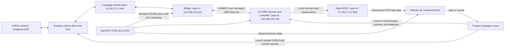

# Autoverse

Autoverse is the X-Verse vehicle integration workspace for the Eclipse SDV Hackathon 2026 Track 2 use case: **Open Vehicle Lifecycle — Drive, Diagnose, Update, Verify**. It supplies the existing CARLA, Eclipse Zenoh, Zenoh–SOME/IP, VCU, and Eclipse S-CORE cruise control environment. The companion hackathon integration adds **Eclipse OpenSOVD diagnosis**, an **Eclipse openDuT testbench**, reproducible fault campaigns, and a **web dashboard for Diagnosis and Test Manager**.

This repository selects vehicle component repositories through [autoverse.repos](autoverse.repos), exposes recipes through [justfile](justfile), and runs the baseline vehicle demo through [run_autoverse.py](run_autoverse.py). The agreed diagnostic/test integration lives in [eclipse_sdv_hackathon_2026][hackathon-repo], alongside this checkout. Its campaign runner and dashboard launch the OpenSOVD/openDuT use case; they are separate from the baseline supervisor.

## Start or resume X-Verse

With the X-Verse environment already provisioned, start the complete vehicle demo with:

```bash
cd "$HOME/autoverse"            # or your checkout, e.g. Thinking_CAPs/demo/X-Verse
python3 run_autoverse.py --enable-camera-display --vcu-zenoh
```

This single command coordinates CARLA, the Zenoh VCU, the Zenoh–SOME/IP bridge, S-CORE ADAS, the OTA vECU (EOL backend + RTCU), Vehicle Manual Control, the virtual vehicle with its camera display, and the Android Cuttlefish cluster. It also starts a Zenoh router when none is running, and the ThreadX AZ3166 lighting ECU when that board is plugged in. There is no need to start these components individually. Press **Ctrl+C** in this terminal to stop the supervised environment, and run the same command to resume it.

The [first-installation reference](#first-installation-reference) below covers acquiring dependencies and provisioning the environment on a new machine. For an existing workspace, continue with the [OpenSOVD/openDuT and web UI guide](#bring-up-the-agreed-opensovdopendut-use-case).

The diagnostic campaigns have their own lifecycle: they start instrumented application instances on the managed openDuT bench and a dedicated CARLA instance. Stop the interactive X-Verse supervisor (it also stops the Zenoh router it started) and any separately started Zenoh router before running that workflow. The router can bind port 7447 on every interface and prevent the campaign listener from starting. OpenSOVD, openDuT, and Vehicle Lab are started by the integration instructions below.

For a fresh installation, follow [Recreate the integration](docs/fresh-workspace.md). It covers source checkout, image/native builds, configuration generation, web UI checks, Android readiness and teardown. The integration is published on `contributions/eclipse-sdv-hackathon`; Autoverse and the CARLA bridge, SOME/IP bridge, S-CORE, Zenoh VCU, OTA vECU and Cuttlefish changes are on the `dev/sdv-hackathon-2026` branch of their repositories.

## Eclipse SDV Hackathon 2026 — Track 2

**Freestyle Track: Integration & Feature Development**

Autoverse provides an integration environment for Track 2 work: developing capabilities, creating interfaces between projects, improving existing functionality, and preparing contributions directly to Eclipse SDV projects. The track encourages contributors to work with project maintainers and community experts. See the [Eclipse Foundation track announcement](https://www.eclipse.org/lists/sdv-wg/msg00870.html).

The agreed work connects the actual S-CORE receiving application to OpenSOVD and exercises its communication and recovery over openDuT. It preserves the existing vehicle control return path and reuses the X-Verse bridge without new bridge features. The contribution includes receiver instrumentation, native OpenSOVD providers, an integration/test example, and a bounded OpenSOVD fault-storage persistence fix prepared for upstream review.

The scope and acceptance criteria are in the [implementation specification][hackathon-spec]. The [dashboard specification][dashboard-spec] adds the browser Diagnosis and Test Manager flows. The [handover][hackathon-handover] records implemented work and later scope decisions. The upstream patch packet remains local preparation; it is not a claim of submission, maintainer acceptance, or merge.

## Agreed use case: drive → disturb → diagnose → update → verify

The goal is to explain a real communication failure at the receiving application, retain its diagnostic history, and produce repeatable evidence across Eclipse S-CORE, OpenSOVD, and openDuT.

| Stage | What the operator demonstrates | Integration involved |
| --- | --- | --- |
| Drive | Vehicle telemetry reaches native S-CORE Cruise Control; its requests return through the existing bridge and VCU to the vehicle | CARLA, Zenoh, VCU, SOME/IP bridge, S-CORE |
| Disturb | The campaign interrupts the owned openDuT-managed network path carrying SOME/IP while management and diagnosis remain reachable | CARL, two EDGAR peers, external campaign runner |
| Diagnose | OpenSOVD exposes actual consumed speed, target, engagement, source identity, and freshness; the receiver monitor reports `CC.LostCommunication` | Receiver instrumentation, independent diagnostic collector, native OpenSOVD App data, fault reporter/DFM |
| Recover | Restored traffic produces held recovery and retains earlier fault evidence; diagnostic process restart is checked independently of the controller | Receiver watchdog, fault lifecycle and persistent storage |
| Update | Invoke the existing AAOS update asset and independently verify installed identity and the intended diagnostic-display change | Agreed follow-up; AAOS/FOTA is currently deferred |
| Verify | Repeat assertions and inspect diagnostic snapshots, packet evidence, return actuation, cleanup, reports, and provenance | Campaign runner and browser Test Manager |

The current implemented demonstration covers **drive → disturb → diagnose → recover → verify**. AAOS/FOTA was later deferred; the README does not treat Cuttlefish startup or APK installation as completion of the agreed update stage.

### OpenSOVD: observe the actual receiver

Minimal S-CORE instrumentation records what the application actually received and accepted. An independent collector maintains a timestamped cache and reports communication loss through the reused OpenSOVD fault reporter and Diagnostic Fault Manager (DFM). HTTP diagnosis reads that cache without blocking the vehicle control loop.

The native OpenSOVD server models the S-CORE component and Cruise Control application. The client discovers the application data resources `cc.observation` and `cc.fault-history`; the latter is an explicitly labelled **App data fallback for fault history**. The selected integration does not claim native `/faults` routes. The monitor's timeout assessment is separate from the application's engagement policy, and unavailable control-output or E2E integrity fields remain unavailable.

### openDuT: carry and disturb the tested traffic

The selected testbench uses a matched, pinned openDuT 0.10.2 release: CARL manages two EDGAR peers and CLEO provides management observations. The peers connect the bridge and S-CORE DUT interfaces through a managed GRE Ethernet path. Captures and receiver/return-path assertions establish that the relevant SOME/IP traffic traverses that path.

This is a local two-peer profile with TLS management, separate diagnostic access, and VPN/OIDC disabled. Campaign execution belongs to the project runner. Native VIPER execution and distributed-site networking are outside the selected implementation.

### Browser dashboard: Diagnosis and Test Manager

The implemented Vehicle Lab dashboard at `http://127.0.0.1:8791` provides:

- **Diagnosis:** discovered OpenSOVD receiver data, source/session identity, freshness, reachability, and communication fault history. Retained values are labelled last observed after an outage.
- **Test Manager:** observed openDuT peers and device interfaces, campaign selection, one authoritative active run per bench, cancellation, and owned-resource cleanup status.
- **Evidence:** original assertion verdicts, timelines, report downloads, artifact integrity checks, and labelled historical replay.

Supported campaigns are `core` (fixture vehicle inputs with real S-CORE/network/diagnostics), `carla` (real CARLA with harness-generated operator requests), and `cleanup-failure` (a deliberate failure used to verify restoration). See the [dashboard operator guide][dashboard-guide].

![Vehicle Lab showing native CARLA receiver diagnosis][diagnosis-screenshot]

Recorded physical-campaign screenshot. Use the walkthrough below to obtain current data in your own session.

### Delivery status

The companion repository records verification of the native receiver, OpenSOVD providers, fault lifecycle/storage, actual openDuT networking, physical CARLA return actuation, and dashboard flows. Those records are saved evidence; a new launch must produce its own result. AAOS/FOTA and second-contributor reproduction are deferred. E2E protection, native OpenSOVD fault/update routes, and VIPER remain conditional. See the [claim/evidence map][claim-evidence] and [handover][hackathon-handover].

## Vehicle baseline and integration components

The vehicle baseline uses the Python Zenoh VCU with the SOME/IP bridge and S-CORE ADAS controller. Vehicle status and driver requests travel through Zenoh and the bridge to S-CORE; controller outputs return through the bridge and VCU to the virtual vehicle. The baseline includes the Android cluster. The hackathon campaigns add receiver diagnosis and controlled network testing around this path without requiring the deferred AAOS/update stage.

| Component | Role | Workspace location |
| --- | --- | --- |
| CARLA simulator and client bridge | Vehicle simulation, telemetry, and actuator application | `~/carla-simulator`, `bridges/carla` |
| Eclipse Zenoh | Communication between vehicle, control, and HMI components | `core/zenoh` and a separately started router |
| Zenoh–SOME/IP bridge | Maps signals between Zenoh topics and SOME/IP services | `bridges/someip/zenoh-someip-bridge` |
| Eclipse S-CORE ADAS | Cruise control application and middleware runtime in a container | `vecu/s-core` |
| Python Zenoh VCU | Driver requests, cruise control engagement, and vehicle commands | `vecu/vcu_zenoh` |
| Python PID controller | Alternative controller for the Zenoh-only mode | `vecu/simulink/pid_controller` |
| Android Automotive cluster | X-Verse digital cluster application in Cuttlefish | `aaos_digital_cluster/cuttlefish_emulator` |
| Eclipse OpenSOVD integration | Native receiver observation providers and fault history | `~/eclipse_sdv_hackathon_2026/OpenSOVD/` |
| Eclipse openDuT testbench | CARL, EDGAR peers, CLEO, and the managed DUT network | `~/eclipse_sdv_hackathon_2026/OpenDut/` |
| ThreadX | Linux-simulated zonal controller for brake/reverse lights over CAN and Zenoh2CAN | `~/eclipse_sdv_hackathon_2026/ThreadX/` |
| AutoSD | QEMU/KVM vehicle computer hosting ThreadX/Zenoh2CAN, native OpenSOVD lighting resources and optional managed openDuT Ethernet | `~/eclipse_sdv_hackathon_2026/AutoSD/` |
| Campaign runner | Controlled disturbance, diagnostic/regression assertions, cleanup, and evidence | `~/eclipse_sdv_hackathon_2026/scripts/run_campaign.py` |
| Vehicle Lab dashboard | OpenSOVD Diagnosis and Test Manager over the openDuT bench | `~/eclipse_sdv_hackathon_2026/integration/dashboard` |

The [ThreadX lighting controller][threadx-guide] can replace the Zephyr BCM's brake/reverse function. Its Linux emulator and a dedicated Zenoh2CAN bridge profile run alongside the baseline; the supervisor does not start them.

The [AutoSD setup guide][autosd-guide] deploys that controller and gateway inside a real AutoSD VM. It includes image verification, guest provisioning, native OpenSOVD lighting inspection, fixture and actual CARLA light tests, and an optional openDuT-managed Ethernet/GRE profile. Start its guest services before the baseline so they receive the VCU's initial state. Use one lighting controller at a time.

The workspace also imports CAN, ROS 2, FreeRTOS VCU, and Zephyr BCM repositories. Their presence in the manifest does not mean the supervisor starts them. In particular, the CAN bridge and CAN VCU must currently be launched separately.

The [hackathon architecture](UseCases/SDV_Hackathon_2026/Architecture/Cruise_Control.drawio), [message map](UseCases/SDV_Hackathon_2026/Architecture/message_map.xlsx), and [diagnostic integration specification][hackathon-spec] describe the wider use case. The following guide launches the agreed OpenSOVD/openDuT integration; the vehicle baseline setup follows it.

## How CARLA, OpenSOVD, openDuT, and the web UI connect

The supported integration is launched by the **physical campaign**. It creates a dedicated CARLA instance, loads the existing X-Verse vehicle and VCU classes, starts the bridge and instrumented S-CORE application on the openDuT bench, and starts the native OpenSOVD provider. The dashboard launches and observes that campaign. The current integration does not attach itself automatically to an arbitrary vehicle stack already running under `run_autoverse.py`.



| Connection | Exact configuration in the selected profile | Who makes it |
| --- | --- | --- |
| Vehicle client → CARLA | `127.0.0.1:2100`; the campaign reserves ports 2100–2102 | `scripts/owned_carla.py`, using `carla.root` and `carla.port` from campaign JSON |
| Vehicle/VCU ↔ Zenoh | Campaign peer listens on `tcp/172.30.77.1:7447`; vehicle and VCU connect to it | Native campaign and existing X-Verse classes |
| Bridge ↔ Zenoh | `ZENOH_MODE=peer`, `ZENOH_CONNECT=tcp/172.30.77.1:7447` | Campaign launches bridge in peer A's network namespace |
| Bridge ↔ S-CORE | DUT addresses `192.168.123.101` and `.102`; SOME/IP-SD UDP 30490 and event UDP 30511/30513 | Generated vSomeIP/gateway overlays; openDuT connects `dut0` interfaces through `br-opendut` and GRE |
| Receiver → OpenSOVD collector | `SCORE_DIAGNOSTIC_SOCKET=/tmp/receiver.sock`; shared **only between S-CORE and diagnosis on peer B** | Exported receiver patch and campaign bind mounts |
| Dashboard → OpenSOVD | `diagnostic_base=http://172.30.77.12:7691/sovd`; discover from `/sovd/v1` | Dashboard's server-side Diagnosis adapter |
| EDGAR/CLEO → CARL | `carl:8080`, local TLS; CARL management address `172.30.77.10` | Bench preparation, certificates, and enrollment |
| Dashboard → openDuT | Campaign `state` points to the bench's `deployment.json`; backend queries CLEO and interfaces in the owned peers | Dashboard Test Manager adapter |
| Browser → dashboard | `http://127.0.0.1:8791`; browser uses the dashboard's `/api/state` and run APIs | `scripts/run_dashboard.py` |

Management uses `172.30.77.0/24`; SOME/IP DUT traffic uses `192.168.123.0/24`. The campaign interrupts the GRE link carrying SOME/IP, preserving the separate OpenSOVD HTTP path. This separation lets the UI show a reachable diagnostic service **and stale vehicle input** at the same time.

Input mappings retain service/instance `4660/1` and events 30500–30503. Controller outputs retain service/instance `3000/1` and events 30600/30601, returning on `adas/cruise_control/target_speed` and the existing spelling `adas/cruise_control/thruttle_req`. Network overlays set UDP reliability and output major version 0 to match the unchanged bridge subscription. The runner generates and mounts those overlays; do not rewrite the bridge source or share its local `/tmp` across both DUTs.

The physical campaign runs CARLA off-screen with automated pedal/engagement/steering requests. The web UI shows diagnosis and test evidence; it has no driving controls or CARLA camera viewer. The baseline camera/manual-control mode is documented separately below.

## Bring up the agreed OpenSOVD/openDuT use case

These commands run from the **companion integration repository**, `eclipse_sdv_hackathon_2026`, under the selected workspace. They use its pinned native assets and private configuration. The [reproduction guide][hackathon-reproduction] defines the build inputs and current reproduction limits.

Set `SDV_WORKSPACE` to the parent directory containing both repositories. The commands default to your home directory; use a filesystem that supports symbolic links and executable permissions:

```bash
export SDV_WORKSPACE="${SDV_WORKSPACE:-$HOME}"
mkdir -p "$SDV_WORKSPACE"
```

The integration steps below use `~/autoverse`; the baseline supervisor itself runs from any checkout location. For an isolated second workspace, the [workspace isolation steps](docs/fresh-workspace.md#9-prepare-and-check-the-complete-supervisor) provide the required filesystem namespace and container/image overrides. Run one baseline or managed campaign at a time: they share ports, Docker resources and the testbench network profile.

### 1. Prepare the vehicle assets and integration checkout

Provision CARLA, S-CORE and the bridge using the [first-installation reference](#first-installation-reference) or the [fresh setup guide](docs/fresh-workspace.md). Once provisioned, X-Verse starts with the single command in [Start or resume X-Verse](#start-or-resume-x-verse). Cuttlefish is not required for the diagnostic campaigns.

Keep the baseline supervisor stopped while running the managed campaign. Also stop the independently launched baseline router in its terminal, or, if you created the named container from the baseline guide:

```bash
docker stop autoverse-zenoh-router
```

Run this command only for that router, if it exists. The campaign deploys its own application instances and network configuration; launching `run_autoverse.py` alone does not start OpenSOVD or openDuT.

If the integration checkout is not already present, follow the [source checkout steps](docs/fresh-workspace.md#1-obtain-the-current-sources), or verify the published branch before cloning:

```bash
git ls-remote --exit-code --heads \
  git@github.com:The-Xverse/eclipse_sdv_hackathon_2026.git \
  contributions/eclipse-sdv-hackathon

# Continue only if the command above prints the branch revision.
cd "$SDV_WORKSPACE"
git clone --branch contributions/eclipse-sdv-hackathon \
  git@github.com:The-Xverse/eclipse_sdv_hackathon_2026.git
```

Install its Python dependencies in a dedicated environment. The host needs `python3-venv` (included in the host-tool installation below). Keep `LAB_PYTHON` set in this terminal:

```bash
cd "$SDV_WORKSPACE/eclipse_sdv_hackathon_2026"
/usr/bin/python3 -m venv .venv
export LAB_PYTHON="$PWD/.venv/bin/python"
"$LAB_PYTHON" -m pip install -r requirements-core.txt

# Also needed for the physical CARLA campaign:
"$LAB_PYTHON" -m pip install -r requirements-carla.txt
```

Native rebuilding also needs the selected Rust and LLVM toolchains, S-CORE development/runtime images, bridge image and Bazel volume. The [native image build steps](docs/fresh-workspace.md#3-build-native-runtime-and-development-images) and [cache/configuration steps](docs/fresh-workspace.md#4-create-the-cache-and-native-build-configuration) prepare those inputs. Resolve image IDs from images built or installed on your machine.

### 2. Prepare and deploy the openDuT bench

Run steps 2–4 in the same terminal so that `SDV_WORKSPACE`, `LAB_PYTHON` and `LAB_DIR` remain set. Create a new private session directory; all generated configuration, bench state, dashboard state, and setup results will stay together:

```bash
cd "$SDV_WORKSPACE/eclipse_sdv_hackathon_2026"
mkdir -p .local
export LAB_DIR="$(mktemp -d "$PWD/.local/vehicle-lab-XXXXXX")"
printf 'This session uses LAB_DIR=%s\n' "$LAB_DIR"

"$LAB_PYTHON" OpenDut/scripts/opendut_testbench.py prepare \
  --state "$LAB_DIR/bench" \
  --output "$LAB_DIR/bench-prepare"
"$LAB_PYTHON" OpenDut/scripts/opendut_testbench.py up \
  --state "$LAB_DIR/bench" \
  --output "$LAB_DIR/bench-up"
"$LAB_PYTHON" OpenDut/scripts/opendut_testbench.py status \
  --state "$LAB_DIR/bench" \
  --output "$LAB_DIR/bench-status"
```

The helper acquires the pinned CARL/EDGAR/CLEO assets, prepares local TLS/enrollment, and deploys the two-peer network. A ready bench has **two `Connected` peers**, a deployed cluster, and each `dut0` attached to `br-opendut` with a managed GRE interface. Its peer containers need `NET_ADMIN`. This profile reserves `172.30.77.0/24` for management and `192.168.123.0/24` for DUT traffic; startup rejects overlapping networks. Certificates expire after seven days. See the [testbench configuration][testbench-guide].

### 3. Connect the campaign and dashboard configuration

Generate the campaign configuration using the [native build configuration steps](docs/fresh-workspace.md#4-create-the-cache-and-native-build-configuration). Use the same `LAB_DIR` as the bench above. Set the paths, image references and compiler inputs for your installation; do not copy paths or image IDs from a historical run.

| Configuration | Required input |
| --- | --- |
| `state` | Absolute path to `"$LAB_DIR/bench"` |
| `baseline_source`, `bridge_source` | S-CORE source subdirectory and bridge checkout in your workspace |
| `score_image`, `bridge_image`, `score_build_image` | Immutable IDs resolved from your runtime and build images |
| `bazel_volume` | Docker volume for the native compiler/cache inputs |
| `expected_rustc`, `llvm_repository` | Selected Rust compiler identity and LLVM repository path inside the build container |
| `carla` | Simulator installation, dedicated port, vehicle/VCU modules, signals and Vulkan configuration |
| `binary`, `score_source`, `flatc`, `gateway_schema` | Generated by native reproduction; use the resulting configuration after building |

The physical campaign uses CARLA 0.9.15 on RPC port 2100 by default. Reserve that port and the next two ports, install the matching CARLA Python package, and select a compatible Vulkan driver. The campaign starts its server and Zenoh peer itself.

Build the native integration with the generated configuration:

```bash
"$LAB_PYTHON" scripts/reproduce_core.py \
  --config "$LAB_DIR/campaign.json" \
  --state "$LAB_DIR/native-build" \
  --output "$LAB_DIR/reproduction"
```

The helper freezes the committed integration revision, creates isolated S-CORE and bridge checkouts, applies the exported receiver patch, builds the native controller and OpenSOVD diagnostic/fault profile, runs its checks, and executes the core campaign. It preserves the original component checkouts. The exported fault-storage patch and its separate build lock are part of this native fault profile.

After a successful run, use its generated configuration containing the actual new binary and tool paths:

```bash
cp "$LAB_DIR/reproduction/reproduction-inputs.json" "$LAB_DIR/campaign.json"
```

After rebuilding, generate the dashboard configuration for the current session:

```bash
"$LAB_PYTHON" - <<'PY'
import json
import os
from pathlib import Path
session = Path(os.environ['LAB_DIR']).resolve()
config = {
    'schema_version': 1,
    'state_dir': str(session / 'dashboard-state'),
    'campaign_config': str(session / 'campaign.json'),
    'python': os.environ['LAB_PYTHON'],
    'diagnostic_base': 'http://172.30.77.12:7691/sovd',
    'historical': [],
}
(session / 'dashboard.json').write_text(json.dumps(config, indent=2) + '\n')
PY
```

Keep the generated manifests with the results; they record the source revisions, compiler identities and binary paths used by the run.

### 4. Launch Diagnosis and Test Manager

The generated dashboard configuration already connects diagnosis to OpenSOVD and Test Manager to the campaign's openDuT state. Start the service and leave this terminal open:

```bash
"$LAB_PYTHON" scripts/run_dashboard.py \
  --config "$LAB_DIR/dashboard.json" \
  --port 8791
```

Open **`http://127.0.0.1:8791`**. If that port already belongs to another dashboard, use `--port 8792` and open `http://127.0.0.1:8792`; keep the URL consistent in subsequent checks. For remote access, forward the selected port with SSH and open the forwarded localhost URL. The service binds to localhost.

Before a campaign, the expected UI state is **Dashboard connected**, **Bench available**, and **Current run: idle**. Diagnosis can show **unavailable / unknown** because the campaign has not yet started the native provider. This is expected; the dashboard does not itself keep CARLA or OpenSOVD running between tests.

### 5. Exercise the agreed scenario

1. Click **02 Test Manager** in the left navigation.
2. In **Managed testbench**, verify the two connected peers and open **Device attachments and interfaces** to inspect `dut0`, `br-opendut`, and GRE links.
3. In **Launch campaign → Campaign**, select **CARLA physical campaign**. Check **Prerequisites**; resolve any missing inputs before treating the run as a vehicle test.
4. Click **Start campaign** once. **Current run** shows the UUID, campaign, evidence mode, and queued/running state. The runner starts the owned CARLA server, bridge, native controller, and OpenSOVD provider.
5. Click **01 Diagnosis** while the campaign runs. Observe consumed speed, target, engagement, freshness, source identity, and communication fault assessment. Use the expected-state table below to interpret each phase.
6. Return to **02 Test Manager**. In **Evidence library → Select a run**, choose the UUID from **Current run**. Check **Runner verdict**, assertion rows, **Cleanup outcome**, and the report links under **Reports and provenance**.

The default setup registers no historical runs, so the first visible evidence is generated by your campaign. Closing or reloading the browser does not cancel a run; reconnect and verify its UUID. The dashboard supports one campaign per bench.

For command-line execution, run from the integration checkout when the bench is idle:

```bash
"$LAB_PYTHON" scripts/run_campaign.py \
  --config "$LAB_DIR/campaign.json" \
  --scenario carla \
  --output evidence/readme-physical-demo
```

For CLI execution in another terminal, restore `SDV_WORKSPACE`, set `LAB_PYTHON` to that integration checkout's `.venv/bin/python`, and set `LAB_DIR` to the absolute session path printed in step 2. Use a new output directory on every run. Dashboard and CLI campaigns share the bench lock. The following section gives the test scenarios and expected results.

Observe the following evidence in the dashboard or generated reports:

1. Fresh receiver data and a working control return path. The physical campaign uses real CARLA with harness-generated pedal, engagement, and steering requests.
2. Interruption of the owned SOME/IP network path while receiver heartbeat and diagnostic HTTP remain available.
3. Receiver freshness expiry and a debounced `CC.LostCommunication` report, without inventing a physical root cause or automatic controller disengagement.
4. Restored accepted samples, held fault recovery, and retained history.
5. Diagnostic/DFM restart and history persistence; diagnosis can fail independently while the vehicle control path continues.
6. Original assertion verdicts and successful restoration of test-owned resources. Inspect `results.json`, `junit.xml`, `summary.md`, `timeline.jsonl`, and the native observations/packet records.

The runner returns `0` when selected checks pass, `1` for failure or cleanup errors, and `2` for missing prerequisites. Deferred or conditional checks are skipped rather than counted as passes. A saved replay remains historical evidence.

### 6. Stop the dashboard and tear down the bench

Cancel an active campaign with **Request cancellation** and wait for its terminal status and cleanup acknowledgment. Stop the dashboard with `Ctrl+C`, then tear down the bench in the setup terminal (where `LAB_DIR` is still set):

```bash
cd "$SDV_WORKSPACE/eclipse_sdv_hackathon_2026"
"$LAB_PYTHON" OpenDut/scripts/opendut_testbench.py down \
  --state "$LAB_DIR/bench" \
  --output "$LAB_DIR/bench-down"
```

The campaign restores its owned application/network changes; bench teardown removes only resources carrying its ownership labels. Keep the private state and evidence for inspection, especially after failed or unknown cleanup. The baseline containers are outside this profile.

To return to the interactive X-Verse demo after the campaign and bench have stopped, restart the standalone router from baseline step 4, then run:

```bash
cd "$HOME/autoverse"
python3 run_autoverse.py --enable-camera-display --vcu-zenoh
```

## Read the web UI and test the integration

### Diagnosis: what each panel means

Select **01 Diagnosis**. This view reads the configured OpenSOVD provider; the browser does not connect directly to CARLA or EDGAR.

| UI panel or field | What to inspect |
| --- | --- |
| **Receiver diagnosis → service status** | `available` means a current OpenSOVD observation was acquired. It does not mean vehicle data is fresh. |
| **Consumed speed / Target speed** | Actual receiver/controller values and reported units, rather than a value inferred solely from a Zenoh publisher. |
| **Engagement** | Reported controller state. Communication fault recovery does not itself prove automatic re-engagement. |
| **Control output** | Deliberately `Unavailable` in this observation contract. Verify physical return actuation through campaign assertions and saved native evidence. |
| **Observation health** | Receiver availability, speed freshness, accepted sample age, heartbeat age, clock, and accepted timestamp. A live receiver can have stale speed data. |
| **Communication fault** | History availability, monitor assessment, `Test failed`, occurrence count, timestamps, and storage acknowledgment. The monitor-derived assessment and persisted fault query are separate. |
| **Receiver provenance** | Source instance, receiver session, software identity, host boot ID, acceptance kind, and available integrity/sample metadata. |

The UI polls every 500 ms. Some fault/recovery phases are brief; the captured timeline and original assertions preserve them even if an operator misses a visible transition.

| Campaign phase | Expected UI / evidence |
| --- | --- |
| Before launch / before the first sample | Diagnosis `unavailable` or freshness `unknown`; no default healthy state |
| Nominal driving | Service `available`, speed freshness `fresh`, changing consumed speed, communication assessment `healthy` |
| Managed link loss | Service remains `available`; heartbeat continues; accepted sample age increases; speed becomes `stale`; fault assessment becomes `failed` and `Test failed` is true |
| Diagnostic stall or diagnostic/DFM restart | Diagnosis becomes unavailable and values are labelled last observed; controller return traffic is checked independently |
| Traffic restored | Fresh accepted samples return; assessment passes through `pending_recovery` and returns to `healthy`; stored occurrence/history remains |
| Receiver collector stopped | Source assessment becomes `unknown`; retained fault history is not discarded |
| Campaign finished and apps cleaned up | Diagnosis becomes unavailable again; the completed result remains in **Evidence library** |

### Test Manager: run, cancel, and inspect evidence

![Vehicle Lab Test Manager and evidence library][test-manager-screenshot]

Recorded UI layout with historical evidence selected; this image is not a live bench status.

Select **02 Test Manager** and use these controls:

| Control | Operator action and expected result |
| --- | --- |
| **Managed testbench** | Check bench availability, peer cards, profile, and acquisition time. Expand **Device attachments and interfaces** to inspect actual devices and links. |
| **Launch campaign → Campaign** | Choose **CARLA physical campaign**, **Native receiver · fixture inputs**, or **Cleanup failure acceptance**. The evidence mode is shown below the selection. |
| **Prerequisites** | Read missing binaries/source/bench inputs. A missing prerequisite can produce `blocked`; it cannot establish a passed vehicle test. The runner also checks executable inputs. |
| **Start campaign** | Start one authoritative run. Repeated clicks, a second browser, or reload do not create a second simultaneous run. |
| **Current run** | Follow UUID, campaign, queued/running/cancelling state, cancellation request, cleanup status, and progress timeline. |
| **Request cancellation** | Request termination of the owned runner. Wait for `cancelled` and the separate cleanup outcome. A cancellation is never a passed run. |
| **Evidence library → Select a run** | Select a completed UUID to see its original verdict, reasons, assertion table, cleanup, and evidence mode. |
| **Reports and provenance** | Download verified `results.json`, `junit.xml`, `summary.md`, manifests, timelines, and registered native records. Missing or mismatched artifacts are labelled and do not become verified downloads. |
| **Captured timeline and observation / Run manifest** | Expand details to connect displayed verdicts with recorded events, observations, input identities, and timestamps. |
| **Open historical replay** | Available only for a registered, verified replay. New sessions with `historical: []` have no replay button until a replay is explicitly registered. |

### Run the test cases

Use a deployed bench and the session configuration from the setup guide. Run one campaign at a time. UI results are stored under `"$LAB_DIR/dashboard-state/runs/<run-UUID>/"`; CLI results go to the `--output` directory you choose.

| Test | UI selection / CLI scenario | Required result |
| --- | --- | --- |
| Native integration without GPU simulation | **Native receiver · fixture inputs** / `core` | Real S-CORE receiver, real OpenSOVD fault lifecycle, actual openDuT traffic and recovery; explicitly fixture vehicle input |
| Physical vehicle integration | **CARLA physical campaign** / `carla` | Actual moving CARLA actor, native controller return via VCU to applied throttle, plus the native diagnostic/network scenarios |
| Deliberate failure and restoration | **Cleanup failure acceptance** / `cleanup-failure` | The expected injected child failure occurs and all owned resources are restored. A passed restoration check does not mean the deliberately failed vehicle campaign passed. |
| Operator cancellation | Start a second campaign, wait for live receiver data, then **Request cancellation** | Final state `cancelled`, cleanup separately `passed`; admission remains inhibited if cleanup is missing or failed |
| Browser reconnection | Reload or open another browser during a running campaign | The same UUID remains active; closing the browser does not cancel the runner |
| Missing prerequisites | Select a scenario with an unavailable input or stopped bench | `blocked` with a reason; no successful vehicle verdict |

The `core` and `carla` campaigns include the following named scenarios from `tests/campaigns/core.json`:

| Scenario | What is checked |
| --- | --- |
| **T01 Nominal actual receiver** | Receiver consumption, actual controller identity, nominal native DFM, engagement, and control return through openDuT |
| **T02 Startup** | Unknown before the first observation; no fabricated healthy fault state |
| **T03 Managed stream loss** | Measured cadence, stale accepted input, reachable management/diagnosis, native stored/queryable failed fault, detector timing, and source attribution |
| **T04 Held recovery** | Restored consumption, retained history, and separation of controller engagement from monitor recovery |
| **T05 Diagnostic stall** | Diagnostic HTTP becomes unavailable while actual control returns continue, then resumes |
| **T06 Collector disconnected** | Unknown source assessment with retained history |
| **T11 Native history process restart** | Separate diagnostic/DFM process reloads stored occurrence/environment and shuts down its IPC cleanly |
| **CARLA**, physical selection only | Moving actor, applied return actuation, sampled native→VCU→actor throttle correlation, and owned CARLA cleanup |

For CLI runs, set `LAB_DIR` in the terminal to your printed session directory, then run:

```bash
cd "$SDV_WORKSPACE/eclipse_sdv_hackathon_2026"
"$LAB_PYTHON" scripts/run_campaign.py \
  --config "$LAB_DIR/campaign.json" --scenario core \
  --output "$LAB_DIR/core-check"
"$LAB_PYTHON" scripts/run_campaign.py \
  --config "$LAB_DIR/campaign.json" --scenario carla \
  --output "$LAB_DIR/carla-check"
"$LAB_PYTHON" scripts/run_campaign.py \
  --config "$LAB_DIR/campaign.json" --scenario cleanup-failure \
  --output "$LAB_DIR/cleanup-check"
```

Use fresh output paths if repeating these commands. Inspect both the top-level verdict and native assertion/cleanup rows:

```bash
"$LAB_PYTHON" - <<'PY'
import json
import os
from pathlib import Path
output = Path(os.environ['LAB_DIR']) / 'carla-check'
result = json.loads((output / 'results.json').read_text())
native = json.loads((output / 'native/results.json').read_text())
print('Runner verdict:', result['status'])
for row in result['scenarios']:
    print(row['id'], row['status'])
print('Native assertions:', len(native['checks']))
print('Non-passing native checks:', [r for r in native['checks'] if r['status'] != 'passed'])
correlation = json.loads((output / 'native/carla-control-return.json').read_text())
print('Native/VCU/actor throttle matches:', correlation['match_count'])
PY
```

The physical return-correlation file is available in the local run directory; it is not currently an allowlisted dashboard download. The reference campaign requires at least 20 sampled matches. It does not claim an E2E sample identifier or a guaranteed latency.

### Check OpenSOVD directly while a campaign is running

Run this in another terminal during live diagnosis. Discovery follows the advertised application/data links rather than guessing a `/faults` route:

```bash
"$LAB_PYTHON" - <<'PY'
import json
import urllib.parse
import urllib.request
opener = urllib.request.build_opener(urllib.request.ProxyHandler({}))
def get(uri):
    with opener.open(uri, timeout=2) as response:
        return json.load(response)
root = get('http://172.30.77.12:7691/sovd/v1')
apps = get(root['apps'])['items']
app = get(next(item['href'] for item in apps if item['id'] == 'cruise-control'))
resources = get(app['data'])['items']
for item in resources:
    if item['id'] in ('cc.observation', 'cc.fault-history'):
        uri = app['data'] + '/' + urllib.parse.quote(item['id'], safe='')
        print(item['id'], uri)
        print(json.dumps(get(uri)['data']['value'], indent=2))
PY
```

`cc.observation` contains actual receiver state/provenance and freshness. `cc.fault-history` contains the native fault report/query/storage evidence through App data. Connection failures are expected before launch, during the diagnostic-stall/restart tests, and after cleanup.

### Check the openDuT side directly

The following queries the owned peer selected by the session, without assuming a fixed container name:

```bash
export LAB_PEER_A="$("$LAB_PYTHON" -c \
  'import json,os; from pathlib import Path; p=Path(os.environ["LAB_DIR"])/"bench/deployment.json"; print(json.loads(p.read_text())["project"]+"-a")')"
docker exec "$LAB_PEER_A" /cleo/opendut-cleo list --output json peers
docker exec "$LAB_PEER_A" /cleo/opendut-cleo list --output json devices
docker exec "$LAB_PEER_A" ip -d link show
```

Look for the two `Connected` peers, registered device attachments, and `dut0`/GRE interfaces on `br-opendut`. Peer connectivity or ping alone is insufficient: the campaign's **receiver-through-opendut**, **control-return-through-opendut**, and packet-record assertions establish the application path. Let the runner perform fault injection and restoration; do not manually drop an unrelated host interface.

### Check dashboard and diagnostic components without a vehicle campaign

```bash
cd "$SDV_WORKSPACE/eclipse_sdv_hackathon_2026"
"$LAB_PYTHON" -B -m unittest discover -s tests -p 'test_*.py' -v
"$LAB_PYTHON" -B OpenSOVD/tests/dashboard_diagnosis_smoke.py \
  --binary "$("$LAB_PYTHON" -c 'import json,os; from pathlib import Path; print(json.loads((Path(os.environ["LAB_DIR"])/"campaign.json").read_text())["binary"])')" \
  --output "$LAB_DIR/provider-check"
```

The unit suite exercises run admission, cancellation, persisted state, and report integrity. The provider smoke test uses synthetic observations with the native OpenSOVD binary; it checks diagnosis behavior without establishing CARLA/openDuT acceptance. The physical campaign supplies that integration check.

### Diagnose a failed bring-up

| Symptom | What to check |
| --- | --- |
| `Address already in use` starting the dashboard | Choose another free UI port, such as 8792, and use its matching browser URL |
| **Bench unavailable** | Confirm `campaign.json → state` points to this session's deployed bench; query its `deployment.json` and owned CARL/peer containers |
| **Prerequisites** lists missing `binary` or source | Use the validated native build configuration or complete native reproduction; do not use an uninstrumented controller source as `score_source` |
| CARLA run is `blocked` | Inspect the run's reason and local `native/carla-server.log`/`vulkan-probe.txt`; check API version, GPU/driver, and free dedicated ports |
| `receiver-through-opendut` fails before nominal diagnosis | The runner continues publishing real inputs for a bounded service-discovery window before asserting acceptance. Keep failed evidence and inspect `native/receiver.txt`, `someipd.txt`, `bridge.txt` and `requests.json` if readiness still fails. |
| Cancellation during startup leaves cleanup `unknown` | Use the current integration branch, which records the actual application cleanup inventory. Missing/failed cleanup blocks admission. Preserve failed ledgers; restarting does not rewrite their verdicts. |
| **Diagnosis unavailable** while the bench is available | Start a campaign; then check its owned `-diag` container and `172.30.77.12:7691`. Availability also drops intentionally during stall/restart scenarios. |
| Fresh Zenoh publishing but stale receiver data | Inspect bridge/S-CORE overlays, DUT transport, service/version/reliability negotiation, and the campaign packet records |
| **Control output: Unavailable** | Expected UI contract; inspect return-path assertions and `native/carla-control-return.json` |
| Run remains active after a browser closes | Expected behavior; reconnect to the same dashboard and UUID to observe or cancel it |
| Cancellation/cleanup is `unknown` or `failed` | Keep the ledger and artifacts, inspect owned resources, and reconcile cleanup; do not clear state to manufacture an idle/passed bench |

## First-installation reference

This section is for preparing a new machine or working on individual components. Once provisioning is complete, use `python3 run_autoverse.py --enable-camera-display --vcu-zenoh` to start or resume X-Verse.

### Vehicle baseline prerequisites

The steps below target **Ubuntu 22.04 on x86-64**, with its system Python 3.10 and a graphical desktop. The bridge uses prebuilt Linux x86-64 libraries.

You need:

- GitHub SSH access, because the component manifest uses SSH repository URLs.
- Docker Engine and the Docker Compose plugin, usable by your normal user.
- Hardware virtualization and an accessible `/dev/kvm` for Android Cuttlefish. See the [Android Cuttlefish prerequisites](https://source.android.com/docs/devices/cuttlefish/get-started).
- A compatible GPU and driver for local CARLA simulation. The supervisor's local server recipe selects NVIDIA; use an external server or mock mode when appropriate.
- Internet access and space for CARLA, Android artifacts, container images, and S-CORE build outputs.

A Logitech G920 wheel is optional; Vehicle Manual Control supports keyboard input. Mock mode removes the CARLA server requirement, but the supervisor still starts Cuttlefish and graphical client interfaces.

The commands below use **`~/autoverse`**; substitute your checkout path if it lives elsewhere. `run_autoverse.py` resolves every component from its own location, so any directory works, including the copy inside the Thinking_CAPs repository (`Thinking_CAPs/demo/X-Verse`, see step 2).

### Provision the vehicle components

### 1. Install host tools

```bash
sudo apt update
sudo apt install -y git git-lfs curl wget unzip python3-pip python3-venv x11-xserver-utils xdg-utils adb ripgrep bubblewrap

/usr/bin/python3 -m pip install --user rust-just vcstool
export PATH="$HOME/.local/bin:/usr/bin:$PATH"

git lfs install
just --version
vcs --help
pip --version
```

Keep this `PATH` available in subsequent terminals. The installation recipes call `pip` and the client recipes call `python3`; check that both use the intended system Python environment.

Install Docker Engine and its Compose plugin using the [official Ubuntu instructions](https://docs.docker.com/engine/install/ubuntu/), including the linked steps for access by your normal user. Verify access before building components:

```bash
docker info
docker compose version
test -e /dev/kvm && ls -l /dev/kvm
```

If `/dev/kvm` is missing, enable virtualization on the host before proceeding with Cuttlefish. A VM also needs nested virtualization support.

### 2. Clone the hackathon branch and import components

```bash
cd "$HOME"
git clone --branch dev/sdv-hackathon-2026 git@github.com:The-Xverse/autoverse.git
cd "$HOME/autoverse"

vcs import . < autoverse.repos
/usr/bin/python3 -m pip install --user -r requirements.txt

just check-host
just --list
```

**From the Thinking_CAPs repository.** Thinking_CAPs carries an exact copy of this branch in `demo/X-Verse` (it is not edited there; changes are made here and synced). Its ThreadX lighting controller sits next to it in `ThreadX/`, where the launcher finds it. The components are imported the same way:

```bash
git clone git@github.com:Eclipse-SDV-Hackathon-Chapter-Four/Thinking_CAPs.git
cd Thinking_CAPs/demo/X-Verse
vcs import . < autoverse.repos
```

[autoverse.repos](autoverse.repos) is the source of truth for component branches and tags. The CARLA bridge, SOME/IP bridge, S-CORE, Zenoh VCU, OTA vECU and Cuttlefish use the hackathon branch; other components use the versions listed in the manifest. Access to the The-Xverse repositories over SSH is required.

For an existing workspace, check local changes in the component repositories before updating them. Import any newly added repositories and pull the nested repositories:

```bash
cd "$HOME/autoverse"
vcs status --nested
vcs import . < autoverse.repos
vcs pull --nested
```

`vcs import` does not switch an existing checkout to a different branch or tag. If a manifest entry changes its version, select that revision in the affected component repository before pulling. Preserve local component work when doing so.

### 3. Install Zenoh and the CARLA client environment

```bash
cd "$HOME/autoverse"
just install-zenoh
just install-client
```

These recipes install the Zenoh Python API and the CARLA client dependencies, including Pygame, NumPy, Matplotlib, and evdev. They also prepare `~/zenoh-python` and `~/carla-api`, which the client recipes use. Run the client setup for mock mode too, because those recipes copy the virtual vehicle scripts into `~/carla-api/PythonAPI/examples`.

For a local CARLA server, also run:

```bash
# Download the matching 0.9.15 archive from the official release endpoint.
curl --fail --location --retry 3 \
  https://downloads.carlasim.com/Linux/CARLA_0.9.15.tar.gz \
  --output "$HOME/CARLA_0.9.15.tar.gz.part"
mv "$HOME/CARLA_0.9.15.tar.gz.part" "$HOME/CARLA_0.9.15.tar.gz"
just install-server
```

Skip server installation when using an existing external CARLA server or mock mode. The CARLA Python API must match the server version. Check `bridges/carla/just/carla-common.just` for the recipe's selected release; do not mix a server installed independently with a different API release. The [official 0.9.15 release](https://github.com/carla-simulator/carla/releases/tag/0.9.15) supplies the archive above. The recipe verifies MD5 `32fa681fb925cd62951a63977582ea8c` before extraction.

Verify the selected interpreter:

```bash
/usr/bin/python3 -c 'import psutil, pygame, numpy, matplotlib, zenoh, evdev, carla; print("Python dependencies ready")'
```

`requirements.txt` contains only the supervisor dependency, `psutil`. The launcher checks component imports before stopping or starting modules. It tries its current Python and then `/usr/bin/python3`; `--python` or `AUTOVERSE_PYTHON` selects an interpreter explicitly.

### 4. Start a local Zenoh router

The vehicle clients and bridge connect to `tcp/127.0.0.1:7447`. `run_autoverse.py` starts a router as its first step (Docker container `autoverse-zenoh-router`, image `eclipse/zenoh:1.3.4`) when nothing answers on that port, and stops it again at shutdown. A router that already owns the port is reused and left alone. Set `AUTOVERSE_ZENOH_ROUTER=0` to never start one, or `ZENOH_ROUTER_IMAGE` to use another image. To run a router yourself instead, start it in a separate terminal and leave it running:

```bash
docker run --init --rm --name autoverse-zenoh-router \
  --network host eclipse/zenoh:1.3.4
```

This uses the version selected by the checked-in Zenoh Python installation recipe. When changing the workspace's Zenoh versions, review the router version too. Host networking supports local peer discovery; see the [Zenoh Docker guide](https://zenoh.io/docs/getting-started/quick-test/).

Test communication from two more terminals. Start the subscriber first:

```bash
cd "$HOME/autoverse"
just run-subscriber 'demo/**'
```

Then publish:

```bash
cd "$HOME/autoverse"
just run-publisher demo/example/test 'Hello Autoverse' 10 1.0
```

The subscriber should receive the messages. Stop these test commands with `Ctrl+C`, keeping the router running for the demo.

### 5. Prepare the Zenoh–SOME/IP bridge

This step is needed for the S-CORE modes. Skip it for `--only-zenoh-modules`.

```bash
cd "$HOME/autoverse/bridges/someip/zenoh-someip-bridge"
git lfs pull
./scripts/ctl.sh up
./scripts/ctl.sh stop
```

`up` builds the image and creates the bridge container; `stop` leaves it ready for the supervisor to resume. Git LFS must fetch the actual shared libraries before the image build. The default container name is `bridge-e2e`.

See the [bridge documentation](bridges/someip/README.md) for signal mappings and standalone development. Keep the mapping and SOME/IP configuration consistent across both ends of the interface.

### 6. Build and create the S-CORE ADAS container

This step is needed for the S-CORE modes. Skip it for `--only-zenoh-modules`.

```bash
export SCORE_FOR=X-Verse
cd "$HOME/autoverse/vecu/s-core"
source ./prepare.sh
./make.sh
./ctl.sh up
./ctl.sh stop
```

`prepare.sh` initializes the development container and shared Bazel cache. `make.sh` builds the controller, gateway, SOME/IP daemon, and deployment image. `up` creates the runtime container; the supervisor subsequently uses `start`, which requires the container to exist. The expected runtime container is `docker_setup-adas_score-1`.

Keep `SCORE_FOR=X-Verse` in the terminal used to launch Autoverse. See the [S-CORE integration README](vecu/s-core/README.md) for the separate integration-test profiles.

### 7. Prepare Android Automotive Cuttlefish

**This step is required for every current supervisor mode**, including mock and Zenoh-only modes.

```bash
cd "$HOME/autoverse/aaos_digital_cluster/cuttlefish_emulator"
./ctl.sh make
```

`make` downloads the Cuttlefish image and Android artifacts, extracts the runtime, and prepares the bundled X-Verse cluster APK. Run it for initial provisioning or an intentional image refresh; it replaces the existing artifact and runtime directories.

Keep at least 10 GB free on the filesystem containing `runtime` before starting
or resuming Android. Cuttlefish checks space for an 8 GB userdata image even when
that image already exists as a sparse file. Check `df -h runtime` after builds
and extraction; insufficient headroom prevents the guest from starting.

The supervisor later runs `./ctl.sh start`, which boots Android and waits for boot completion. It does **not** install the cluster APK: the app is delivered over the air by the OTA vECU ([step 10](#10-install-the-cluster-app-over-the-air-ota)), and `make` leaves the APK at `apk/digital-cluster-app-debug.apk` for that upload. Its browser interface is **`https://localhost:8443`**; Android debugging uses **`localhost:6520`**. The default container name is `cuttlefish-orchestration-cont`.

**Verify Android readiness.** The Cuttlefish startup script enables the serial console and waits for boot completion against `localhost:6520`. Check guest boot before launching the complete baseline.

Before starting the supervisor, boot Cuttlefish separately and verify its guest:

```bash
./ctl.sh start
adb connect localhost:6520
timeout 10 adb -s localhost:6520 shell getprop sys.boot_completed
adb -s localhost:6520 shell pm list packages | rg com.example.digitalclusterapp
```

Boot completion must print `1`. The package query lists `com.example.digitalclusterapp` once the app was installed over the air (step 10); on a fresh guest it is empty until then. `ctl.sh start` waits up to 300 seconds for the boot. If a step fails, inspect `runtime/cvd_launch.log` and `runtime/cvd-state/instances/cvd-1/logs/kernel.log`; resolve startup before continuing. For a manual install without OTA:

```bash
adb -s localhost:6520 install -r apk/digital-cluster-app-debug.apk
```

Installation must report `Success`. The required Android component has not been reproduced if this check is unavailable. The selected OpenSOVD/openDuT campaigns do not require Cuttlefish and can be tested independently.

See the [Cuttlefish README](aaos_digital_cluster/cuttlefish_emulator/README.md) for the image selection and lifecycle commands.

### 8. Configure the steering wheel, if used

Connect the Logitech G920, then run:

```bash
cd "$HOME/autoverse"
just setup-g920-steer
```

Log out and back in for input-group changes to apply. The recipe creates `/dev/input/g920_event`. Without a wheel, the automation script starts the virtual vehicle once and Vehicle Manual Control accepts keyboard input.

To keep SDL fullscreen windows visible when switching focus, run this in the launch terminal:

```bash
export SDL_VIDEO_MINIMIZE_ON_FOCUS_LOSS=0
```

### 9. Start X-Verse

With provisioning complete, start all supervised vehicle components with the same command used to resume an existing environment:

```bash
cd "$HOME/autoverse"
python3 run_autoverse.py --enable-camera-display --vcu-zenoh
```

The launcher selects an interpreter with the required component packages automatically. Use `--python /path/to/python` only when explicitly selecting another installed environment.

Omit `--enable-camera-display` to disable the CARLA camera window. Vehicle Manual Control and Cuttlefish still have graphical interfaces.

### 10. Install the cluster app over the air (OTA)

The supervisor starts the OTA vECU (`vecu/ota`: EOL backend + one RTCU) and opens its EOL console at **`https://localhost:9444`** once it answers (self-signed certificate: accept the warning). The RTCU registers the vehicle and lists its Android targets: `PC-CUTTLEFISH-01` (Cuttlefish, `127.0.0.1:6520`) and, optionally, a Raspberry Pi. A green row is reachable.

On a fresh setup, install the cluster app on Cuttlefish once:

1. **Upload an APK**: enter a version and choose `aaos_digital_cluster/cuttlefish_emulator/apk/digital-cluster-app-debug.apk` (created by `./ctl.sh make` in step 7).
2. **Push update** to `PC-CUTTLEFISH-01`.
3. The campaign moves through `downloading` → `installing` → `success` within about 10–20 s; the RTCU installs it with `adb`.

The upload and installed state persist in `vecu/ota/data/` across restarts. To roll back or update, upload another APK and push again. Follow the RTCU with `docker logs -f ota-rtcu`; `vecu/ota/ctl.sh logs` follows both containers. See the [OTA vECU README](vecu/ota/README.md) for the design and configuration.

**Optional Raspberry Pi target (Android Automotive on a Pi 4).** The RTCU updates every target in `vecu/ota/config.json` (`targets[].adb_endpoint`). A large APK over Wi-Fi takes minutes, so connect the Pi by Ethernet:

```bash
# Ethernet cable Pi <-> PC: let NetworkManager hand out addresses (10.42.0.0/24).
# Use your wired profile's name from `nmcli con show` (often "Wired connection 1").
nmcli con modify "Wired connection 1" ipv4.method shared && nmcli con up "Wired connection 1"
# Pi over USB once: enable ADB over TCP, keep it across reboots (userdebug build)
adb -s <usb-serial> tcpip 5555
adb -s <usb-serial> shell su 0 setprop persist.adb.tcp.port 5555
adb -s <usb-serial> shell ip -4 -br addr show eth0   # e.g. 10.42.0.35
```

Put `<pi-address>:5555` into the `PI-ANDROID-15` target in `vecu/ota/config.json`, run `docker restart ota-rtcu` (the RTCU reads the file at startup), and accept the first ADB authorization on the Pi. For the cluster app on the Pi to receive vehicle data, open its Zenoh settings (`adb shell am start -a com.example.digitalclusterapp.ZENOH_SETTINGS`), select **client (router)** with endpoint `tcp/10.42.0.1:7447`, save, and restart the app (`adb shell am start --user current -n com.example.digitalclusterapp/.app.MainActivity`).

### 11. Verify the demo and stop it

Check the supervisor output for the selected Python, CARLA endpoint, launched processes, and container status. The supervisor checks that managed containers are running and reports a component failure.

In another terminal:

```bash
docker ps --format 'table {{.Names}}\t{{.Status}}'
```

For the S-CORE mode, expect `bridge-e2e`, `docker_setup-adas_score-1`, `ota-backend`, `ota-rtcu` and `cuttlefish-orchestration-cont` to be running, plus `autoverse-zenoh-router` when the supervisor started the router.

Focus the **Vehicle Manual Control** window to drive:

| Input | Action |
| --- | --- |
| `W` / up arrow | Throttle |
| `S` / down arrow | Brake |
| `A` / left arrow, `D` / right arrow | Steer |
| `C` | Toggle cruise control |
| `Z` / `X` | Decrease / increase the speed request |
| `Q` | Toggle reverse |
| `I` | Toggle the vehicle-speed publish inhibit (fault injection: the speed signal stops, upstream of the bridge) |

With the Zenoh VCU, cruise control engagement requires at least 10 km/h and forward operation. Accelerate, engage cruise control, change the speed request, and check that telemetry and controller outputs change consistently. Braking disengages cruise control.

**Lost speed signal.** With cruise control engaged, press `I`. After about 1.1 s without a speed sample (`CRUISE_SIGNAL_BUDGET_MS` 1000 + `CRUISE_DEBOUNCE_FAILED_MS` 100), S-CORE cancels cruise control and sends `adas/cruise_control/cancel_req`; the VCU disengages. S-CORE's diagnostics server reports DTC `CC.LostCommunication` over SOVD:

```bash
curl -s http://127.0.0.1:7691/sovd/v1/components/cruise_control/data/cc_lost_communication
```

With a fresh speed signal it reports `"status":"passed"`; while the signal is lost the entry qualifies the failure, and pressing `I` again restores the signal (see the [cruise control docs](vecu/s-core/cc_s-core/score/cruise_control/docs/index.rst) for the debounce). Open `https://localhost:8443`, then launch the cluster installed in step 10 from Android's app menu. You can also launch it with:

```bash
adb -s localhost:6520 shell am start \
  -a android.intent.action.MAIN -c android.intent.category.LAUNCHER \
  -p com.example.digitalclusterapp
```

Configure the cluster through its gear icon. Select **client (router)** and
enter `tcp/<Cuttlefish-host-gateway>:7447`, then **Save** and **Restart app**.
Find the gateway with:

```bash
adb -s localhost:6520 shell ip route show table all
```

Use the `default via` gateway for `buried_eth0`. Set the endpoint to that
gateway rather than relying on the bundled Android Emulator default
`tcp/10.0.2.2:7447`. Keep the host Zenoh router running and verify changing
speed on the Android display while driving. The saved endpoint survives app
and guest restarts; recheck it if the Cuttlefish network changes.

### 12. Optional: ThreadX AZ3166 lighting ECU

The ThreadX zonal lighting controller can run on an MXChip AZ3166 board as the vehicle's brake/reverse lighting ECU. It lives in the Thinking_CAPs repository (`ThreadX/`; build, flash and SLCAN details in `ThreadX/az3166/README.md`). Prepare the host once with `./setup.sh --threadx` (bridge Python packages and the `dialout` group; log in again afterwards), flash the board, and plug it in over USB.

When the board's ST-LINK serial port is present, the supervisor adds the step **ThreadX zonal lights (AZ3166)** before the VCU. It runs `ThreadX/ctl.sh start`: a watchdog keeps the unchanged Zenoh2CAN bridge connected to the board, also across USB re-enumeration, and `ctl.sh down` closes it at shutdown. The board's OLED shows *X-Verse online*. Brake (`S`) lights its red RGB LED and reverse (`Q`) its user LED, and the CARLA vehicle's brake and reverse lights follow the board's commands. Check it with `ThreadX/ctl.sh status` and `ThreadX/ctl.sh logs`.

Press **`Ctrl+C` in the supervisor terminal** to stop the launched processes and managed containers. Local CARLA is cleaned up; a server selected with `--external-carla-server` is left running. The Zenoh router started by the supervisor is stopped with it; a separately started router can be stopped with `Ctrl+C` in its own terminal.

## Other baseline launch modes

All examples assume the applicable setup steps above are complete. Every supervisor mode includes Vehicle Manual Control, the virtual vehicle automation, and Cuttlefish.

| Mode | Command | Controller and communication path |
| --- | --- | --- |
| S-CORE with a mock vehicle | `python3 run_autoverse.py --python /usr/bin/python3 --carla-mock --vcu-zenoh` | Zenoh VCU, SOME/IP bridge, S-CORE; no CARLA server |
| Zenoh-only with CARLA | `python3 run_autoverse.py --python /usr/bin/python3 --only-zenoh-modules --enable-camera-display` | Zenoh VCU and Python PID controller |
| Zenoh-only with a mock vehicle | `python3 run_autoverse.py --python /usr/bin/python3 --carla-mock --only-zenoh-modules` | Zenoh VCU and Python PID controller; no CARLA server |
| Default S-CORE mode | `python3 run_autoverse.py --python /usr/bin/python3` | SOME/IP bridge and S-CORE; CAN VCU and CAN bridge require separate startup |

`--only-zenoh-modules` replaces the S-CORE controller with the Python PID controller. Use the S-CORE modes when validating a contribution to that integration.

### Use an external CARLA server

Start CARLA on the chosen host, ensure the Python API matches it, and launch:

```bash
cd "$HOME/autoverse"
python3 run_autoverse.py \
  --python /usr/bin/python3 \
  --external-carla-server \
  --carla-host carla.example.net \
  --carla-port 2000 \
  --vcu-zenoh \
  --enable-camera-display
```

Replace the example address with your server address. This changes the CARLA endpoint; the Zenoh clients still use the local router. Allow CARLA RPC and streaming traffic between the client and server hosts.

### Run only the Python control loop manually

To develop the vehicle/VCU/PID loop without the supervisor's Cuttlefish step, complete host, workspace, Python client, and router setup, then run each command in a separate terminal from `~/autoverse`:

```bash
# Terminal 1: driver input
just run-vehicle-manual-control 127.0.0.1
```

```bash
# Terminal 2: virtual vehicle mock
just run-virtual-vehicle-on-cloud --carla-mock
```

```bash
# Terminal 3: Python PID controller
/usr/bin/python3 vecu/simulink/pid_controller/main.py
```

```bash
# Terminal 4: VCU
cd "$HOME/autoverse/vecu/vcu_zenoh/src"
/usr/bin/python3 main.py
```

For real CARLA, start `just server-offscreen Low 2000` in another terminal and replace the mock command with `just run-virtual-vehicle-on-cloud --enable-camera-display`. Stop each process with `Ctrl+C`.

## Setup script shortcut

[setup.sh](setup.sh) automates much of the provisioning above: host tools, Docker Engine with the Compose plugin (from Docker's Ubuntu repository, when missing, including the `docker` group; the script then continues under that group), the `/dev/kvm` check, the S-CORE build including its cruise-control diagnostics server (built in the devcontainer; `--rebuild-diag` forces a rebuild), the SOME/IP bridge and, optionally, CARLA and Cuttlefish. Virtualization must be enabled in the BIOS/UEFI; the script stops with a hint when `/dev/kvm` is missing. After cloning, run:

```bash
cd "$HOME/autoverse"
./setup.sh --carla --cuttlefish
```

Use `--steer` for the G920 setup, `--rust` for host Rust tooling and `--threadx` for the ThreadX AZ3166 lighting ECU (bridge dependencies and `dialout` group). The checkout does not have to be at `~/autoverse`: the script works in its own directory, and `run_autoverse.py` resolves every component path from its own location (exported to the components as `AUTOVERSE_ROOT`; set it to override). After `vcs import` it lists component checkouts that are not on the branch or tag in `autoverse.repos`, because `vcs import` does not switch existing checkouts. Omit `--carla` when using an existing server or mock mode, then run `just install-client` separately to prepare the client environment. The script always prepares the SOME/IP bridge and S-CORE, so it also builds those components for a Zenoh-only deployment. The Zenoh router is started by `run_autoverse.py` when needed.

After the script, start X-Verse ([step 9](#9-start-x-verse)) and install the cluster app over the air once ([step 10](#10-install-the-cluster-app-over-the-air-ota)).

The script modifies `~/.bashrc`, installs packages, imports repositories, and provisions containers. The manual steps above explain those operations and provide checkpoints for troubleshooting. The CARLA server installation in the script tolerates failures; confirm server installation separately before a local simulation launch.

## Launcher reference

```bash
python3 run_autoverse.py --help
```

| Option | Behavior |
| --- | --- |
| `--vcu-zenoh` | Add the Python Zenoh VCU to the S-CORE mode |
| `--only-zenoh-modules` | Use the Python Zenoh VCU and PID controller instead of the SOME/IP/S-CORE path |
| `--carla-mock` | Use the vehicle mock without starting CARLA |
| `--enable-camera-display` | Enable the CARLA client camera window; mutually exclusive with `--carla-mock` |
| `--external-carla-server` | Use a server that the supervisor does not start or stop |
| `--carla-host` | CARLA server address; default `127.0.0.1` |
| `--carla-port` | CARLA RPC port passed to the server/client; default `2000` |
| `--python` | Component interpreter; defaults to `AUTOVERSE_PYTHON`, then dependency-based selection |

| Environment variable | Purpose |
| --- | --- |
| `AUTOVERSE_PYTHON` | Default component interpreter for `--python` |
| `AUTOVERSE_DISPLAY_NAME` | Prefer a monitor by name, such as `HDMI-0` |
| `AUTOVERSE_DISPLAY_INDEX` | Prefer a monitor by its zero-based index |
| `SDL_VIDEO_MINIMIZE_ON_FOCUS_LOSS` | Set to `0` to keep SDL fullscreen windows visible after focus changes |
| `SCORE_FOR` | S-CORE deployment profile; use `X-Verse` for this walkthrough |
| `CARLA_PORT`, `CARLA_STREAMING_PORT` | Ports used by CARLA process cleanup; defaults `2000` and `2001` |
| `AUTOVERSE_ROOT` | Checkout the components are taken from; defaults to the launcher's own directory and is passed to the components |
| `AUTOVERSE_ZENOH_ROUTER` | `0` never starts the Docker Zenoh router; by default it starts when nothing answers on `127.0.0.1:7447` |
| `ZENOH_ROUTER_IMAGE` | Router image; default `eclipse/zenoh:1.3.4` |
| `THREADX_DIR` | ThreadX checkout; default `ThreadX/` next to `demo/X-Verse` in Thinking_CAPs, else `~/Thinking_CAPs/ThreadX` |
| `AZ3166_PORT` | AZ3166 serial device; default the ST-LINK `/dev/serial/by-id/...-if02` path |

`--carla-port` configures the launch endpoint; `CARLA_PORT` and `CARLA_STREAMING_PORT` affect cleanup. For a custom local port, align those environment variables with the server configuration. Monitor placement uses X11 and may behave differently under Wayland.

## Logs and troubleshooting

Each supervised component has timestamped stdout and stderr logs under:

```text
~/.cache/autoverse-runner/logs/
```

Container logs for the main integration are available with:

```bash
docker logs bridge-e2e
docker logs docker_setup-adas_score-1
docker logs cuttlefish-orchestration-cont
docker logs ota-backend
docker logs ota-rtcu
```

| Symptom | Check or fix |
| --- | --- |
| `just` or `vcs` is not found | Add `~/.local/bin` to `PATH` in the current terminal |
| CARLA/Zenoh recipes are missing | Import the component repositories, then run `just --list` again |
| Missing Python packages | Check `pip --version`, repeat dependency installation in the intended interpreter, and select it with `--python` |
| CARLA client/server version mismatch | Align the installed simulator and CARLA Python API versions |
| Zenoh connection errors or no telemetry | Check the router at `127.0.0.1:7447` and run the publisher/subscriber test |
| Bridge link/build failure involving shared libraries | Run `git lfs pull` in the SOME/IP repository before rebuilding |
| S-CORE container missing | Run `./ctl.sh up` in `vecu/s-core` with `SCORE_FOR=X-Verse` before using the supervisor |
| Cuttlefish fails to boot | Check `/dev/kvm`, complete `./ctl.sh make`, and inspect container and `runtime/cvd_launch.log` output |
| Cuttlefish browser shows a certificate prompt | Use the local emulator certificate exception described by its control script |
| Cruise control does not engage | Focus Vehicle Manual Control, reach the VCU minimum speed, and check engagement and brake state |
| A second launcher is rejected | Stop the existing supervisor before starting another instance |
| Cluster app missing on Cuttlefish | Install it over the air ([step 10](#10-install-the-cluster-app-over-the-air-ota)); `ctl.sh start` no longer installs it |
| EOL console does not open | Open `https://localhost:9444` manually and accept the certificate; check `docker logs ota-backend` |
| OTA target shows unreachable | Check `adb connect <endpoint>`; after a Pi reboot without `persist.adb.tcp.port`, run `adb tcpip 5555` over USB again |
| OTA campaign stays in `installing` | The APK is still transferring; over Wi-Fi a Pi needs minutes, use Ethernet |
| AZ3166 OLED shows *X-Verse offline* | Run `ThreadX/ctl.sh status`; check the board's `/dev/serial/by-id/` entry and membership of `dialout` (log in again after `setup.sh --threadx`) |
| Lights do not change in CARLA | Check the light commands with `ThreadX/ctl.sh logs`; without the board, no component publishes `vehicle/lights/*_cmd` |

For the known WSL recipe permission issue, use `just fix-wsl`, then open a new shell or run `source ~/.bashrc` and retry `just check-host`. WSL deployments also need working GUI, GPU, Docker, and virtualization support for the chosen components.

## Contributing

Choose an integration problem or feature and agree on its scope with the maintainers of the affected Eclipse SDV project. Reproduce it with the relevant Autoverse launch mode, implement the change in the component repository, and capture commands, configuration, versions, and observed behavior so another contributor can repeat the result.

Submit component changes to their owning repositories. Use this repository for workspace manifests, orchestration, setup, and integration documentation. Imported component directories are ignored by the meta-repository, so their changes need separate commits and pull requests.

For supervisor changes, run the existing tests without starting the vehicle environment:

```bash
cd "$HOME/autoverse"
python3 -m unittest discover -s tests -v
```

A Track 2 deliverable should include the feature or fix, meaningful validation, reproduction instructions, and a link to the upstream issue or pull request. For this use case, start with the [OpenSOVD fault-storage contribution packet][fault-storage-packet] and the receiver/OpenSOVD integration and campaigns in the companion repository. Record fixture, physical CARLA, and historical replay results with their actual execution modes.

## License

This repository uses the [Apache License 2.0](LICENSE). Component repositories retain their own licenses and notices.

[hackathon-repo]: https://github.com/The-Xverse/eclipse_sdv_hackathon_2026/tree/contributions/eclipse-sdv-hackathon
[hackathon-spec]: https://github.com/The-Xverse/eclipse_sdv_hackathon_2026/blob/contributions/eclipse-sdv-hackathon/docs/implementation-brief.md
[dashboard-spec]: https://github.com/The-Xverse/eclipse_sdv_hackathon_2026/blob/contributions/eclipse-sdv-hackathon/specs/010-diagnosis-test-dashboard/spec.md
[dashboard-guide]: https://github.com/The-Xverse/eclipse_sdv_hackathon_2026/blob/contributions/eclipse-sdv-hackathon/docs/dashboard.md
[hackathon-handover]: https://github.com/The-Xverse/eclipse_sdv_hackathon_2026/blob/contributions/eclipse-sdv-hackathon/docs/handover.md
[hackathon-reproduction]: https://github.com/The-Xverse/eclipse_sdv_hackathon_2026/blob/contributions/eclipse-sdv-hackathon/docs/reproduction.md
[claim-evidence]: https://github.com/The-Xverse/eclipse_sdv_hackathon_2026/blob/contributions/eclipse-sdv-hackathon/docs/claim-evidence.md
[dependency-lock]: https://github.com/The-Xverse/eclipse_sdv_hackathon_2026/blob/contributions/eclipse-sdv-hackathon/config/dependencies.lock.json
[testbench-guide]: https://github.com/The-Xverse/eclipse_sdv_hackathon_2026/blob/contributions/eclipse-sdv-hackathon/OpenDut/config/testbench/README.md
[fault-storage-packet]: https://github.com/The-Xverse/eclipse_sdv_hackathon_2026/blob/contributions/eclipse-sdv-hackathon/OpenSOVD/contributions/fault-storage-write-through/README.md
[diagnosis-screenshot]: https://github.com/The-Xverse/eclipse_sdv_hackathon_2026/blob/contributions/eclipse-sdv-hackathon/evidence/f010-live/physical-live-diagnosis.png?raw=true
[test-manager-screenshot]: https://github.com/The-Xverse/eclipse_sdv_hackathon_2026/blob/contributions/eclipse-sdv-hackathon/evidence/f010-browser-acceptance/tests-desktop.png?raw=true

[threadx-guide]: https://github.com/The-Xverse/eclipse_sdv_hackathon_2026/blob/contributions/eclipse-sdv-hackathon/ThreadX/README.md
[autosd-guide]: https://github.com/The-Xverse/eclipse_sdv_hackathon_2026/blob/contributions/eclipse-sdv-hackathon/AutoSD/README.md
