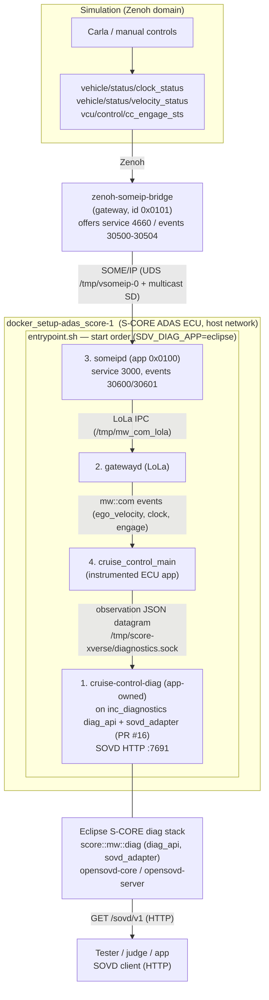
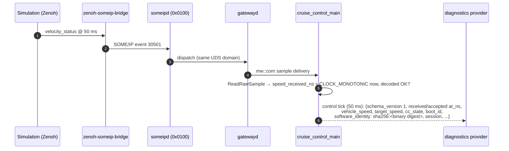
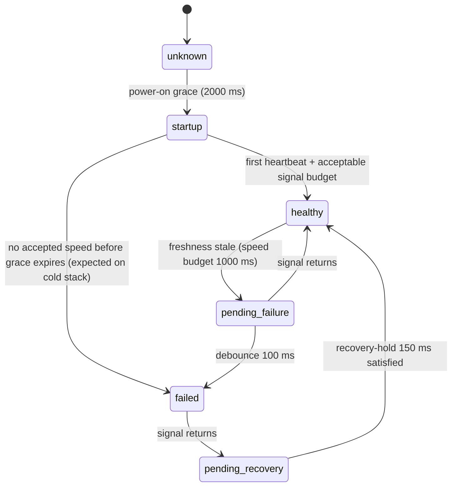

# Receiver Diagnostics & SOVD on the S-CORE ADAS ECU

> **Status:** Production-demonstrated (E2E PASS, 2026-10-06)
> **Demo target:** `docker_setup-adas_score-1` (autoverse / vecu / s-core)
> **Audience:** SDV Hackathon 2026 judges, integration team
> **Related upstream work:** [eclipse-score/inc_diagnostics issue #16](https://github.com/eclipse-score/inc_diagnostics/issues/16) — see [Appendix A](#appendix-a--pr-16-sovd_adapter-contribution-mapping)

---

## 1. Feature overview

The ADAS S-CORE ECU (cruise control, `cc_s-core/score/cruise_control`) now supports a
**native receiver-diagnostics vertical served through the Eclipse openSOVD stack**:

- The ECU **stamps every speed-signal reception and acceptance** inside its control-loop
  input handlers (no new threads, no behavior change to the controller).
- On every control tick (50 ms) the ECU emits a compact **diagnostic observation** over a
  Unix datagram socket. Emission is strictly **non-blocking** — a missing or dead diagnostics
  peer can never stall the control loop.
- The **application stays a pure detector**: it only reports what it received and accepted.
  Everything diagnostic lives in `score::mw::diag` / openSOVD:
  the application-owned **`cruise-control-diag`** server, built only on the public
  **`eclipse-score/inc_diagnostics`** platform API (PR #16 branch; the platform
  `opensovd-gateway` stays unchanged — see [Appendix A](#appendix-a--pr-16-sovd_adapter-contribution-mapping)), consumes
  the observation stream, applies **TimeBased debounce semantics from
  `score::mw::diag::dtc`**, qualifies DTC **`CC.LostCommunication`** and serves it — with the
  live speed and cruise state — as **`diag_api` `DataResource`s** through the
  **`opensovd-server` SOVD HTTP API**, adapted by PR-16's `sovd_adapter`.
- Externally, a tester, judge, or application talks plain **HTTP (SOVD semantics)** to the
  ECU: `GET /sovd/v1/...` returns live observation state and the DTC lifecycle.

**What was demonstrated live (2026-10-06):** with the real Zenoh→SOME/IP simulation driving
the ECU, pressing `I` in manual controls dropped the speed message from the network; within
~1 s the ECU set `CC.LostCommunication` to **confirmed/failed**; restoring the signal healed
the DTC back to **passed** — recorded timelines (f004 for the receiver-diagnostics provider,
f005 through the inc_diagnostics gateway), zero control-loop interference.

---

## 2. Architecture

### 2.1 Deployment view



`setarch -R` on the entrypoint keeps the S-CORE binaries' behavior stable; the same
diagnostics socket contract (env-gated `SCORE_DIAGNOSTIC_SOCKET`) is what both provider
modes (eclipse / legacy) bind.

### 2.2 Observation data flow inside the ECU



Notes:

- `received/accepted` clocks are set **per event** inside the input receive handler, while
  `observed_at` is stamped when the control loop emits — the ordering rules the provider
  validates (`received <= accepted <= observed`) hold by construction.
- The datagram payload is ~600 B (cap 4096 B on both ends). All strings are schema-validated;
  `boot_id` must match the running kernel, guaranteeing observations come from the live boot.
- If the diagnostics socket is missing/full/closed, `sendto(MSG_DONTWAIT|MSG_NOSIGNAL)` just
  drops the sample — **control decisions are never gated on diagnostics**.

### 2.3 Fault lifecycle state machine (CC.LostCommunication)



Runtime parameters (env at container start, defaults match the debounce the fault catalog
specifies):

| Parameter | Default | Meaning |
|---|---|---|
| `CRUISE_SIGNAL_BUDGET_MS` | 1000 | accepted-speed freshness budget |
| `CRUISE_STARTUP_GRACE_MS` | 2000 | no fault during boot |
| `CRUISE_DEBOUNCE_FAILED_MS` | 100 | TimeBased debounce before declaring failed |
| `CRUISE_DEBOUNCE_PASSED_MS` | 150 | recovery hold before declaring recovered |

The debounce itself is `score::mw::diag::dtc::Debounce::TimeBased` semantics implemented on
top of diag_api in `score/examples/cruise_control_diag/src/lib.rs` — not a bespoke state machine. An observation whose
speed field is `null` (sender's datagram landed but nothing was accepted in that tick)
**prefails immediately** (receiver sees the stream, not the signal); a datagram older than
the signal budget fails; nothing at all after the boot grace fails.

The eclipse gateway is stateless in-memory (fault read from the observation link each
request). Persisting DTC state across ECU restarts (KVS write-through, as the legacy
provider did) is future `diag_api` work — see [§8](#8-known-limitations-be-explicit-to-judges).

### 2.4 Software identity & provenance

Every observation carries `software_identity: sha256:<digest>` of the running
`cruise_control_main`, computed by the entrypoint at every container start
(`sha256sum $CRUISE_CONTROL_BIN`) and exported as `SCORE_BUILD_IDENTITY` — so it can never
drift from the deployed binary. The gateway validates each datagram (schema 1, matching
`source_instance=cruise-control`, matching the current `boot_id`, monotonic clock ordering
`received <= accepted <= observed`) and rejects foreign or malformed datagrams before they
can touch the fault lifecycle.

### 2.5 Eclipse alignment — what is S-CORE-native, what is the interim seam

| Layer | End-state S-CORE shape | This release |
|---|---|---|
| App → diag | app reports observations in-process via its component's diagnostic port | **interim**: env-gated Unix-datagram link (`SCORE_DIAGNOSTIC_SOCKET`), non-blocking, dormant by default |
| Qualification | `diag_api` (`Debounce::TimeBased`) inside mw::diag | identical — `diag_api` Rust crate, unchanged semantics |
| DTC state | diag stack owns it; app never holds DTC state | identical — the app holds **no** DTC state, only per-sample facts |
| Serving | shared openSOVD server across components | identical — PR-16 `sovd_adapter` → `opensovd-server` |

`diag_api` is Rust-only today and the ECU app is C++ (no C++ binding, no `mw/diag` in the ECU
tree yet), so a transport between the two is required; the datagram link is that interim
seam. When S-CORE ships a C++ diag report port, app instrumentation stays as-is and the
gateway integration collapses into diag-stack configuration.

---

## 3. Component inventory

| Component | Location | Language | Role |
|---|---|---|---|
| `diagnostic_publisher.h` | `cc_s-core/score/cruise_control/src/` (from `OpenSOVD/patches/receiver-diagnostics/s-core-observation.patch`) | C++ header | Non-blocking observation emitter (env-gated) |
| Instrumented input handlers | `cc_s-core/score/cruise_control/src/cruise_control.{cpp,h}` | C++ | received/accepted speed clocks per event |
| `sdv-receiver-diagnostics` | `eclipse_sdv_hackathon_2026/OpenSOVD/integration/diagnostics/` (Rust crate) | Rust | Socket receiver, freshness monitor, `CC.LostCommunication` lifecycle, KVS storage, SOVD HTTP server |
| Deployment wiring | `cc_s-core/deployment/xverse/docker_setup/{entrypoint.sh,docker-compose.yaml}` | Bash/YAML | Start order, mounts, env wiring |
| Fault catalog | `OpenSOVD/config/faults/cruise-control.json` | JSON | `CC.LostCommunication` definition compiled into the provider |

Base revision: `cc_s-core` @ `93f8ea1` (observation patch applies cleanly on top).

---

## 4. Build & deployment — step by step

Everything below is one-time (already applied in this checkout); section 5 covers every-day operation.

1. **Build the diagnostics server (on Eclipse inc_diagnostics, PR #16)**
   ```bash
   # inside the s-core devcontainer, as root (third_party/inc_diagnostics is the clone:
   # feat/16-sovd-data-provider = b975ed4 + PR16, demo/cruise-control-diag = + demo)
   cd /workspaces/s-core && bash third_party/build-diag-gateway.sh
   # -> bazel test  //score/mw/diag/sovd_adapter:all //score/examples/cruise_control_diag:all
   # -> bazel build //score/examples/cruise_control_diag:cruise-control-diag
   # -> stages the binary to cc_s-core/.local/cruise-gateway/cruise-control-diag
   ```
   Patches live in `third_party/cruise_diag/patches/`: `pr16_sovd_data_provider/` (the
   upstream PR-16 contribution) and `demo_enable_dtc_set_and_disable_cruise_control/` (the
   app-owned diagnostics server, ECU deployment, DTC set and cruise disable — see
   [Appendix A](#appendix-a--pr-16-sovd_adapter-contribution-mapping)). The script documents the toolchain sysroot
   workaround needed for the aws-lc-sys (opensovd-server TLS chain) C build probe.

2. **Apply & rebuild the ECU app (observation emitter + signal-loss reaction)**
   ```bash
   cd /home/randd/autoverse/vecu/s-core
   git am third_party/cruise_diag/patches/demo_enable_dtc_set_and_disable_cruise_control/s-core/*.patch
   source ./prepare.sh    # devcontainer + bazel
   ./make.sh              # builds //score/cruise_control:cruise_control_main
   ```

3. **Deployment wiring (already in place)**
   - `docker-compose.yaml`: binds `OpenSOVD/.local/fault-profile → /home/diagnostics:ro`,
     `OpenSOVD/.local/score-fault-storage → /home/fault-storage`, env `SDV_DIAGNOSTIC_LISTEN=0.0.0.0:7691`.
   - `entrypoint.sh`: declares the speed-signal contract (`CRUISE_SIGNAL_BUDGET_MS`,
     `CRUISE_DEBOUNCE_FAILED_MS`) once for the app and the diagnostics server; `SDV_DIAG_APP`
     selects the provider — `eclipse` (`cruise-control-diag`, staged at
     `.local/cruise-gateway/cruise-control-diag`) or `legacy` (the standalone
     `sdv-receiver-diagnostics` binary from workstream A). Both bind the same
     observation socket and the same `:7691` SOVD listener; the eclipse mode is the default.

4. **Start the stack**
   ```bash
   docker run --rm -v /tmp:/tmp alpine sh -c 'rm -f /tmp/vsomeip.lck /tmp/vsomeip-101'  # stale-socket cleanup
   cd /home/randd/autoverse/vecu/s-core && SOURCE_DIR=/home/randd/autoverse/vecu/s-core/cc_s-core ./ctl.sh up
   docker logs docker_setup-adas_score-1 | grep -E "Started cruise-control-diag|Speed-signal loss threshold"
   ```

---

## 5. How to test — E2E procedure (the `I` press)

**Objective:** prove signal-drop → DTC set, signal-restore → DTC healed, end-to-end through
the real network stack (SOME/IP → LoLa → mw::com → ECU app → diag → openSOVD) with
zero diagnostics rejection and zero control interference.

5.1 **Record the timeline** (poll the gateway's SOVD resources at 1 Hz):

```bash
RUN_DIR=/home/randd/eclipse_sdv_hackathon_2026/OpenSOVD/evidence/f005-e2e-sovd-ipress-$(date +%Y%m%dT%H%M%S)
mkdir -p "$RUN_DIR" && cp OpenSOVD/evidence/recorder3.py "$RUN_DIR/"
rm -f /tmp/STOP_RECORDER
timeout 3600 python3 "$RUN_DIR/recorder3.py" "$RUN_DIR/timeline.jsonl" &
tail -f "$RUN_DIR/timeline.jsonl"
```

5.2 **Baseline (10–30 s):** simulation drives the ECU.
Expect: `vehicle_speed` live, `cruise_state` live, `cc_lost_communication.status = "passed"`.

5.3 **Press `I`** in the manual controls (speed message dropped from the network).
Expect within ~1.1 s (budget 1000 ms + debounce 100 ms + poll resolution):

```json
{"fault": "CC.LostCommunication", "status": "failed", "confirmed": true}
```

5.4 **Keep it dropped (10–20 s):** state remains `failed/confirmed`.

5.5 **Press again (restore feed):** expect `status = "passed"`, `confirmed = false`
after the 150 ms recovery hold; `vehicle_speed` live again.

5.6 **Invariants to assert** (all must hold across the whole run):

| Assertion | Source field | Expected |
|---|---|---|
| DTC code | `cc_lost_communication.fault` | `CC.LostCommunication` |
| Control preserved | cruise behaviour / `cruise_state` transitions | unchanged during recorder run |
| Detector decoupled | kill the gateway process in the container | cruise_control keeps controlling; container stays up |
| Tampering rejected (unit) | `cruise_control_diag` tests | foreign boot_id / wrong schema / non-numeric speed rejected |

5.7 **Raw endpoint reference** (what a judge can curl directly):

```bash
curl -fsS http://127.0.0.1:7691/sovd/v1
curl -fsS http://127.0.0.1:7691/sovd/v1/components
curl -fsS http://127.0.0.1:7691/sovd/v1/components/cruise_control
curl -fsS http://127.0.0.1:7691/sovd/v1/components/cruise_control/data/vehicle_speed
curl -fsS http://127.0.0.1:7691/sovd/v1/components/cruise_control/data/cruise_state
curl -fsS http://127.0.0.1:7691/sovd/v1/components/cruise_control/data/cc_lost_communication
curl -fsS http://127.0.0.1:7691/sovd/v1/components/cruise_control/data/cc_fault_injection
```

---

## 6. Recorded E2E runs (evidence)

### 6.1 Option 3 — the Eclipse inc_diagnostics gateway stack (f005)

- **Artifact:** `OpenSOVD/evidence/f005-e2e-sovd-ipress-20261006T200230/`
  (`timeline.jsonl` — 1 Hz samples of the four SOVD data resources; `verdict.md`; `recorder3.py`)
- **Stack under test:** full Option-3 vertical — someipd → gatewayd → cruise_control_main →
  observation datagram → opensovd-gateway (`cruise_diag`, PR-16 stack) → SOVD `:7691`.
  (f005 ran the earlier gateway-hosted build. The current app-owned `cruise-control-diag`
  with the cancel-on-signal-loss reaction is verified headless in
  `OpenSOVD/evidence/f008-headless-app-owned-diag-20261006T232700/`: cancel 1.06 s after the drop, DTC failed → passed.)
- **Transition summary** (decisive window, local wall clock; full detail in `verdict.md`):

| Wall | Speed | `cc_lost_communication` |
|---|---|---|
| 21:10:18 | 45.341385 km/h | `passed` |
| 21:10:19 | 45.341385 (frozen — `I` pressed) | **`prefailed`** |
| 21:10:20 | 45.341385 (frozen) | **`failed`, confirmed = `CC.LostCommunication` SET** |
| 21:10:21–37 | 45.341385 (frozen, ~19 s) | stays `failed`/`confirmed` |
| 21:10:38 | 43.9 km/h live | `prepassed` (recovery hold) |
| 21:10:39 | live | **`passed`**, confirmed = false → healed |

- **Timings:** detection ≤ 1 s after freeze onset (1 Hz poll resolution), `TimeBased`
  debounce 100 ms, recovery hold 150 ms — all within documented budgets.
- **Policy proven by this run:** the datagram stream kept flowing throughout the drop
  (`vehicle_speed` answered with low `age_ms` the whole time) — the DTC tripped because the
  policy now reads the **ECU-declared accepted age** (`accepted_lag_ns`) from each
  observation. An earlier binary (20:30:15–20:30:24, same file) held `passed` under an
  identical freeze and is retained in this timeline as the pre-fix finding; covered
  by unit test `declared_staleness_fails_even_on_a_live_stream`.
- **Log hygiene:** zero rejected/dropped observations across the run (only benign
  mw::log-fallback noise); binary sha256 `ec198779b93c96ac…` =
  Bazel artifact = staged copy; tests 15/15.

### 6.2 Workstream A — the standalone receiver-diagnostics provider (f004)

- **Artifact:** `OpenSOVD/evidence/f004-e2e-ipress-20261006T155209/`
  (`timeline2.jsonl` — 71 samples; `verdict.md`; recorder script)

| t (s) | Speed | freshness | fault |
|---|---|---|---|
| 0.0–30.3 | 82→52 km/h live | fresh | healthy / passed |
| 31.3 | (signal dropped) | **stale** | **failed (confirmed)** |
| 31.3–46.5 | — | stale | failed |
| 47.5 | (feed restored) | **fresh** | **healthy / passed** |

- Zero rejected observations; DTC `CC.LostCommunication` present in KVS storage.

---

## 7. Design guarantees

1. **Diagnostics can never block/alter control.** Sender is non-blocking UDP-style
   datagrams with best-effort delivery; controller decisions, acceptance semantics and
   throttle behaviour are untouched by the patch.
2. **Acceptance is decode-level, not functional.** `acceptance_kind = "decoded_by_consumer"`
   — the ECU explicitly does *not* claim E2E-protected or functional-plausibility approval
   (`integrity_result = "not_available"`).
3. **Provenance is verifiable.** `boot_id` + monotonic clock domain + binary sha256 identity;
   the provider rejects tampered/foreign observations (`rejected_observations` counter).
4. **Fail-safe defaults.** No `SCORE_DIAGNOSTIC_SOCKET` env → instrumentation fully dormant.
5. **Restart hygiene.** Entrypoint clears stale sockets (previous container was SIGKILLed);
   provider session retirement handles ECU restarts (>128 restarts per provider lifetime
   requires a provider restart — container restart covers it).

## 8. Known limitations (be explicit to judges)

- Freshness budgets (1000/2000/100/150 ms) are **provisional**, not engineering-accepted
  deadlines.
- `CC.LostCommunication` is the only fault in the catalog; native `/faults` (SOVD fault
  management) is not exposed — the DTC is served as a `diag_api`
  `DataResource`/`FaultResource` under
  `/sovd/v1/components/cruise_control/data/cc_lost_communication`.
- Sequence IDs / native E2E protection are not yet available on this path.
- On a cold stack with no simulation attached, the fault **will** enter `failed` after the
  startup grace — that is by-design receiver policy, not a defect.
- **Stateless DTC state**: the eclipse gateway holds fault state in memory only (read from
  the observation link on every request). Persisting DTC state across ECU restarts (KVS
  write-through, as the legacy provider did) is future `diag_api` work — a container
  restart starts clean.
- Cold-stack data endpoints (`vehicle_speed`, `cruise_state`) return **HTTP 500** until the
  simulation produces the first observation; the DTC resource answers from boot.
- SOVD read-only: the DTC resource has no fault-clear via SOVD yet (recovery is automatic
  when the signal returns; `cc_fault_injection` supports deterministic test forcing).

---

## Appendix A — PR-16 `sovd_adapter` contribution mapping

Patches live in `third_party/cruise_diag/patches/` (s-core tree, `autoverse/vecu/s-core`),
split by audience — tracking [inc_diagnostics issue #16](https://github.com/eclipse-score/inc_diagnostics/issues/16);
gateway patches exported from the clone `third_party/inc_diagnostics`, branch
`feat/16-sovd-data-provider`, based on PR-16 head `b975ed4`.

**Upstream contribution — `patches/pr16_sovd_data_provider/`** (generic, no demo code)

| Patch | Purpose | Commit |
|---|---|---|
| 0001 build-bazel | cargo-bazel lock fix | `5aafb8b` |
| 0002 build-bazel | expose tokio/serde deps | `7a8c203` |
| 0003 diag_api | re-export `JsonSchemaRequired` | `775f95c` |
| 0004 sovd_adapter | serve diag_api `DataResources` as an opensovd `DataProvider` (DTC exposed as a data resource; no SOVD `faults` provider yet) | `a0802a0` |
| 0005 gateway | wire HVAC diag_api resources into gateway | `3ab687b` |

**Hackathon demo — `patches/demo_enable_dtc_set_and_disable_cruise_control/`** (on top of PR16; not upstreamed)

| Folder / patch | Purpose |
|---|---|
| `inc_diagnostics/0001` | **app-owned diagnostics server** `score/examples/cruise_control_diag` (new files only): observation link + validation, `CC.LostCommunication` TimeBased debounce on the declared accepted age, `cruise-control-diag` binary composing it with `sovd_adapter` + opensovd server. Platform `opensovd-gateway` and `sovd_adapter` unchanged. |
| `s-core/0001` | ECU deployment: `SDV_DIAG_APP=eclipse` mode switch, speed-signal contract declared once (`entrypoint.sh`) + compose |
| `s-core/0002` | refactor: component into `score::cruise_control` |
| `s-core/0003` | cruise_control: publish speed-signal observations — **DTC set** |
| `s-core/0004` | cruise_control: cancel cruise on lost speed signal — **disable cruise** (`adas_cc_cancel_req`, SOME/IP 3000/30603), speed plausibility, fail closed without contract |
| `s-core/0005` | docs-as-code traceability (8/8 requirements, 15/15 tests fully linked) + root `BUILD` fix |
| `zenoh-someip-bridge/0001` | route 30603 → zenoh `adas/cruise_control/cancel_req` |
| `vcu_zenoh/0001` | VCU disengages on the cancel request (HUD shows DISENGAGED) |

**Relationship to this feature:** PR16 applied to upstream `b975ed4` reproduces `3ab687b`
exactly, and the unmodified platform `opensovd-gateway` builds. PR16 + `demo/inc_diagnostics`
reproduces the demo branch; verified with
`bazel test //score/mw/diag/sovd_adapter:all //score/examples/cruise_control_diag:all`
(15/15 diagnostics unit tests) and the binary staged to
`cc_s-core/.local/cruise-gateway/cruise-control-diag`.