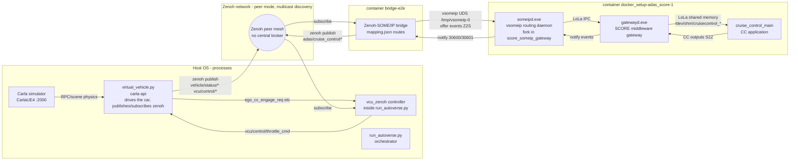
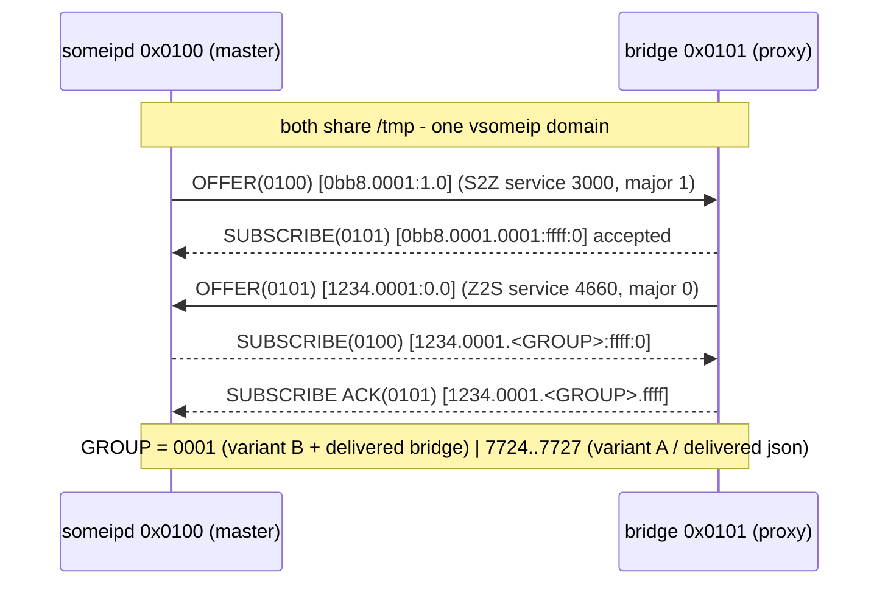
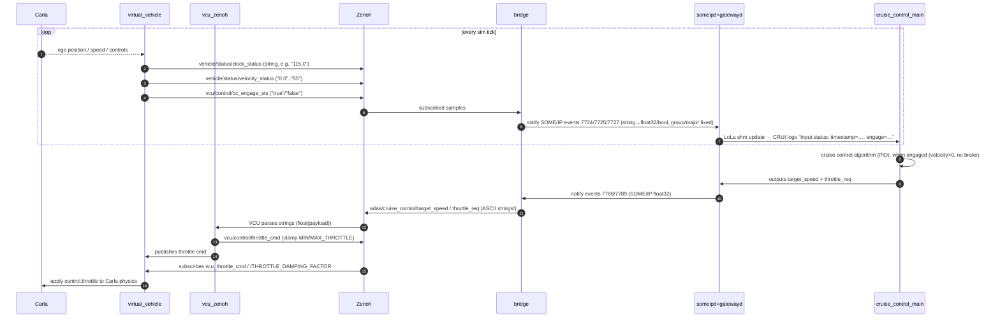

# Autoverse: Zenoh ⇄ SOME/IP ⇄ S-Core vECU integration — full architecture memory

> Consolidated, durable architecture + troubleshooting memory for the whole
> solution chain: **Carla → virtual_vehicle → VCU (zenoh) → zenoh ↔ SOME/IP
> bridge → S-Core vECU (someipd/gatewayd → LoLa → cruise_control)**.
> Written 2026-10-02. Companion docs:
> `vecu/s-core/cc_s-core/ZENOH_SOMEIP_BRIDGE_FIX.md` (root cause + fixes),
> `vecu/s-core/cc_s-core/SCORE_EVENTGROUP_PATCH_PROPOSAL.md` (middleware
> patch variant, both verified).

## 1. What this system is

A virtual vehicle e2e: a Carla-simulated car publishes vehicle signals on
**Zenoh**; the S-Core vECU (Eclipse SCORE middleware + ADaptive AUTOSAR stack)
consumes them over **SOME/IP** via a protocol bridge, runs the
**cruise-control** application, and returns cruise-control commands
(target speed, throttle request) to vehicle over Zenoh, closing the loop so
Carla actually accelerates the car.

Two independent, **both-verified**, mutually alternative fixes make the
integration work; only ONE may be active per deployment:

| Variant | Where the deviation lives | Status |
|---|---|---|
| **A. Bridge-config** (deployed/committed) | bridge `config/mapping.json`: 5 Z2S entries `event_group: 1 → <event_id>`; plus 2 S2Z entries `zenoh_type float32 → string` | ✅ committed, verified e2e incl. full Carla stack |
| **B. Middleware patch** | score repo: `third_party/someipd-eventgroup-subscribe.patch` + `MODULE.bazel` `archive_override` + json `eventgroup_ids: [1]` | ✅ activated + verified e2e (999 test), local experiment, roll back after (2026-10-02) |

Shared, mandatory on BOTH variants:

- Score json `CruiseControlInput.service_version_major: 0` (matches the
  bridge's hardcoded vsomeip `DEFAULT_MAJOR` offer).
- S2Z `zenoh_type: "string"` for events 30600/30601 — every consumer
  (vcu_zenoh, carla virtual_vehicle) parses payloads as utf-8 text.

## 2. Architecture

### 2.1 High-level component diagram



### 2.2 Shared-memory vsomeip domain (single-domain topology)

Both containers bind-mount the host `/tmp` (see score compose volume
`/tmp:/tmp`), so ALL vsomeip processes share ONE vsomeip domain over the UDS
root socket `/tmp/vsomeip-0`:

- Whichever container starts **first** becomes the vsomeip **routing master
  ("Host")**, the other joins as a **proxy client** (`is_provided`
  registrations and subscriptions are re-dispatched by the master).
- Score-first (the usual order) → `someipd.exe` = master (client `0x0100`),
  bridge = proxy `0x0101`. Both orders work once the fixes are in; only the
  log lines move between containers.
- Stale remnants on host `/tmp` (previous master's lock
  `/tmp/vsomeip.lck`, sockets) can affect a fresh boot — the score entrypoint
  cleans `/tmp/mw_com_lola/`; `rm -f /tmp/vsomeip*` helps on weird startup
  states.

```mermaid
flowchart TB
    subgraph sharedhosttmp[/tmp bind-mounted into both containers/]
        S[UDS root socket someipd-uds-8994<br/>/tmp/vsomeip-0]
        LCK["lock file /tmp/vsomeip.lck (master marker)"]
    end
    MASTER["Routing master - 'Host'<br/>own vsomeip routing manager + stub"]
    PROXY["Proxy clients<br/>speak to master via UDS (VSOMEIP_APPLICATION_NAME<br/>/ network)"]
    MASTER --- S --- PROXY
    LCK .-> MASTER
```

### 2.3 LoLa and the CRUI shared-memory delivery oracle

- `someipd.exe ⇄ gatewayd.exe` talk LoLa IPC over `/tmp/mw_com_lola/`.
- `gatewayd ⇄ cruise_control_main` exchange service data through LoLa
  **shared memory** files:
  `/dev/shm/cruisecontrol_CruiseControlInput_4660` and
  `.../cruisecontrol_CruiseControlOutput_3000`.
- **Delivery oracle:** `md5sum` of the Input shm file. When a Zenoh
  publication correctly becomes CC input data, the md5 changes; when
  frozen (`6f03af36…` historically), data does not arrive.

## 3. SOM/IP side identifier map (service 4660 CruiseControlInput)

| Zenoh key (Z2S in) | SOME/IP service / instance | event id (hex) | eventgroup — variant A (bridge) | eventgroup — variant B (patch+json) | major | payload |
|---|---|---|---|---|---|---|
| `vehicle/status/clock_status` | 4660 `0x1234` / 1 | 30500 `0x7724` | 30500 | 1 | 0 | string → float32 |
| `vehicle/status/velocity_status` | 4660 / 1 | 30501 `0x7725` | 30501 | 1 | 0 | string → float32 |
| `vehicle/control/delta_speed` | 4660 / 1 | 30502 `0x7726` | 30502 | 1 | 0 | string → float32 |
| `vcu/control/cc_engage_sts` | 4660 / 1 | 30503 `0x7727` | 30503 | 1 | 0 | string → bool |
| `adas/radar_sensor/near_obstacle_distance` | 4660 / 1 | 30504 `0x7728` | 30504 | — (no score consumer) | 0 | string → float32 |

| Zenoh key (S2Z out) | event id (hex) | eventgroup | someip_type/zenoh_type | major |
|---|---|---|---|---|
| `adas/cruise_control/target_speed` | 30600 `0x7788` | 1 | float32 → **string** | 1 (score-major; bridge subscribes DEFAULT_MAJOR 0 on its side… actually subscribe of S2Z is on bridge = its own app) |
| `adas/cruise_control/thruttle_req` | 30601 `0x7789` | 1 | float32 → **string** | same |
| `adas/radar_fusion/near_obstacle_level` | 30602 `0x778A` | 1 | uint8 → string | same |

Notes: `someipd` subscribes 3000 (S2Z) with major **1** per json; the bridge's
S2Z subscribe uses `DEFAULT_MAJOR 0` — service 3000 works because the S2Z
subscription is per-event `event 1` on group 1 with matching group; see
`ZENOH_SOMEIP_BRIDGE_FIX.md` fingerprint.
`CruiseControlOutput.service_version_major` in the json stays `1` (do not
change; S2Z verified working as-is).
`thruttle_req` (sic) — the key spelling is historical, keep it spelled exactly.

## 4. The three failure modes (root-cause chain, silent)

### Failure 1 — major-version mismatch (decisive for Z2S)

The score json compiled major (delivered: 1) must equal the bridge's offer
major (hardcoded `DEFAULT_MAJOR = 0` in the bridge C++ — not config):
vsomeip's master re-dispatches boot-time pending subscriptions only on exact
major match. Fingerprinted:

```
SUBSCRIBE(0100):  [1234.0001.7724:ffff:1]   <- score subscribes major 1
OFFER(0101):      [1234.0001:0.0] (true)    <- bridge offers major 0 → no re-dispatch, silent
```

Fix: score json `service_version_major: 0`.

### Failure 2 — eventgroup Z2S (the TODO the patch implements)

`someipd` subscribe side hardcodes group = event id (TODO comment in
`remote_network_service.cpp`); its offer side reads `eventgroup_ids` from
config. So:

- Z2S: score subscribes groups **30500…30503**; delivered bridge offers all
  Z2S events in group **1** → master: "received subscription for unknown …
  eventgroup. Creating placeholder event" + `add_subscriber: Didnt insert
  client 0100` → permanent silent drop of the event.
- S2Z: score OFFERS 3000's events with `eventgroup_ids: [1]` (json) —
  delivered bridge subscribes group 1 → works unmodified (asymmetry!).

Fixes: variant A (bridge offers group = event id) or variant B (patch +
json group 1). Failure 2's mechanism was additionally validated against
stock vsomeip: subscribing a group the provider does not declare → never
delivers; subscribing a declared group → delivers.

### Failure 3 — `is_offered_remote` filter (masked, NOT blocking)

The fork's master stub (`routing_manager_stub.cpp:563`) drops a proxy
provider's `is_provided` event registrations for a service without declared
ports. This looked like a third drop point but was **masked by failure 1**:
once the major matches, Z2S works with NO 4660 entry in the score's
`vsomeip.json` (the master-side events exist because someipd's own
`request_event` creates them; the fanout targets someipd itself).
`deployment/xverse/docker_setup/vsomeip.json` therefore needs NO change.

### Failure 4 (found 2026-10-02 with the full Carla stack) — S2Z payload encoding

The score computed and "sent" `throttle=2.0 (sent=True)`, but the car coasted
to a stop. The bridge published the values on zenoh as **raw float32 bytes**
(`zenoh_type: "float32"`), while ALL ecosystem consumers parse zenoh payloads
as **utf-8 text**:

- `vcu_zenoh/src/controller.py::_parse_value`: `payload.to_bytes().decode('utf-8')`
  → `float(payload)` → a callback exception kills the ADAS-throttle
  application silently (no exception is surfaced to the user);
- carla `virtual_vehicle.py`: `float(payload)`;
- the simulink `pid_controller` (previous provider of these keys) published
  **strings** (`znh.put(str(value))`).

Fix (committed with variant A): bridge `zenoh_type: float32 → string` for
events 30600 + 30601. Verified: VCU then publishes
`vcu/control/throttle_cmd ≈ 0.7…` during CC engagement. This fix must be
preserved in EVERY variant — it is orthogonal to the eventgroup choice.

## 5. Fix variant B — the middleware patch (how to apply when needed)

Artifacts (committed on the score branch):

1. `cc_s-core/third_party/someipd-eventgroup-subscribe.patch` — rewrites the
   subscribe side of `score/someipd/impl/remote_network_service.cpp` to read
   `eventgroup_ids` from the compiled config, falling back to
   group-per-event — mirroring `Routing::SetupOfferings`:
   
   ```diff
   (see SCORE_EVENTGROUP_PATCH_PROPOSAL.md Step 1 — hunk
    @@ -157,11 +157,23 @@, verified `patch -p1` on the pristine tarball)
   ```

2. `MODULE.bazel` `archive_override` (NOT `git_override` — bzlmod cannot
   apply patches through git_override):

```python
   bazel_dep(name = "score_someip_gateway", version = "0.0.0")
   archive_override(
       module_name = "score_someip_gateway",
       urls = ["https://github.com/eclipse-score/inc_someip_gateway/archive/f8a196c3b16d5172d898394ab99b0ed81346d63d.tar.gz"],
       integrity = "sha256-5mtEhG/v8+8uaAOnPFMAIHqd/RSt9n+OKx7+I+tjPaE=",
       strip_prefix = "inc_someip_gateway-f8a196c3b16d5172d898394ab99b0ed81346d63d",
       patches = ["//:third_party/someipd-eventgroup-subscribe.patch"],
       patch_strip = 1,
   )
```

   GOTCHA: the patch label must be the **root-package** form
   `//:third_party/…` (like the existing vsomeip patch). The
   `//third_party:…` package-label form fails:
   *"BUILD file not found in any of the following directories"*.
3. json `eventgroup_ids` for the four 4660 events → `[1]`.

Apply:

```bash
cd autoverse/vecu/s-core && source prepare.sh && ./make.sh
docker start docker_setup-adas_score-1 bridge-e2e   # or compose up
# fingerprint:
```

Roll back: `git checkout -- MODULE.bazel tests/integration/gateway_mw_someip_config.json`
then rebuild — the patch file itself may stay; it only takes effect via the
`archive_override` reference.

Upstream end-state: PR the patch against
`eclipse-score/inc_someip_gateway` (upstream `d5b300b` "Fix Subscription
Major Version Issue" shows that area is being worked; base the PR on it),
then drop the patch + `archive_override` and bump the `git_override` pin.

## 6. Handshake sequence (working state)



## 7. Data-plane sequence (one full cruise-control round trip)



## 8. Engagement rules implemented by vcu_zenoh (loop controller)

- `_on_cc_engage_req` (key `ego_cc_engage_req` from the carla UI/driver):
  engage cruise control only if `can_engage` conditions pass (velocity etc.);
  publishes `vcu/control/cc_engage_sts` on change → someipd subscribes this
  → CC application input `engage`.
- Brake pedal above `BRAKE_THRESHOLD` while engaged → auto-disable CC
  ("Brake detected - disabling cruise control") and republish.
- Active CC → `throttle_cmd = clamp(adas_throttle, MIN_THROTTLE, MAX_THROTTLE)`;
  negative adas_throttle → braking.
- Idle/manual → `throttle_cmd = ego_acc_pedal`.

## 9. Build & deployment (team flow)

```bash
cd autoverse/vecu/s-core
source prepare.sh                                  # installs devcontainer CLI (v0.89.0)
./make.sh                                          # bazel build in devcontainer + compose artifacts
# the SOME/IP config `cruise_control_someip_config.bin` is COMPILED from
# tests/integration/gateway_mw_someip_config.json by generate_someip_config_bin
docker compose -f cc_s-core/deployment/xverse/docker_setup/docker-compose.yaml up -d
# score entrypoint copies .bin + manifest + vsomeip.json into /tmp/score-xverse/
cd autoverse/bridges/someip/zenoh-someip-bridge && scripts/ctl.sh start
# full stack: python3 autoverse/run_autoverse.py --enable-camera-display --vcu-zenoh
```

NEVER byte-patch the compiled `.bin` — change the json and rebuild (bazel
regenerates the binary deterministically; flatbuffers schema via
`generate_someip_config_bin`).

## 10. Verification fingerprints (copy-paste checklist)

```bash
# handshake - score container (major must be 0 on Z2S, group per variant):
docker logs docker_setup-adas_score-1 | grep -E "SUBSCRIBE\(|OFFER\(|ACK"
#   expected: SUBSCRIBE(0100): [1234.0001.0001:ffff:0] | variant A: [1234.0001.7724..7727:ffff:0]
#             OFFER(0101): [1234.0001:0.0]; SUBSCRIBE ACK(0101) lines; NO placeholder warnings
# delivery:
python3 /tmp/test_publish_999.py          # or the carla stack itself
docker exec docker_setup-adas_score-1 md5sum /dev/shm/cruisecontrol_CruiseControlInput_4660
docker logs docker_setup-adas_score-1 | grep -F "timestamp= 999000" | grep -F "engage= 1"
# throttle backflow (full stack):
#   python zenoh probe of adas/cruise_control/thruttle_req must show ASCII ("2", "48.15…"),
#   vcu/control/throttle_cmd must show 0..<MAX_THROTTLE> while engaged
```

Quick zenoh probe script pattern (peer mode; payload may be text or raw:)

```python
import zenoh, time
s = zenoh.open(zenoh.Config())
s.declare_subscriber("vcu/control/throttle_cmd",
                     lambda sm, k=None: print(k, sm.payload.to_string()[:20]))
time.sleep(10)
```

## 11. Gotchas list (everything that bit us)

1. **Silent drops are the default failure mode** in this stack: wrong major,
   wrong eventgroup, wrong payload encoding — all show NO error (only debug
   warnings in the master log). Always check the SUBSCRIBE/OFFER majors
   first.
2. vsomeip config json numeric fields are parsed as **HEX**: bare `1234` =
   0x1234 = 4660. Use the string form `"0x1234"` for clarity.
3. The fork's config parser only accepts the **plain** `"unreliable": 30500`
   form; the object form `{"port": X}` silently yields `ILLEGAL_PORT`.
4. The bridge hardcodes major 0 for its offers; if the score json ever moves
   back to major 1 (e.g. to match a real ECU), the bridge C++ needs a change.
5. Start-order: first vsomeip app on the shared `/tmp` becomes routing
   master; both orders work, fingerprints just move between containers.
6. Log timestamps inside containers are ~1h behind the host clock (container
   clock skew); compare within one container only.
7. `prepare.sh` must be sourced in the SAME shell invocation as `./make.sh`
   (shell state does not persist between calls).
8. Bazel patch labels in `MODULE.bazel` must be root-package form
   (`//:third_party/x.patch`), not `//third_party:x.patch`.
9. `MODULE.bazel.lock` must be recommitted after any archive_override switch;
   on rollback the lock regenerates from the committed MODULE state on
   rebuild.
10. The `is_offered_remote` filter in the vsomeip fork is a red herring: no
    extra `vsomeip.json` entry is needed for bridge-provided services once
    the major matches.
11. Consumers of a zenoh key define its wire type. Here: utf-8 strings
    everywhere (VCU + virtual_vehicle). A numeric `zenoh_type` from the
    bridge breaks them with no visible error.
12. 30504 (`adas/radar_sensor/near_obstacle_distance`) is bridged Z2S but has
    NO score-side consumer (not in the vECU's SOME/IP config) — the bridge
    notifies it into the void; that's expected, not an error.
13. Pre-existing unrelated diffs in the fetched bridge HEAD exist (S2Z
    `zenoh_type` handling); treat `mapping.json` as the single configurable
    integration point and diff-before-rely.

## 12. Repo/component locations

### Key artifacts (absolute paths on this machine)

| Artifact | Path |
|---|---|
| Full architecture memory (this file) | `/home/randd/autoverse/ZENOH_SOMEIP_SCORE_MEMORY.md` |
| Root-cause write-up (variant A) | `/home/randd/autoverse/vecu/s-core/cc_s-core/ZENOH_SOMEIP_BRIDGE_FIX.md` |
| **Proposal file — middleware patch variant B** (design, TL;DR apply, verify, rollback, upstream path) | `/home/randd/autoverse/vecu/s-core/cc_s-core/SCORE_EVENTGROUP_PATCH_PROPOSAL.md` |
| **Patch batch file — variant B** (eventgroup-subscribe TODO fix, `patch -p1` verified) | `/home/randd/autoverse/vecu/s-core/cc_s-core/third_party/someipd-eventgroup-subscribe.patch` |
| Pre-existing third-party patch example (-Werror removal for stock vsomeip 3.6.1 — the repo's established patch mechanism, NOT part of this fix) | `/home/randd/autoverse/vecu/s-core/cc_s-core/third_party/vsomeip-no-werror.patch` |
| Score config json (the compiled-from source) | `/home/randd/autoverse/vecu/s-core/cc_s-core/tests/integration/gateway_mw_someip_config.json` |
| Bridge mapping (vari A deployed) | `/home/randd/autoverse/bridges/someip/zenoh-someip-bridge/config/mapping.json` |
| Score entrypoint (copies .bin/manifests/vsomeip.json; exports `VSOMEIP_CONFIGURATION`) | `/home/randd/autoverse/vecu/s-core/cc_s-core/deployment/xverse/docker_setup/entrypoint.sh` |
| Delivered vsomeip.json (score side, service 3000 only) | `/home/randd/autoverse/vecu/s-core/cc_s-core/deployment/xverse/docker_setup/vsomeip.json` |
| **Proposal file — fault simulation "I" key** (speed publish inhibit, DTC demo; verified 3-level e2e 2026-10-02) | `/home/randd/autoverse/bridges/carla/examples/FAULT_SIM_SPEED_INHIBIT_PROPOSAL.md` |
| **Patch file — fault simulation** (`git apply` in `bridges/carla`; reverse-check verified) | `/home/randd/autoverse/bridges/carla/examples/fault-sim-speed-publish-inhibit.patch` |
| Fault-sim vehicle-side files for carla-api (untracked there → delivered by copy) | `/home/randd/autoverse/bridges/carla/examples/fault-sim-carla-api-files/{virtual_vehicle.py,signals_config.json}` → copy into `~/carla-api/PythonAPI/examples/` |
| Fault-sim test scripts (zenoh 3-phase, bridge forward-delta, stale-hold prover) | `/tmp/fault_sim_test3.py`, `/tmp/fault_check3.py`, `/tmp/stale_test.py` |
| OTA proposal (AAOS APK install; Eclipse Ankaios/Symphony/uProtocol investigation, mermaid architecture + sequence diagrams, fit-vs-current-Autoverse analysis) | `/home/randd/autoverse/aaos_digital_cluster/OTA_PROPOSAL.md` |
| OTA proposal — self-built variant (EOL backend+frontend, RTCU orchestrator ECU in docker, C++ both sides, mTLS PKI, adb install; rev B adds variant B: SOME/IP UpdateAvailable event → in-AAOS native agent pulls+pm install; feasibility + sequence diagrams; NO Eclipse deps, containers only) | `/home/randd/autoverse/aaos_digital_cluster/OTA_RTCU_PROPOSAL.md` |
| **OTA implementation — Variant A, VERIFIED LIVE 2026-10-03** (not committed; all NEW files, zero E2E impact; MOVED 2026-10-04 to the vECU layout `vecu/ota/` — same container names, own ctl.sh `up/stop/start/down/logs` whose `up` also opens the EOL console in the browser, run_autoverse Step 4 points to `vecu/ota`): `docker compose up -d --build` in `vecu/ota/` brings up `ota-certgen` (one-shot PKI) → `ota-backend` (C++ cpp-httplib; mTLS device API :9443 + operator API/EOL console :9444; SQLite in `ota/data/db`) → `ota-rtcu` (C++ libcurl; registered as VIN PC-CUTTLEFISH-01; private adb server on 5038 so host adb stays intact). Live proof: APK uploaded via :9444 (sha256 verified), campaign 1 pushed → RTCU downloaded (mTLS), sha256-checked, `adb install -r` into cuttlefish (localhost:6520, port 6520 unaffected), `com.example.digitalclusterapp` present in `pm list packages`, campaign status downloading→installing→success in the web console. Gotchas fixed during work: pass `.c_str()` when giving std::string to variadic `curl_easy_setopt`; certgen names client certs per-VIN (`client-<VIN>.crt`) → RTCU takes `CLIENT_CERT`/`CLIENT_KEY` env; mermaid semicolons inside sequenceDiagram Note/message text break rendering (statement separator); restart E2E containers NOT required for OTA (only cuttlefish). Post-verification evolution: ALL env vars replaced by `ota/config.json` (single stack config: backend ports/paths, `devices[]` = ECU inventory VIN+adb_endpoint, `rtcu` identity) parsed by `ota/common/simple_json.h` (minimal parser, no libs, comment-free pure JSON); backend verifies VIN == client-cert CN on reg/manifest/status (403 "vin does not match client certificate CN" — tested with IMPOSTER-01). Bootstrap change (user-requested, LOCAL UNCOMMITTED edits in E2E files): `cuttlefish_emulator/ctl.sh` `install_xverse_apk` call commented out (fresh container boots app-less; function kept) + `run_autoverse.py` new step 3 "OTA stack: EOL backend + RTCU (APK installer)" (`docker compose up -d` in ota/, stp=`docker compose stop`, idempotent) — verified e2e with campaign 6: fresh container → pm list packages EMPTY → RTCU campaign → package back (versionName 1.0). The RTCU is now the ONLY APK installer. Fleet model — ONE-RCU REDESIGN (2026-10-03, user: "the rtcu shall only be 1 ... this ecu shall update both aosp container vECU and raspberry pi vECU"): the single RTCU = vehicle OTA agent (cert CN = vehicle VIN, one client cert, `rtcu.vehicle` in config); Android vECUs are TARGETS from `config.json` `targets[]` ({id, adb_endpoint}, no certs); RTCU probes every target each cycle (non-blocking TCP connect 800 ms + `adb get-state` via private adb server 5038) and POSTs them to NEW endpoint `/api/v1/targets` (backend `targets` table: id/adb_endpoint/vehicle_vin/reachable/last_seen; `vehicles` table = fingerprint+VIN from reg; statuses column renamed vin→target; campaigns got `delivered` csv + `last_served` for one-shot per-target manifests + 300 s stale re-serve recovery); unreachable reported targets get their share of queued campaigns failed by the backend immediately (campaigns always go terminal); console card 2 = "Android vECU targets" green/red. Previous per-ECU-RTCU model (`rtcu-pi` container, profile `pi`, `config.pi.json`, per-ECU client certs) REMOVED. Live-verified 2026-10-03: /api/devices shows both targets (PC reachable=true green, PI reachable=false red, lastSeen refreshing each cycle); campaign 7 (PC target) → downloading→installing→SUCCESS in ~6 s (sha256-verified 150 MB install into cuttlefish); campaign 8 (PI target) → closed `failed` in one poll cycle with detail "target unreachable at RTCU probe (adb 192.168.1.72:5555)"; VIN==CN negative test still 403. | `/home/randd/autoverse/vecu/ota/` (README.md has config schema + run transcript; `../OTA_RTCU_PROPOSAL.md` §7 = one-RCU fleet model + probe sequence, §10 judges' pitch, §11 implementation + §11.8 config/VIN + §11.9 bootstrap change, §11.6-11.7 operator pit script) |

About the `-Werror` patch: the delivered vsomeip 3.6.1 build enables
`-Wall -Wextra -Wconversion -Wpedantic … -Werror`; the team toolchain is
gcc-12 (newer than vsomeip 3.6.1 was written for), so benign new-compiler
warnings would abort the build. The patch removes ONLY `-Werror` from
`CMakeLists.txt` `OS_CXX_FLAGS` — every warning check and security flag
(`-Wformat-security`, `-fstack-protector-strong`, `-D_FORTIFY_SOURCE`, fPIE)
stays enforced. It rides the same archive-`patches` mechanism as our batch,
which is why the batch follows that pattern.

### Components

| Component | Location | Container |
|---|---|---|
| S-Core vECU (score repo, ACTIVE dev) | `autoverse/vecu/s-core/cc_s-core` (bind-mounted as `/home/source` in its container) | `docker_setup-adas_score-1` |
| Zenoh↔SOME/IP bridge (delivered product; treat changes via PR) | `autoverse/bridges/someip/zenoh-someip-bridge` | `bridge-e2e` |
| VCU controller (zenoh) | `autoverse/vecu/vcu_zenoh` | (in `run_autoverse.py`) |
| Carla wrapper / virtual vehicle | `~/carla-simulator`, `~/carla-api/PythonAPI/examples/virtual_vehicle.py` | host |
| Orchestrator | `autoverse/run_autoverse.py` | host |
| Test publishers | `/tmp/test_publish.py`, `/tmp/test_publish_999.py` | host (for zenoh-only e2e of the vECU) |
| Score devcontainer image | `vsc-s-core-…-uid:latest` (bazel 9.2.0), container `gracious_jang` volume `eclipse-s-core-bazel-cache` | devcontainer |
| Someipd/gatewayd sources (pinned) | `eclipse-score/inc_someip_gateway@f8a196c…` via MODULE.bazel `git_override`; patch file `cc_s-core/third_party/someipd-eventgroup-subscribe.patch` for variant B | in-bazel external |
```