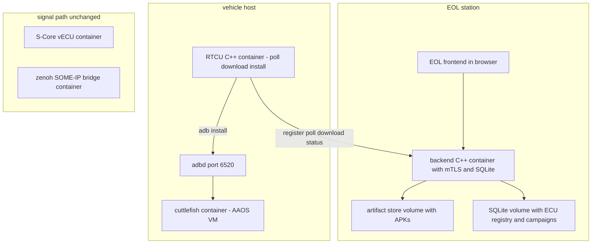
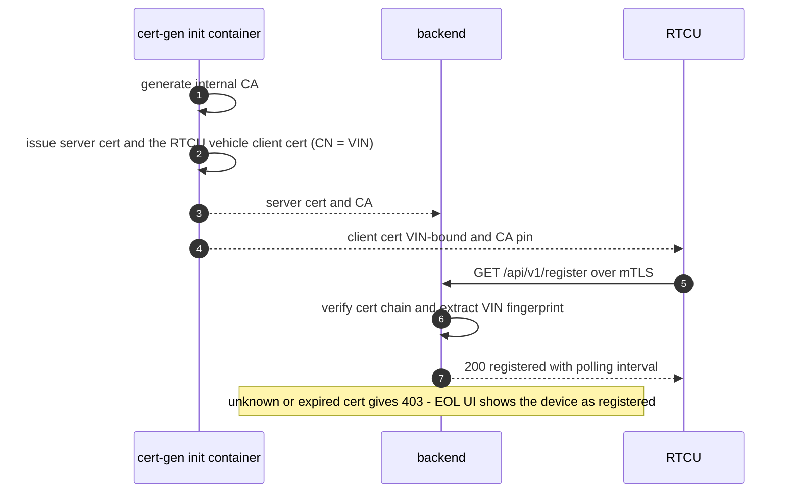
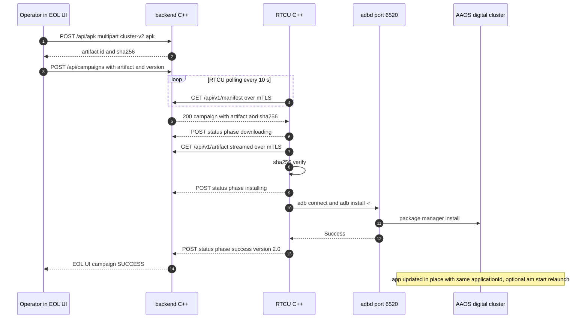
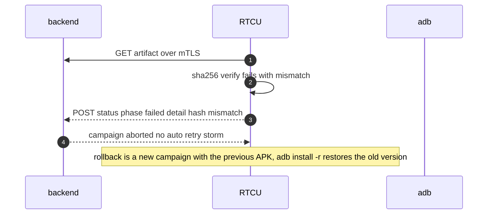
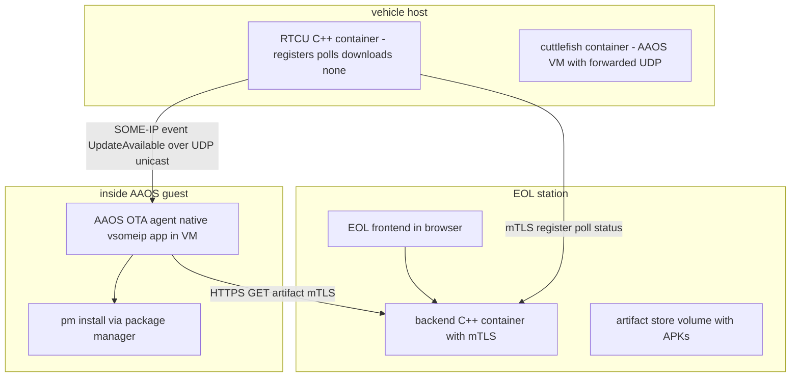
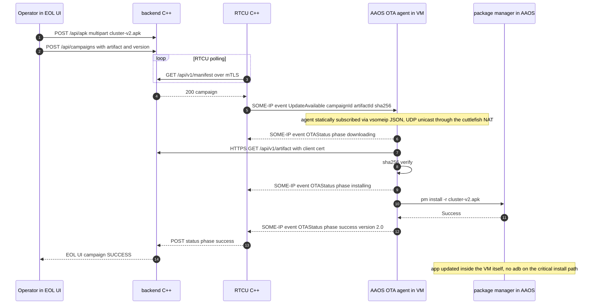
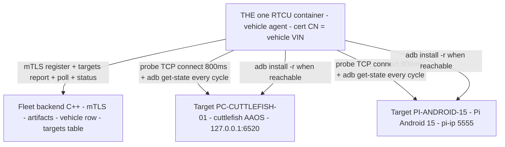
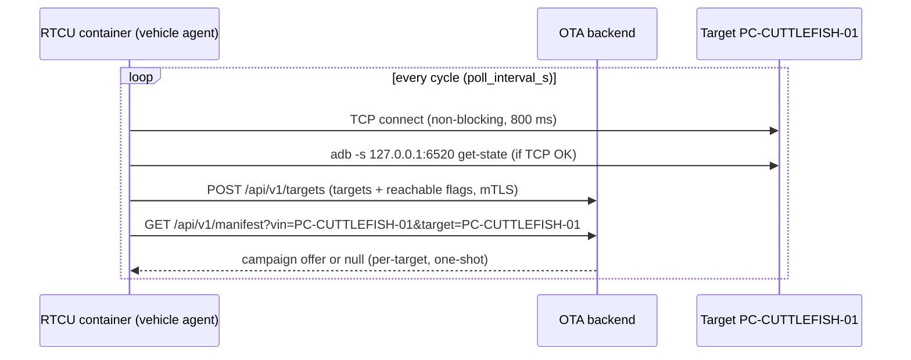
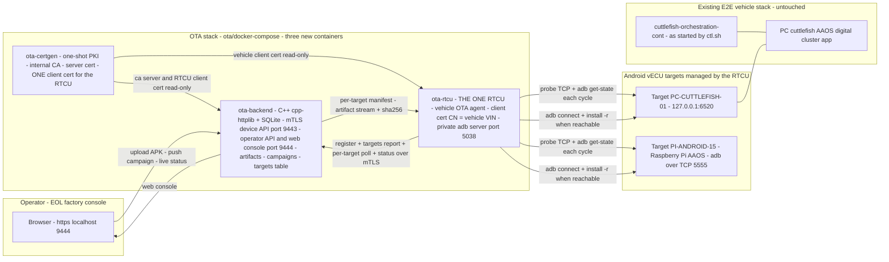
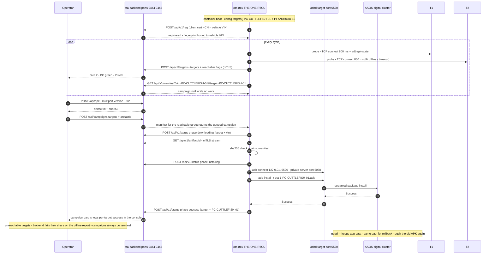

# Proposal: Self-built OTA platform — EOL-style backend + RTCU orchestrator ECU (C++, full container stack) (2026-10-03, rev B)

> Companion to `OTA_PROPOSAL.md` (Eclipse-component route). This doc defines
> the **alternative without Eclipse solutions**: our own backend + frontend
> (EOL-factory style) and a new **RTCU** virtual ECU in its own container that
> registers with the backend, polls for updates, downloads the APK, and
> orchestrates the OTA deployment into the Android (AAOS) ECU. C++ on both
> server and vehicle side. Investigation/design only — no code written yet.
>
> Rev B: renderer-safe diagrams + new **Variant B** — the RTCU notifies a
> dedicated OTA agent *inside* the AAOS via a SOME/IP event, and that agent
> pulls and installs the APK locally (§6).

## 1. Concept

An EOL (end-of-line) station metaphor: a factory-style web console where the
operator uploads an APK and pushes it to a fleet of virtual ECUs. The vehicle
side receives it through a dedicated management-plane ECU — the **RTCU**
(remote/Radio Telematics Control Unit) — running in its own container on the
vehicle host. The RTCU is the *only* component allowed to install into the
AAOS (single point of OTA authority), talking to the backend exclusively over
mutual-TLS HTTPS (register + poll + download + report).

Two deployment variants:

- **Variant A (host-side install):** RTCU installs the APK itself via adb
  from its container (default; simplest, proven mechanism).
- **Variant B (in-VM agent):** RTCU publishes a SOME/IP *UpdateAvailable*
  event over the vehicle network; a dedicated native binary **inside the AAOS
  VM** receives it, pulls the APK from the backend, and installs it locally
  with the Android package manager (§6). More realistic vehicle architecture
  (the ECU owns its own software) — more plumbing in the demo.

### 1.1 Decision — why Variant A first

1. **Faster to a working demo.** Every Variant B unknown (NDK build of
   vsomeip for Android, per-run binary push into the VM, static vsomeip
   config, two-way UDP channel through the cuttlefish NAT) moves off the
   critical path; Variant A's install mechanism (`adb connect` + `install -r`)
   is already proven in this stack — `ctl.sh install_xverse_apk` does exactly
   that today, just from a different caller.
2. **No new failure domain on the vehicle network.** Variant A adds zero
   SOME/IP/zenoh traffic; its only transports are management HTTPS (backend)
   and adb (AAOS) — both already-running, well-understood paths. The silent
   drop points we fought in the signal path (major version, eventgroup,
   port declarations) simply cannot bite an adb call.
3. **Single OTA authority is preserved.** Whether the RTCU (Variant A) or the
   in-VM agent (Variant B) installs, the rule "only one component ever
   installs into the AAOS" holds — the governance property doesn't depend on
   the variant.
4. **Variants are separable.** Variant B replaces only the *install step* of
   Variant A (same backend, same RTCU state machine, same API contract).
   Building A first is not throwaway work; it is the substrate B bolts onto.
5. **The trade-off is acceptable for the demo.** Variant A's weakness is
   architectural purity: the install runs host-side instead of inside the ECU.
   For this solution's purpose (demonstrating the OTA *pipeline*: upload →
   campaign → orchestrated update of the running digital cluster) that is a
   presentation detail, and §6 explicitly documents B as the stretch goal
   once A works.

**Isolation guarantee:** Variant A has **no impact on any other vECU or the
verified signal path** — see §8. The RTCU is a new, unprivileged container
that only opens management HTTPS to the backend and an adb connection to the
already-running cuttlefish adbd; `run_autoverse.py`, the zenoh⇄SOME/IP⇄S-Core
chain, the vcu, the manual control and the cuttlefish bootstrap install are
all untouched.

## 2. Component design

### 2.1 Backend (C++)

| Concern | Choice (feasible, minimal-dependency) |
|---|---|
| HTTP server | `cpp-httplib` (single header, HTTPS + client-cert support via OpenSSL) or Boost.Beast if the team prefers Boost. No framework needed at this size. |
| TLS | OpenSSL 3; **server cert + required client certs** (mTLS) on the API; internal CA generated at `make` time |
| REST API | `POST /api/apk` (multipart upload → sha256 → store), `GET /api/apk` (catalog), `POST /api/campaigns`, `GET /api/campaigns`, plus ECU-facing endpoints below |
| ECU-facing API | `POST /api/v1/reg` (the RTCU presents its client cert; backend binds cert fingerprint → vehicle VIN, VIN == cert CN), `POST /api/v1/targets` (the RTCU reports its managed Android vECU targets + live reachable flags), `GET /api/v1/manifest?vin=&target=` (poll; campaign offer per target), `GET /api/v1/artifact/<id>` (the APK), `POST /api/v1/status` (progress + result reporting) |
| State | SQLite (campaigns, artifacts with sha256, the vehicle row, the RTCU-reported target table, status history) — no external DB for the demo |
| Frontend | Static HTML/JS (or a small Vite/React app) served by the same C++ process — the EOL console: upload widget, target list with live adb reachability, campaign button, live status feed (WebSocket or SSE or simple poll) |
| Docker | own container + docker-compose; APKs on a volume (`/var/ota/artifacts`), SQLite on volume, `certs/` generated by a one-shot `cert-gen` init container (CA → server cert → the ONE RTCU client cert, CN = vehicle VIN) |

API sketch (server):

```
GET  /api/v1/manifest         → {"vin":"CARLA-01","campaign":{...}|null}
GET  /api/v1/artifact/<id>    → binary APK (sha256 in header)
POST /api/v1/status           → {"phase":"downloaded|installing|success|failed",
                                 "progress":0-100, "detail":"..."}
```

### 2.2 RTCU (C++, dedicated container)

State machine (this is the orchestrator logic; mirrors Symphony-agent+target,
Kanto Update Manager, and Leda VUM in miniature). The ONE-RCU revision
(2026-10-03) turns the single-vehicle loop into a per-target loop:

```
BOOT → REGISTER (mTLS, cert CN = vehicle VIN) → IDLE ⇄ CYCLE
CYCLE: for each target in config targets[]
         PROBE (TCP connect 800 ms + adb get-state)
         REPORT (POST /api/v1/targets with reachable flags)
         if reachable: POLL manifest?vin=&target= → DOWNLOADING (sha256 verify)
                       → INSTALLING (adb install -r) → SUCCESS/FAILED → status
       (unreachable targets are failed by the backend on the report)
```

Key decisions:

- **Talks to the backend by polling** (e.g. every 10 s while IDLE — cheap,
  firewall-friendly, and matches the demo; no MQTT/WebSocket needed). A
  `Retry-After` header lets the backend pace a fleet later.
- **Targets come from the config file, probing finds them at startup** —
  per the requirement that ONE RTCU updates both the AOSP container vECU and
  the Raspberry Pi vECU: `targets[]` lists id + adb_endpoint; every cycle
  the RTCU probes each endpoint and reports the table. No scan of unknown
  networks — only the endpoints you list are ever dialed.
- **Variant A — APK install into the AAOS via adb**: the RTCU container runs
  the platform-tools `adb` binary and does `adb connect <endpoint>` +
  `adb install -r <path>` per reachable target (its own private adb server
  on port 5038, so host adb sessions stay untouched). Implemented by invoking
  the `adb` binary (`popen`); wrapping libadbclient buys nothing — `adb` is
  already proven in this stack (`ctl.sh install_xverse_apk`).
- **Certificates**: RTCU holds ITS OWN client cert (CN = vehicle VIN) + the
  internal CA cert, provisioned at build/make time (bind-mounted, not baked
  into the image). Backend verifies client cert + fingerprint (VIN == CN);
  RTCU pins the server CA. No docker socket, no privileged mode needed — the
  RTCU stays unprivileged. Targets need no certificates.
- **Network**: RTCU container runs with `--network host` on the carla host
  (same pattern as cuttlefish) → direct reach to both the backend and
  `localhost:6520`. Alternatively a bridge network to the backend plus the
  published adb port. Host-network keeps it identical to the existing
  topology.
- No zenoh/SOME/IP involvement in variant A — RTCU is a **management-plane
  ECU**, fully separated from the verified signal path (same isolation
  argument as the Eclipse proposal §5). In variant B the RTCU *additionally*
  publishes one SOME/IP event on the vehicle network (§6) — that is an
  addition to, not a change of, the signal path.

### 2.3 What stays as-is

`run_autoverse.py`, cuttlefish + `ctl.sh` bootstrap install (first install
still ships the APK at container creation), the zenoh⇄SOME/IP⇄S-Core chain —
the RTCU only talks management HTTPS + the install mechanism, nothing in the
signal path changes.

## 3. Variant A — architecture



## 4. Variant A — sequence diagrams

### 4.1 Onboarding / registration (certificates)



### 4.2 OTA campaign (the core flow)



### 4.3 Failure and rollback



## 5. Technical feasibility

**Verdict: feasible, and the realistic effort is moderate — the risky part is
not the C++ (it's the demo plumbing).**

| Piece | Risk | Notes |
|---|---|---|
| C++ HTTPS server w/ mTLS | low | `cpp-httplib` supports client-cert verification and SSL out of the box (OpenSSL); Boost.Beast as plan B |
| Multipart APK upload (100–300 MB) | low | stream to disk + incremental sha256; cap payload size |
| OpenSSL PKI automation | low | `openssl` one-shot cert-gen container writes to a shared volume |
| RTCU HTTP client + polling | low | libcurl (mTLS client cert, streaming download) |
| **adb from inside a container** (Variant A) | medium, half-solved here | platform-tools `adb` in the RTCU image; `--network host` or published port; `adb connect` then `install -r` — the `ctl.sh` pattern already proves it. Watch: one adb server per container, re-`connect` after VM restart |
| Orchestrator state machine | low | simple FSM; subtlety is in-place update: same `applicationId` + `install -r`; campaign id = idempotency key for retries |
| Frontend | low | static + fetch to the REST API; WebSocket optional |
| Everything in containers | low | compose with backend, rtcu, cert-gen; volumes for artifacts/db/certs; no new privileged containers |

Estimated effort: **backend 2–3 d, RTCU 2–3 d, frontend 1–2 d, certs+compose 1 d**
— call it **a 2-person week** for a polished demo, or a 3–4 day hack-stretch
for the minimal path (poll manifest from a static endpoint, adb install,
status page).

vs. the Eclipse route (`OTA_PROPOSAL.md`): same separation of concerns
(campaign plane / orchestrator / thin install shim), but here *you own* the
server + agent code, the PKI is simpler (one internal CA, no SDK), and there
is **zero dependency on external ecosystems** — at the cost of writing the
control plane yourself (the Eclipse route gets Symphony/Ankaios "for free").

## 6. Variant B — in-AAOS OTA agent notified via SOME/IP

Concept: the RTCU stops doing the install. Instead it **publishes a SOME/IP
event "UpdateAvailable"** on the vehicle network, and a dedicated native
binary (the *AAOS OTA agent*) running **inside the AAOS VM** receives it,
pulls the APK from the backend over HTTPS, and installs it locally with the
Android package manager. The ECU owns its own software — architecturally the
most realistic of all variants.

### 6.1 How the SOME/IP side must be set up (the make-or-break details)

The host-side vsomeip topology is the **UDS single-domain** used by the
S-Core vECU + bridge (see `ZENOH_SOMEIP_SCORE_MEMORY.md` §2). The AAOS
guest is a *separate OS instance* — it **cannot join** that UDS domain
(host `/tmp` socket), and SOME/IP-SD multicast does not traverse the
cuttlefish NAT. So the in-VM agent runs as its **own vsomeip application
over UDP**, wired with static configuration:

| Detail | Requirement | Why |
|---|---|---|
| Transport | UDP unicast between host RTCU and guest agent | SD multicast does not cross the cuttlefish NAT (guest↔host veth/NAT) |
| Reachability | guest→host: `10.0.2.2` (cuttlefish NAT's alias for the host); host→guest: the cuttlefish-mapped guest IP (cuttlefish runs a fixed NAT, e.g. guest `10.0.2.15`, host-side reachable via the cuttlefish network namespace or a vsock-based relay) | both directions needed: subscription request and event notification |
| Discovery | **static service configuration** (vsomeip JSON) instead of SD: guest config declares RTCU's OTA service (id/instance/major/endpoints); RTCU side declares the guest's callback service if two-way reporting is wanted | no multicast in a NATed topology |
| Guest network | cuttlefish VM has NATed internet egress by default → the agent can reach the backend host directly | for the APK pull |
| Install | `pm install -r` (or `PackageInstaller` API) — needs a **rootable/userdebug image**: `aosp_cf_x86_64_auto-userdebug` **is** userdebug → `adb root` or running the agent as `root` in the VM works | system build would refuse `pm install` |
| Agent binary delivery | pre-built vsomeip for Android (NDK build of vsomeip 3.x — known ports exist) + agent binary + `vsomeip.json` pushed once per VM via `adb push /data/local/tmp` and started from a run script in the cuttlefish runtime bundle | no AOSP rebuild needed (rebuilding AOSP to bake it in is the heavyweight alternative) |

Two service identifiers (example, following the fleet conventions):

- **OTA service 4712 (0x1268), instance 1** — offered by RTCU; event
  **UpdateAvailable 4713 (0x1269)** with payload `{campaignId, artifactId,
  sha256, version}`.
- **OTA feedback service 4714 (0x126A), instance 1** — offered by the in-VM
  agent; event **OTAStatus 4715 (0x126B)** so the RTCU sees install progress
  without any HTTPS session into the VM.

### 6.2 Variant B — architecture



### 6.3 Variant B — sequence



### 6.4 Variant B verdict and risks

**Feasible but the fiddliest part of the whole design.** The SOME/IP-over-UDP
link between host RTCU and in-VM agent is the one piece with real unknowns:

- **Static vsomeip config needed** (no SD multicast through the NAT) — known,
  supported mechanism, but configuration mistakes fail *silently* (see the
  three silent-drop points we already fought: major version, eventgroup,
  port declarations; the same fingerprints apply — `SUBSCRIBE`/`OFFER` lines
  in logs are the verification tool).
- **In-VM vsomeip on Android**: vsomeip builds with the NDK (ports exist in
  other automotive projects) but is *not* shipped in the AAOS image — agent +
  libs + config must be pushed into the VM per run and started from the
  cuttlefish runtime bundle. Manageable; just more moving parts than Variant A.
- **Reachability both directions**: guest→`10.0.2.2` works by default;
  host→guest requires the cuttlefish NAT mapping (the same mechanism the
  adb port 6520 uses, so per-port forwarding to the guest is a solved pattern
  in this stack — but the event channel adds another one to keep alive).
- **Gain vs Variant A**: architecturally purer (ECU owns its software, adb is
  off the critical path, install happens with the vehicle's own package
  manager), and it re-showcases the SOME/IP vehicle network in the demo
  (OTA status visible on the SOME/IP bus — can even be mapped over the
  zenoh⇄SOME/IP bridge so the S-Core vECU *sees* the OTA, tying the two
  stories together). Cost: ~1–2 extra days and the NATed two-way SOME/IP
  link as the main integration risk.

**Recommendation:** Variant A for the working demo (day 1–4), Variant B as
the stretch goal — it bolts on top of Variant A (same backend, same RTCU
state machine; only the *install step* is replaced by the event + agent).

### 6.5 Delta between variants (summary)

| Aspect | Variant A (host-side install) | Variant B (in-AAOS agent) |
|---|---|---|
| Install authority | RTCU (host container) | AAOS OTA agent **inside the VM** |
| Install mechanism | `adb connect` + `adb install -r` | `pm install -r` via Android package manager |
| SOME/IP involvement | **none** | `UpdateAvailable` event (RCU→agent) + `OTAStatus` event (agent→RCU) |
| New software per VM | none | NDK-built vsomeip + agent binary + `vsomeip.json`, pushed per run to `/data/local/tmp`, started from the runtime bundle |
| Network requirement | host-side adb to already-exposed adb port 6520 | **two-way UDP through the cuttlefish NAT**, static vsomeip config (no SD multicast) |
| Failure modes in the new part | adb offline after VM restart (visible, retryable) | silent SOME/IP config drops (same fingerprints as past: major/eventgroup/port) |
| Effort | baseline (~3–4 d minimal to ~1 polished week) | **+1–2 days**, mostly the cross-compile + NATed link spike |
| Demo narrative | OTA pipeline story | adds "OS real OTA" + OTA status visible on the SOME/IP bus (bridgeable to the S-Core vECU) |
| Relationship | first deliverable | **replaces only the install step** — backend, RTCU FSM, API identical |

## 7. Multi-target fleet — PC cuttlefish AAOS + Raspberry Pi (Android 15)

**One RTCU, many targets** (redesigned 2026-10-03 on this requirement:
"the rtcu shall only be 1 in this whole system, this ecu shall update both
aosp container vECU and raspberry pi vECU"). The RTCU is the vehicle's OTA
agent — its client certificate CN = the vehicle VIN. The Android vECUs are
**targets** declared in its config (`targets[]`: `id` + `adb_endpoint`);
adding one is a config-line edit, not new code or a new certificate.

| Target | Runs | Install transport | Extra requirements |
|---|---|---|---|
| PC cuttlefish AAOS | inside the same RTCU container's target list | `adb connect 127.0.0.1:6520` | none — proven today |
| Raspberry Pi Android 15 | same RTCU container — same process, one more target row | `adb connect <pi-ip>:5555` (adb over TCP) | `adb tcpip 5555` armed once on the Pi + its real IP in `targets[]` |

Certificate model: the internal CA issues **one client cert for the RTCU**
(CN = vehicle VIN). Targets are not identities — they are adb endpoints the
RTCU manages and reports, so there is deliberately **no** per-target PKI.



### 7.1 Visibility model — how targets appear WITHOUT the RTCU containing them

Nothing pings or scans the network. The RTCU dials **only** the endpoints
configured in `targets[]` — at startup and on every poll cycle:

1. **Probe** — non-blocking TCP connect (800 ms hard timeout, so an
   unplugged Pi costs 0.8 s of cycle time, not an adb hang). If TCP answers,
   the RTCU additionally runs `adb get-state` through its private adb server
   to confirm adbd itself is alive.
2. **Report** — the RTCU posts the whole target table with live
   reachability flags to `POST /api/v1/targets` (mTLS, vehicle VIN ==
   cert CN). The backend upserts its `targets` table from it; the console
   shows each target green (`reachable`) or red (`unreachable`).
3. **Install** — for reachable targets only, the RTCU polls a per-target
   manifest and executes the campaign. For unreachable targets the backend
   fails their share of queued campaigns on arrival of the offline report,
   so * campaigns go terminal instead of hanging.



The consequence for the console: **both targets ALWAYS appear as soon as
the one RTCU runs its first cycle** — the Pi as the red `unreachable` row
while it is unplugged, green the moment it is attached with `adb tcpip 5555`
armed and its IP set in `targets[]`. The old per-ECU-RTCU question of "when
does the Pi appear" disappears: the RTCU that manages it simply speaks for
it.

Three-state model per target now reads:

| State | Gate |
|---|---|
| *Managed* — declared | `targets[]` in `config.json` (no cert needed) |
| *Visible* — in the console | the one RTCU reports it via `POST /api/v1/targets` |
| *Installable* — green row | the target's adbd answers the probe (Pi: on the network + `adb tcpip 5555` armed once) |

Notes / caveats for the Pi target:

- Standard `adb install` works on **user builds too** (with "Install via
  USB"/debugging enabled) — only Variant B (in-VM agent doing `pm install`
  itself) requires a rootable build; decide per target later.
- Pi community Android images vary in debuggability and adb-TCP persistence —
  the per-cycle `adb get-state` probe catches the known re-arm need.

## 8. Fit into the current architecture

- Adds exactly **two containers** (backend, RTCU) plus a one-shot cert-gen —
  all managed in a new compose file under `aaos_digital_cluster/ota/`.
- Complements, does not replace: cuttlefish + `ctl.sh` keep the bootstrap
  install; `run_autoverse.py` keeps the vehicle sim; score/bridge/signal path
  untouched in both variants (Variant B adds one OTA event on the vehicle
  network as an *addition*; the S-Core vECU stays unaffected unless we later
  add a mapping entry so it can subscribe to OTA status).
- **Single OTA authority rule**: in Variant A the RTCU, in Variant B the
  in-VM agent, is the only component that performs installs during
  demonstrations; the EOL-style flow is: upload in browser → campaign →
  install → updated digital cluster in the browser.
- **adb server port on host-network**: an RTCU container on the host network
  collides with the host's own adb server on port 5037 → the RTCU runs its
  adb server on a private port via `ANDROID_ADB_SERVER_PORT` (RTCU-internal
  config; zero footprint elsewhere).

## 9. Open questions

1. **Fleet scope**: single VIN (this machine) vs. "fleet" of a few RTCPUs —
   §7 makes the PC + Raspberry Pi pair the concrete first fleet; the demo
   decides the scale.
2. **Campaign gating**: accept install only if engine off / CC not engaged
   (the same policy hook the MegaBosses demo used — tie-in with the S-Core
   CC state if wanted).
3. **APK signature verification** beyond sha256: `apksig` verify before
   install (worth adding later; adb/pm already reject unsigned/mismatched
   downgrades).
4. **HTTPS on the EOL UI side** (operator browser): self-signed with
   browser-ignore (as the cuttlefish GUI already does), or a separate user
   cert.
5. **Variant B host→guest event channel**: cuttlefish NAT mapping for the
   guest's feedback service (port-forward style, like adb 6520), or relay
   the feedback over HTTP from the RTCU side — decide after a spike.

## 10. Pitch notes for the judges — decision rationale and isolation guarantee

### 10.1 Why Variant A

Variant A is the **only variant that covers both targets with one code path**
— the APK is architecture-independent; the only per-target piece is the
install transport, a config field, not new code:

| | PC cuttlefish AAOS in docker | Raspberry Pi Android 15 |
|---|---|---|
| **Variant A — RTCU + adb** | ✅ `adb connect localhost:6520` — the exact call `ctl.sh install_xverse_apk` already proves, from a different caller | ✅ `adb connect <pi-ip>:5555` — same code path, different host:port config |
| Variant B — in-AAOS agent | possible, but needs an NDK cross-compiled vsomeip + per-run binary push + static config through the NAT | needs a rootable Pi image **and** an ARM-built vsomeip |

That is exactly why A wins the demo slot: it turns a *architecture question*
(precisely the cross-compilation and NAT problems of §6.1) into a *config
field* per device.

### 10.2 Zero-impact guarantee on the existing E2E

The golden rule is enforced by construction, not by discipline: **everything
lands in a new directory** (`aaos_digital_cluster/ota/`) and every container
is new. What is *not* touched:

| Existing element | Guarantee |
|---|---|
| `run_autoverse.py`, CARLA stack, `virtual_vehicle.py`, `vcu_zenoh`, manual control | no change |
| zenoh bus, `bridge-e2e`, its `mapping.json` | no change — Variant A generates **zero** zenoh/SOME/IP traffic |
| `docker_setup-adas_score-1` (S-Core vECU), its json/bin | no change — the DTC / cruise path never sees the OTA |
| cuttlefish container definition and `ctl.sh` (bootstrap install) | no change — the RTCU only contacts the already-exposed adbd `localhost:6520` *(later: on user request, §11.9 made the APK **only** RTCU-installable by commenting out the `install_xverse_apk` call — one line, local/uncommitted)* |
| fault-sim demo (the committed `I`-key feature) | no change |
| OTA containers themselves | new: backend + RTCU + cert-gen in a separate compose; RTCU **unprivileged** (no docker socket, no privileged mode) |

The RTCU's only interactions with the running world are through interfaces
that already exist: HTTPS to its own backend and adb to the running adbd.
So the verified chain — carla → zenoh → bridge → SOME/IP → S-Core vECU, and
the fault-sim DTC demo — keeps functioning exactly as verified.

### 10.3 Honest side effects (not E2E impacts)

1. **Timing, not correctness**: during a campaign the package manager runs
   inside the cuttlefish VM — a few seconds of extra VM CPU, possible brief
   frame-rate dip in the cluster only, nothing outside the VM.
2. **Expected OTA behavior**: `install -r` makes Android restart the cluster
   app after the update — a visible relaunch *inside* the AAOS only.
3. **One designed-around conflict**: an RTCU on the host network would
   collide with the host's own adb server on port 5037 — the RTCU runs its
   adb server on a private port (`ANDROID_ADB_SERVER_PORT`); RTCU-internal,
   zero footprint elsewhere.

## 11. Implementation — built and verified live (2026-10-03)

Everything below is real, compiled, containerized and executed against the
running cuttlefish AAOS **on 2026-10-03** — not a design sketch. All files are
NEW, under `aaos_digital_cluster/ota/`; nothing committed; zero E2E impact as
guaranteed in §10.2 (§8's stack untouched — only the OTA plane was added and
started).

### 11.1 Delivered tree

> **PATH UPDATE 2026-10-04:** the stack moved out of `aaos_digital_cluster/`
> into the vECU layout — it now lives at **`vecu/ota/`** (next to
> `vecu/s-core`, `vecu/vcu_zenoh`, …). Every `ota/…` path below reads as
> `vecu/ota/…` since then. New: `vecu/ota/ctl.sh` (vECU-style control script:
> up/stop/start/down/logs — `up` also opens the EOL console in the browser)
> and `run_autoverse.py` Step 4 points at the new location.

| Path | What it is |
|---|---|
| `ota/backend/src/main.cpp` | OTA backend (C++, ~470 lines): mTLS device API (:9443, client cert required, per-device fingerprint binding), operator API (:9444), artifact store with streaming sha256, SQLite campaign/status state, serves the web console |
| `ota/backend/httplib.h` | cpp-httplib v0.15.3 (single-header) |
| `ota/backend/web/` | EOL factory console: `index.html`, `app.js`, `style.css` (vanilla, no framework) |
| `ota/backend/Dockerfile` | debian:12-slim + g++, compiles at image build (no toolchain on the host) |
| `ota/rtcu/src/main.cpp` | RTCU (C++, ONE per vehicle): mTLS register → per-target probe (TCP + adb get-state) → targets report → per-target manifest poll → download + sha256 verify → `adb install -r` → status FSM |
| `ota/rtcu/Dockerfile` | debian:12-slim + g++, libcurl, adb CLI, private adb server port preset |
| `ota/certgen/certgen.sh` | one-shot PKI: internal CA, server cert (SAN localhost), ONE client cert for the RTCU (`client-<vehicle>.crt`, CN = `rtcu.vehicle` in the config) |
| `ota/config.json` | **single stack config** (see §11.8): backend ports/paths, the RTCU's managed Android vECU `targets[]` (id + adb endpoint), RTCU/vehicle identity (VIN = cert CN, cert names, adb server port, poll interval) |
| `ota/common/simple_json.h` | minimal JSON parser shared by backend and RTCU for reading the config (no library) |
| `ota/docker-compose.yaml` | whole stack: certgen → backend → rtcu, host ports 9443/9444 only, config mounted read-only everywhere |
| `ota/README.md` | run/test instructions + verified run transcript |

### 11.2 Full solution architecture



Isolation in one line: the OTA plane talks **downward** to the vehicle only
through the adbd endpoints listed in `config.json` `targets[]`, and
**upward** only to its own backend — every arrow touching the existing stack
is that one adb arrow.

### 11.3 Runtime sequence — this is the verified flow



### 11.4 How to test it on the web UI

Start everything (three new containers + cuttlefish; score/bridge irrelevant
for OTA):

```sh
cd /home/randd/autoverse/aaos_digital_cluster/ota && docker compose up -d --build
cd /home/randd/autoverse/aaos_digital_cluster/cuttlefish_emulator && bash ctl.sh start
```

Open the console — **https://localhost:9444** (9443 is the mTLS device API —
the browser uses 9444):

- Firefox/Chromium will warn because the backend serves its own CA-signed
  cert: click **Advanced → Accept the Risk / Proceed**, or import
  `ota/data/certs/ca.crt` as a trusted CA once for a clean lock icon.
- Card 1 **Upload APK**: enter a version (e.g. `1.0`), pick the file (e.g.
  `cuttlefish_emulator/apk/digital-cluster-app-debug.apk`) → Upload → the
  artifact list shows id, version, size and sha256.
- Card 2 **Android vECU targets**: the rows appear automatically — reported
  by the one RTCU from its `targets[]` config after each probe cycle (target
  id, adb endpoint, vehicle VIN, green `reachable` / red `unreachable`,
  last-reported). Per-target **Push update** button — or the row below it:
  **Push to all targets** (campaign target `*`).
- Card 3 **Campaigns & status**: refreshes every 3 s; every RTCU phase
  transition (`queued → downloading → installing → success/failed`) with
  timestamps and the adb output as detail, per target.

CLI equivalents for the same actions:

```sh
curl -sk -F "version=1.0" -F "file=@<apk>" https://localhost:9444/api/apk
curl -sk -d "targets=PC-CUTTLEFISH-01&artifactId=1" https://localhost:9444/api/campaigns
watch -n2 "curl -sk https://localhost:9444/api/campaigns | python3 -m json.tool"
docker compose -f /home/randd/autoverse/aaos_digital_cluster/ota/docker-compose.yaml logs -f rtcu
```

### 11.5 Real E2E proof — app deleted from the AAOS, then OTA-installed

Executed today (the strongest demonstration possible for the pit: the vehicle
starts *without* the app and it arrives over the OTA plane):

```text
1. adb -s 127.0.0.1:6520 uninstall com.example.digitalclusterapp  → Success
   pm list packages → CONFIRMED: package not present
2. POST /api/campaigns targets=PC-CUTTLEFISH-01&artifactId=1
   → {"campaignId": 2, ...}            (artifact 1 was still in the backend store)
3. RTCU poll picks it up within one POLL_INTERVAL:
   [rtcu] adb install: Performing Streamed Install
   Success
   [rtcu] campaign 2 SUCCESS
4. verification on the device:
   adb -s 127.0.0.1:6520 shell pm list packages | grep digitalcluster
   → package:com.example.digitalclusterapp        ← reinstalled by the E2E
```

State now on this machine: `ota-backend` + `ota-rtcu` running (campaigns 1
and 2 both `success`), cuttlefish AAOS up with the digital-cluster app
installed; the score/bridge containers keep their previous state. Repeatable
at any time with §11.4 — a fresh `docker compose up` on a wiped `ota/data`
replays the whole story, and the same uninstall→campaign→verify steps above
are the demo script for the pit.

### 11.6 Operator walkthrough — the hands-on pit script

The full run performed on 2026-10-03, as the operator would do it, including
**removing the app first** so the install can only have come from the OTA
plane. Command list first, narrative after:

```sh
# 0 · bring the stack up (OTA containers + cuttlefish; score/bridge irrelevant here)
cd /home/randd/autoverse/aaos_digital_cluster/ota && docker compose up -d --build
cd /home/randd/autoverse/aaos_digital_cluster/cuttlefish_emulator && bash ctl.sh start

# 1 · create the app-less vehicle state — remove the APK from the AAOS docker
adb connect 127.0.0.1:6520
adb -s 127.0.0.1:6520 uninstall com.example.digitalclusterapp     # → Success
adb -s 127.0.0.1:6520 shell pm list packages | grep digitalcluster  # → nothing

# 2 · open the EOL console in the browser (§11.4) and push the campaign
#     https://localhost:9444  →  accept the self-signed warning
#     Card 2 → Push update on the PC-CUTTLEFISH-01 row

# 3 · watch it live in Card 3 (auto-refresh every 3 s):
#     queued → downloading → installing → success

# 4 · independent verification that the app reappeared
adb -s 127.0.0.1:6520 shell pm list packages | grep digitalcluster
#     → package:com.example.digitalclusterapp
```

What happened in words (the narrative for the judges):

1. **Uninstall first.** `adb uninstall` removes
   `com.example.digitalclusterapp` from the cuttlefish AAOS; `pm list
   packages` confirms the vehicle is app-less. This is the key line of the
   demo: after this point, nothing on the vehicle could provide the app.
2. **The console is the factory view.** The operator sees the ECU
   (`PC-CUTTLEFISH-01`) alive in card 2 — it registered itself with its
   client-certificate fingerprint — and the APK with its sha256 in card 1.
   One click on **Push update** creates the campaign; no other tool, no
   code, no config.
3. **The vehicle acts, not the operator.** The RTCU discovers the campaign
   on its next poll (≤10 s), pulls the artifact over mTLS, verifies the
   sha256 against the manifest, installs via `adb install -r`, and streams
   each phase back. Card 3 shows `downloading → installing → success` with
   timestamps — the operator's phone-in-the-factory moment.
4. **Independent check.** `pm list packages` shows
   `package:com.example.digitalclusterapp` again. The install provably went
   through RTCU → backend → adb because the vehicle started with the package
   absent (step 1) and no other actor could install it.

Rollback demo = the same script with the old APK version: upload it, push,
watch it land — `install -r` replaces in place and keeps app data.

### 11.7 The console, click by click — as shown to the operator

#### 1 · Open the web UI

**https://localhost:9444**

The browser will warn (the backend serves its own CA-signed certificate):
click **Advanced → Accept the Risk and Continue**. Or import
`ota/data/certs/ca.crt` into Firefox (Settings → Privacy & Security →
Certificates → View → Import) for a clean lock icon with no warning.
Once accepted you get the **X-Verse OTA — EOL factory console**, dark UI,
three cards.

#### 2 · What you will see

| Card | Expected content |
|---|---|
| **1 · Upload APK** | 1 row: `#1 — v1.0 — 142.8 MB — sha256 daf9e86…` (already uploaded — artifacts persist in the backend store `ota/data/artifacts`) |
| **2 · Android vECU targets** | `PC-CUTTLEFISH-01` (green `reachable`, adb `127.0.0.1:6520`) and `PI-ANDROID-15` (red `unreachable` while offline) — reported live by the one RTCU's probe each cycle |
| **3 · Campaigns & status** | history of campaigns with per-target phase progression and timestamps |

#### 3 · Your move — push the OTA

On the **PC-CUTTLEFISH-01** row, click **Push update**.

Then watch card 3: a new campaign appears `queued`, and within ~10 s (RTCU
poll interval) the status walks

`downloading → installing → success` with timestamps and the adb output as
the detail. If the vehicle was app-less when you clicked, the app only
exists again because of this chain: **RTCU polls → mTLS download → sha256
check → adb install into cuttlefish**.

#### 4 · Independent proof it landed

From any terminal:

```sh
adb -s 127.0.0.1:6520 shell pm list packages | grep digitalcluster
```

→ `package:com.example.digitalclusterapp` — installed by that click, the
package provably did not exist before the campaign.

Tips for the live demo:

- The status column is color-coded — orange `queued`, green `success`,
  red `failed` — so the outcome is readable from across the table.
- If a campaign fails, the detail cell shows the adb error verbatim without
  opening the docker.
- Repeat from a clean slate any time:

  ```sh
  adb -s 127.0.0.1:6520 uninstall com.example.digitalclusterapp
  ```

  …then push again from the console.
- The Raspberry Pi (Android 15) target uses the **same console and the same
  button** — it appears as a target row (`PI-ANDROID-15`) reported by the
  one RTCU (green when its adbd answers the probe, red while offline) and
  the per-row Push update covers it; see §7.

### 11.8 Configuration — one JSON file, and what the VIN actually verifies

Since this implementation, **all env vars are gone**: every value the backend,
the RTCU and certgen consume lives in `ota/config.json`, mounted read-only
into all three containers. The programs read it directly (shared minimal JSON
parser in `ota/common/simple_json.h`, no library, no env fallback); config
path is the program arg (default `/etc/ota/config.json`). Edit it +
`docker compose restart` = reconfigured.

```jsonc
{
  "backend": {                                        // ota-backend container
    "device_port": 9443,                              // mTLS device API
    "operator_port": 9444,                            // operator API + EOL web console
    "db_path": "/var/ota/db/state.db",
    "artifacts_dir": "/var/ota/artifacts",
    "certs_dir": "/etc/ota/certs",                    // server.crt server.key ca.crt
    "web_dir": "/opt/ota/web"
  },
  "targets": [                                        // ALL Android vECUs the ONE RTCU manages
    { "id": "PC-CUTTLEFISH-01", "adb_endpoint": "127.0.0.1:6520" },
    { "id": "PI-ANDROID-15",    "adb_endpoint": "192.168.1.72:5555" }   // placeholder
  ],
  "rtcu": {                                           // the ONE RTCU (vehicle OTA agent)
    "vehicle": "PC-CUTTLEFISH-01",                    // vehicle VIN = its client-cert CN
    "backend_url": "https://127.0.0.1:9443",
    "client_cert": "client-PC-CUTTLEFISH-01.crt",     // name inside certs_dir
    "client_key": "client-PC-CUTTLEFISH-01.key",
    "adb_server_port": 5038,                          // private vs host adb 5037
    "poll_interval_s": 10,
    "apks_dir": "/var/lib/rtcu/apks"
  }
}
```

(JSON standard — the annotated copy is in `ota/README.md`.)

**What kind of verification happens with the VIN — the identity model
(one-RCU revision):**

1. **The certificate is the VEHICLE identity, not the VIN string.** Only a
   client cert signed by the internal CA can open the device API (:9443,
   mTLS — anything else is a TLS failure before any VIN is even seen). There
   is exactly ONE client cert: the RTCU's. Targets are not identities and
   need none — they are adb endpoints the vehicle's RTCU manages.
2. **At `/api/v1/reg` the backend binds cert fingerprint ↔ vehicle VIN:** it
   takes the SHA-256 fingerprint of the certificate that authenticated the
   session and stores `(fingerprint, vin)` in the `vehicles` table.
3. **VIN ∈ certificate CN is enforced** (implemented + tested): the vehicle
   cert is issued with `CN=<vehicle>`, and the backend rejects `reg`,
   `manifest`, `targets` and `status` calls whose claimed VIN does not equal
   the presenting cert's CN — `POST vin=IMPOSTER-01` with the
   `PC-CUTTLEFISH-01` cert → `403 {"error":"vin does not match client
   certificate CN"}`. A leaked client cert cannot manage another vehicle.
4. **What the VIN *serves for*:** it is the vehicle-level address on top of
   the cert identity — (a) **campaign targeting** (campaigns address a
   *target*, i.e. one Android vECU of this vehicle, or `*` for all; the
   manifest is only served when `target` is registered under that vehicle's
   VIN), (b) **status attribution** (every `downloading/installing/success`
   line is keyed by target, nested under the vehicle's VIN), (c) **the gate
   on `/api/v1/targets`** (the RTCU may only publish targets under its own
   vehicle VIN — `vehicle_vin` must equal the cert CN, 403 otherwise).

**How we know which ECUs are available — three distinct levels (one-RCU
revision, supersedes "inventory vs presence"):**

| Level | Source | Who decides |
|---|---|---|
| *Managed* (who this RTCU owns) | **`targets[]` in `config.json`** (`id` + `adb_endpoint`) | the config file — one line per Android vECU, no certs |
| *Visible* (who the backend knows) | the `targets` table, written by the one RTCU's mTLS `POST /api/v1/targets`; vehicle row from `/api/v1/reg` | the RTCU speaking (cert CN = vehicle) |
| *Installable* (reachable this cycle) | the RTCU's per-cycle probe — TCP connect (800 ms) then `adb get-state` — shown green/red in console card 2 | the live network, re-tested every `poll_interval_s` |

So: the config answers *who the RTCU manages*; the RTCU's reports answer
*who the backend knows*; the probe answers *who can be installed right
now*. Adding a vECU = one `targets[]` line + `docker compose restart rtcu`
— no certgen, no rebuild.

### 11.9 Bootstrap change — the APK is installed ONLY via the RTCU

Two further **local, uncommitted** edits (user-requested 2026-10-03) make the
OTA plane the *only* APK installer, and wire the OTA stack into the normal
startup:

| File | Change |
|---|---|
| `cuttlefish_emulator/ctl.sh` | `install_xverse_apk` **not called** anymore in `run_container()` (function kept, call commented with an explanatory note; the whole `install_xverse_apk` body is unchanged) → a fresh cuttlefish container boots with **no** digital-cluster app |
| `run_autoverse.py` | new step **"OTA stack: EOL backend + RTCU (APK installer)"** in `build_steps()` (Step 3): `docker compose up -d` in `aaos_digital_cluster/ota/` before the cuttlefish step; `stp` = `docker compose stop`; idempotent (no-op when containers already run; the RTCU retries registration until the backend is up) |

Verified live end-to-end after the change (campaign 6):

```text
adb -s 127.0.0.1:6520 uninstall com.example.digitalclusterapp  → Success (app removed)
bash ctl.sh down && bash ctl.sh start   → fresh-container path (the one that
                                          used to run install_xverse_apk)
boot completed; adb pm list packages    → package NOT present
                                          (ctl.sh no longer installs it)
POST /api/campaigns targets=... artifactId=1 → campaignId: 6
RTCU (config-driven): queued → success  → adb install -r via port 6520
adb pm list packages | grep digitalcluster → package:com...digitalclusterapp
   versionName 1.0
```

So the full vehicle lifecycle now is: **fresh AAOS boots empty → the only way
the cluster app gets onto the vehicle is operator's campaign → RTCU → OTA
install**. If the OTA stack is intentionally bypassed (offline work), the old
bootstrap is one uncomment away (`ctl.sh: install_xverse_apk`).