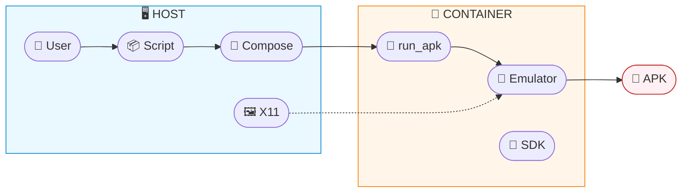
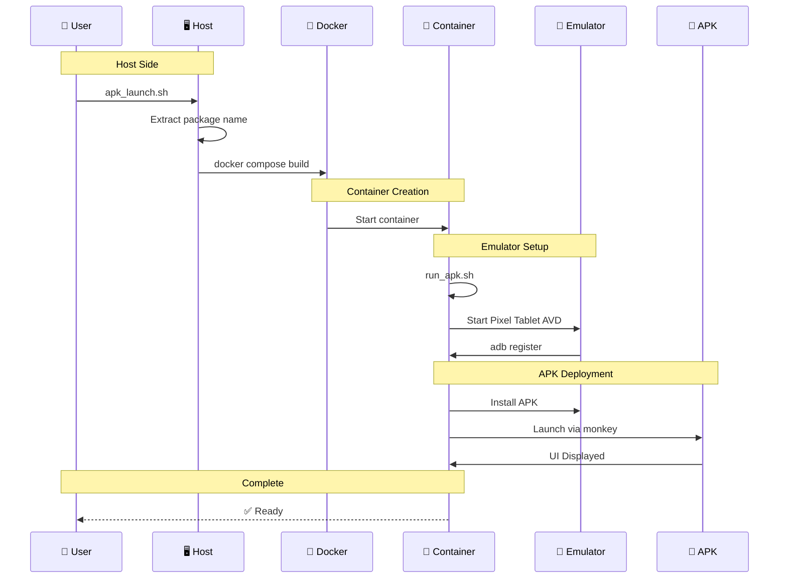

# AAOS Digital Cluster

The Digital Cluster is a digital replica of a traditional vehicle instrument cluster.
It mirrors essential driving information on an Android‑based display, using real‑time data coming from the vehicle through Zenoh.

## Zenoh Subscriptions Used by the Digital Cluster

The application listens to the following Zenoh topics to receive live vehicle telemetry:

- vehicle/status/velocity_status — Current vehicle speed
- adas/cruise_control/engage — Cruise control engagement status
- adas/cruise_control/target_speed — Cruise control target speed

These signals are processed and used to update the driving information shown in the Digital Cluster UI.

---

## Git LFS Setup

Android apk is zipped and stored at GitHub using Git Large File Storage (git-lfs) - https://git-lfs.github.com
In order to have the file available locally git lfs needs to be set up on your local environment.

### Install Git LFS on Ubuntu/Debian

```bash
sudo apt-get install git-lfs
```

### Verify Installation

```bash
git lfs version
```

### Initialize Git LFS  (if not done)

```bash
git lfs install
```

### Verify Files are Tracked

```bash
git lfs track
```

Output should be:

```bash
Listing tracked patterns
    aaos_digital_cluster/*.zip (aaos_digital_cluster/.gitattributes)
Listing excluded patterns
```

### List LFS objects

```bash
git lfs ls-files
```

Output should be:

```bash
<sha256-hash> - aaos_digital_cluster/cluster_vX.Y.Z.zip
```

If you get different as output, try to pull the LFS objects

```bash
git lfs pull
```

---

# Android SDK + Android Emulator inside Docker

Containerized solution created for automated Android testing, GUI emulation, and APK deployment using Docker.

## Automated APK Installer & Launcher (Pixel Tablet Profile)

This project provides a complete environment to:

- Run an Android Emulator (Pixel Tablet–like configuration) inside a Docker Container
- Install any APK
- Automatically launch the APK
- Automate everything from host-side scripts
- Run on Linux or WSL2

## Project Structure

```tree
.
├── Dockerfile
├── docker-compose.yml
├── run_apk.sh
├── apk_launch.sh
├── apk_stop.sh
├── docker_and_android-emulator-gui_setup.sh
├── apk/
│   ├── your_app.apk
│   └── your_app.zip
├── logs/
└── README.md
```

## High-Level Architecture Diagram



## Component Interaction Sequence Diagram



## Quick Start

### 1️⃣ Prepare an APK

If your APK is zipped:

```bash
unzip apk/your_app.zip -d apk
```

This will unzip the `.apk` file and place it inside the `apk/` directory.


### 2️⃣ Launch APK + Emulator

```bash
./apk_launch.sh
```

This script will:

*   Detect available APKs
*   Let you choose one
*   Extract its package name
*   Build & start the Docker container
*   Boot the emulator
*   Install & launch the APK


### 3️⃣ Stop the Emulator & Container

Once apk usage is concluded you can easily stop it by running:

```bash
./apk_stop.sh
```

## 🖥 Requirements

*   Ubuntu 22.04 or WSL2 (Windows)
*   Docker Engine + Docker Compose
*   X11 server (Xming, VcXsrv, or native Linux X11)

### docker_and_android-emulator-gui_setup.sh

This script provides a complete host setup automation script for:

- Docker Engine  
- Docker Compose  
- X11 forwarding  
- WSL2 compatibility  
- Device requirements  

#### Run

```bash
./docker_and_android-emulator-gui_setup.sh
```

## ⚙️ Scripts Overview

### apk_launch.sh

Interactive launcher script.  

#### Features
*   Lists APK files
*   Lets user select one
*   Extracts package name using `aapt`
*   Starts Docker container
*   Passes variables to run\_apk.sh

#### Run
```bash
    ./apk_launch.sh
    ./apk_launch.sh --help
```

### apk_stop.sh

Stops the container based on the name in docker-compose.yml.

#### Run
```bash
    ./apk_stop.sh
    ./apk_stop.sh --help
```


### run_apk.sh

#### Runs *inside* the container

*   Cleans ADB
*   Boots emulator
*   Waits for boot
*   Installs APK
*   Launches APK
*   Detects app boot

You normally don't call this manually, but help is available:

```bash
    docker exec -it android-emulator-tablet /opt/run_apk.sh --help
```

### 🛠 docker_and_android-emulator-gui_setup.sh

This script prepares your HOST system (Linux/WSL2) to run the solution.

#### Run

```bash
    ./docker_and_android-emulator-gui_setup.sh
```

## 🧩 Troubleshooting

### View container logs:
```bash
    docker logs -f android-emulator-tablet
```

### Restart container:
```bash
    ./apk_stop.sh
    ./apk_launch.sh
```

### Remove emulator AVD locks:
```bash
    rm -f ~/.android/avd/*.lock
```
