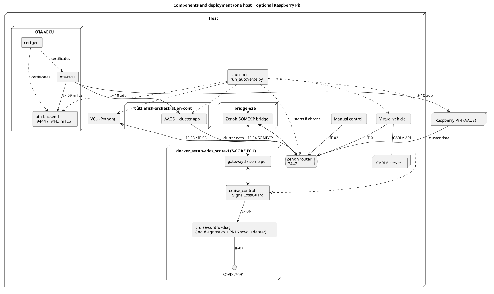
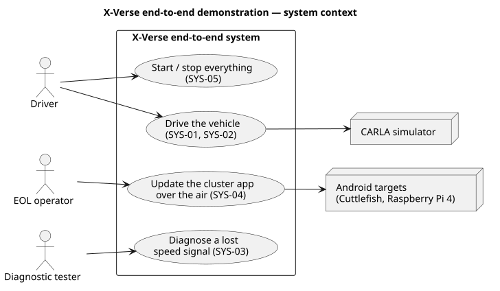
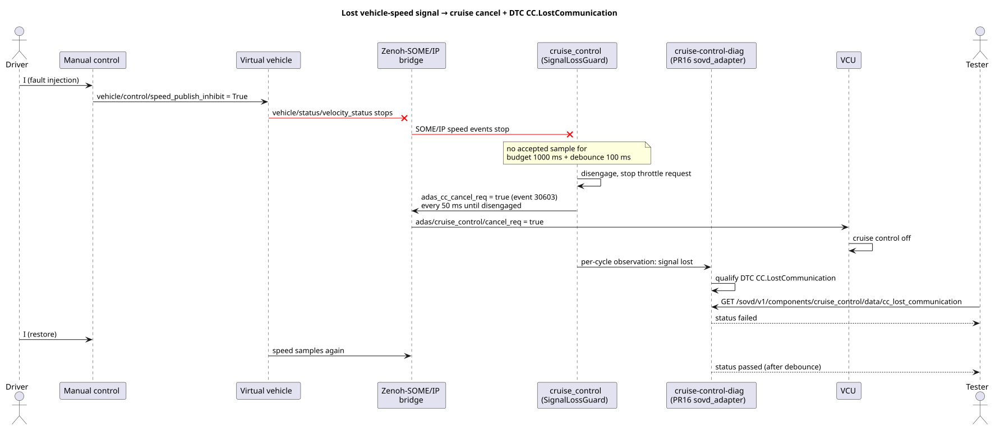
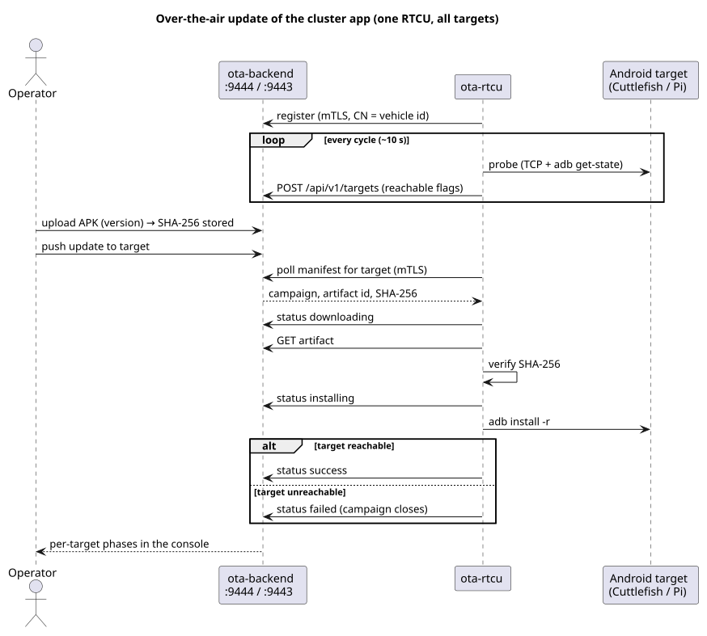

# ASPICE SWE.1–SWE.6 report — X-Verse end-to-end demonstration

Generated 2026-10-07 16:03:52 by `aspice/tools/generate_report.py` (the same data as [aspice-swe-report.html](aspice-swe-report.html) and [summary.json](summary.json)).

CARLA · virtual vehicle · Zenoh VCU · SOME/IP bridge · S-CORE ECU with DTC `CC.LostCommunication` over SOVD (inc_diagnostics PR #16 `sovd_adapter`) · OTA vECU (certgen, EOL backend, RTCU) · Android targets.

## Summary

| Software requirements verified | Test cases passed | Unit test cases / checks | Traceability issues |
| --- | --- | --- | --- |
| **11/11** | **24/24** | **340** | **0** |

Demonstration work products for code quality and traceability; not an assessed capability level. Work products: [requirements](../swe1-requirements/), [architecture](../swe2-architecture/architecture.md), [detailed design](../swe3-detailed-design/detailed-design.md), [unit](../swe4-unit-verification/unit-verification.md), [integration](../swe5-integration-test/integration-test.md) and [qualification](../swe6-qualification-test/qualification-test.md) test specifications.

## SWE.2 Architecture

## SWE.1 Software requirements

| ID | Requirement | Derived from | Allocated to | Status |
| --- | --- | --- | --- | --- |
| SWR-01 | The launcher shall start the components in dependency order, start a Zenoh router when none answers on `127.0.0.1:7447`, supervise processes and containers, and stop everything it started on Ctrl+C. | SYS-05 | Launcher | ✅ VERIFIED |
| SWR-02 | The virtual vehicle shall publish the vehicle state (speed, clock) on Zenoh and apply the VCU throttle, brake and steering commands to the CARLA ego vehicle. | SYS-01 | Virtual vehicle | ✅ VERIFIED |
| SWR-03 | Vehicle Manual Control shall publish the driver requests (pedals, steering, cruise control, reverse) and toggle a vehicle-speed publish inhibit with the `I` key. | SYS-01, SYS-03 | Manual control | ✅ VERIFIED |
| SWR-04 | The VCU shall compute throttle and brake commands, engage cruise control only at 10 km/h or more, and disengage it on braking and on the ADAS cancel request. | SYS-01, SYS-03 | VCU | ✅ VERIFIED |
| SWR-05 | The Zenoh–SOME/IP bridge shall convert payloads between Zenoh keys and SOME/IP events according to its mapping, including the cruise-control cancel request (event 30603). | SYS-02, SYS-03 | SOME/IP bridge | ✅ VERIFIED |
| SWR-06 | The S-CORE cruise-control application shall compute the throttle request and, when no speed sample was accepted for the signal budget plus the failed debounce, cancel cruise control and send the cancel request until the VCU reports disengaged. | SYS-02, SYS-03 | Cruise-control app | ✅ VERIFIED |
| SWR-07 | The cruise-control diagnostics server shall qualify DTC `CC.LostCommunication` with the same signal contract and debounce, and serve it with the vehicle speed and cruise state over SOVD through the PR #16 `sovd_adapter`. | SYS-03 | Diagnostics server | ✅ VERIFIED |
| SWR-08 | certgen shall create a CA, a server certificate and one client certificate per vehicle target, with the target id as common name. | SYS-04 | certgen | ✅ VERIFIED |
| SWR-09 | The OTA backend shall offer the operator console and API, accept device connections only with a client certificate from its CA, store artifacts with their SHA-256 and track campaigns with per-target status. | SYS-04 | OTA backend | ✅ VERIFIED |
| SWR-10 | The RTCU shall register the vehicle, probe every configured target, poll for campaigns, verify the artifact digest, install it with adb and report each phase; a campaign for an unreachable target shall end as failed instead of hanging. | SYS-04 | RTCU | ✅ VERIFIED |
| SWR-11 | The Android target shall boot, accept adb installs from the RTCU and run the cluster application. | SYS-04 | Android target | ✅ VERIFIED |

## SWE.4 Unit verification

| ID | Test | Verifies | Result | Detail |
| --- | --- | --- | --- | --- |
| UT-LAUNCHER | `tests/test_run_autoverse.py` (Python unittest) | SWR-01 | ✅ PASS | OK — 15 cases |
| UT-SOMEIP | `tests/payload/test_convert.cpp` (`test_convert`) | SWR-05 | ✅ PASS | checks=213 failures=0 (build/test_convert) — 213 cases |
| UT-SCORE | `score/cruise_control/tests/cruise_control_test.cpp` (gtest) | SWR-06 | ✅ PASS | bazel test //score/cruise_control/...: 1 target(s), 15 test cases — Executed 1 out of 1 test: 1 test passes. — 15 cases |
| UT-PR16 | `//score/mw/diag/sovd_adapter:all` (inc_diagnostics, PR #16) | SWR-07 | ✅ PASS | bazel test //score/mw/diag/sovd_adapter:all: 1 target(s), 27 test cases — Executed 1 out of 1 test: 1 test passes. — 27 cases |
| UT-OTA | `backend/java/src/test` (JUnit 5, Spring Boot) | SWR-09 | ✅ PASS | 12 JUnit suites (mvn test) — 70 cases |

## SWE.5 Integration test

`tools/e2e_check.py` against the running system — run now (2026-10-07T16:05:36+0100)

| ID | Test | Verifies | Result | Detail |
| --- | --- | --- | --- | --- |
| ITC-01 | Zenoh router reachable | SWR-01 | ✅ PASS | tcp/127.0.0.1:7447 accepts connections |
| ITC-02 | Supervised containers running | SWR-01 | ✅ PASS | all running |
| ITC-03 | Vehicle state and driver requests on Zenoh | SWR-02, SWR-03 | ✅ PASS | received 3/3 |
| ITC-04 | VCU commands on Zenoh | SWR-04 | ✅ PASS | received 2/2 |
| ITC-05 | Speed reaches the S-CORE ECU over SOME/IP | SWR-05, SWR-07 | ✅ PASS | vehicle_speed 0.0 km/h, age 22 ms |
| ITC-06 | Cruise-control state exposed | SWR-06 | ✅ PASS | state standby, identity sha256:ae275d890718… |
| ITC-07 | DTC served through PR #16 `sovd_adapter` | SWR-07 | ✅ PASS | components ['cruise_control'], DTC CC.LostCommunication status passed |
| ITC-08 | certgen PKI | SWR-08 | ✅ PASS | verified against ca.crt: server.crt, client-PC-CUTTLEFISH-01.crt, client-PI-ANDROID-15.crt |
| ITC-09 | Device API requires mutual TLS | SWR-09 | ✅ PASS | without client cert: rejected; with client cert: HTTP/1.1 400 Bad Request |
| ITC-10 | RTCU registered and targets reported | SWR-09, SWR-10 | ✅ PASS | PC-CUTTLEFISH-01 reachable, PI-ANDROID-15 reachable; last seen 7 s ago |
| ITC-11 | Campaign outcomes recorded per target | SWR-10 | ✅ PASS | success: PC-CUTTLEFISH-01 #17, PI-ANDROID-15 #19; unreachable target closed as failed: #8 |
| ITC-12 | CARLA ego vehicle present | SWR-02 | ✅ PASS | ego_vehicle vehicle.audi.etron (id 24) |
| ITC-13 | Android target ready with the cluster app | SWR-11 | ✅ PASS | boot_completed=1, cluster app installed |

## SWE.6 Qualification test

| ID | Test | Verifies | Result | Detail |
| --- | --- | --- | --- | --- |
| QTC-01 | One-command start and stop | SWR-01 | ✅ PASS | 2 supervised run(s) reached 'Supervisor is now running', 1 completed shutdown (~/.cache/autoverse-runner) |
| QTC-02 | Drive and cruise control | SWR-02, SWR-03, SWR-04 | ✅ PASS (witnessed) | witnessed live in the dry run (cruise engaged before the fault) |
| QTC-03 | Lost speed signal | SWR-03, SWR-04, SWR-05, SWR-06, SWR-07 | ✅ PASS (witnessed) | witnessed live in the dry run in front of the competition (issue #44) |
| QTC-04 | OTA update of the Cuttlefish cluster | SWR-09, SWR-10, SWR-11 | ✅ PASS | campaign #17 v1.3: downloading → installing → success |
| QTC-05 | OTA update of the Raspberry Pi | SWR-10 | ✅ PASS | campaign #19 v1.4: downloading → installing → success |
| QTC-06 | OTA to an unreachable target | SWR-10 | ✅ PASS | campaign #8 closed failed: target unreachable at RTCU probe (adb 192.168.1.72:5555) |

## Bidirectional traceability

| Requirement | Unit | Integration | Qualification | Status |
| --- | --- | --- | --- | --- |
| SWR-01 | UT-LAUNCHER | ITC-01 ITC-02 | QTC-01 | ✅ VERIFIED |
| SWR-02 | — | ITC-03 ITC-12 | QTC-02 | ✅ VERIFIED |
| SWR-03 | — | ITC-03 | QTC-02 QTC-03 | ✅ VERIFIED |
| SWR-04 | — | ITC-04 | QTC-02 QTC-03 | ✅ VERIFIED |
| SWR-05 | UT-SOMEIP | ITC-05 | QTC-03 | ✅ VERIFIED |
| SWR-06 | UT-SCORE | ITC-06 | QTC-03 | ✅ VERIFIED |
| SWR-07 | UT-PR16 | ITC-05 ITC-07 | QTC-03 | ✅ VERIFIED |
| SWR-08 | — | ITC-08 | — | ✅ VERIFIED |
| SWR-09 | UT-OTA | ITC-09 ITC-10 | QTC-04 | ✅ VERIFIED |
| SWR-10 | — | ITC-10 ITC-11 | QTC-04 QTC-05 QTC-06 | ✅ VERIFIED |
| SWR-11 | — | ITC-13 | QTC-04 | ✅ VERIFIED |

## Provenance

| Repository | Branch | Commit |
| --- | --- | --- |
| autoverse | dev/sdv-hackathon-2026 | 8debc43 ASPICE report: add a GitHub-renderable Markdown version (local changes) |
| bridges/carla | dev/sdv-hackathon-2026 | 3dc7e8e PRE-WORK: fault-simulation proposal to withhold the ego speed signal |
| bridges/someip | dev/sdv-hackathon-2026 | 3db6b78 Map S-CORE cruise-control cancel request to Zenoh |
| bridges/can | dev/sdv-hackathon-2026 | 33b52ca Point serial2can-bridge docs at its new location; list both bridges |
| vecu/s-core | dev/sdv-hackathon-2026 | 1ddedc8 Default OPENSOVD_DIR inside the checkout, not a developer's home |
| vecu/vcu_zenoh | dev/sdv-hackathon-2026 | c15aea2 Disengage cruise control on the ADAS cancel request |
| vecu/ota | dev/sdv-hackathon-2026 | 95e88f8 README: Raspberry Pi target over Ethernet at 10.42.0.35 |
| vecu/aaos_cuttlefish | dev/sdv-hackathon-2026 | bd0af0c PRE-WORK: deliver the X-Verse APK through OTA; pin display DPI |

Regenerate with the system running: `python3 aspice/tools/generate_report.py --full`.
