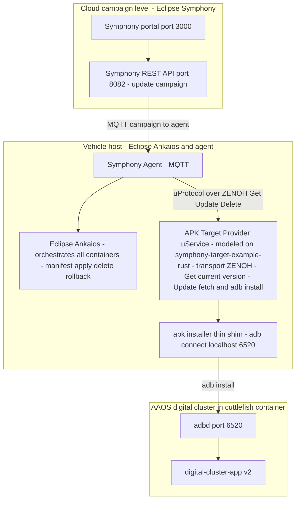
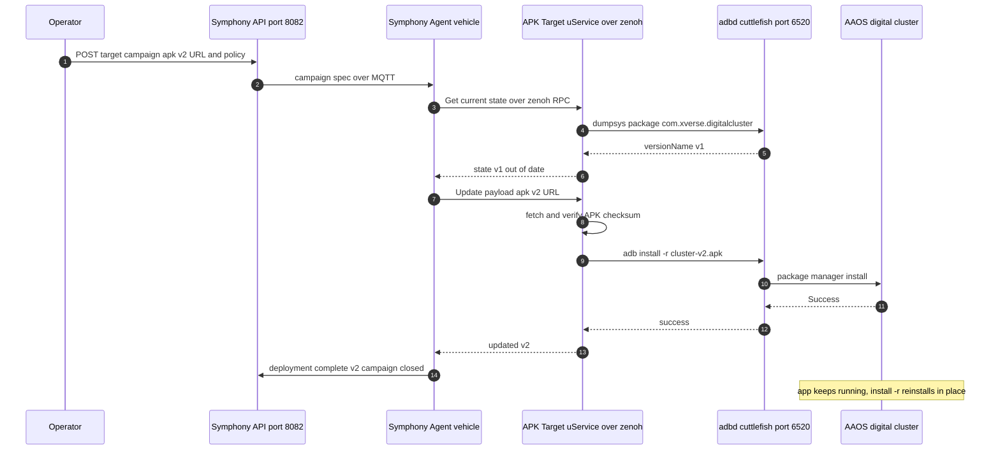
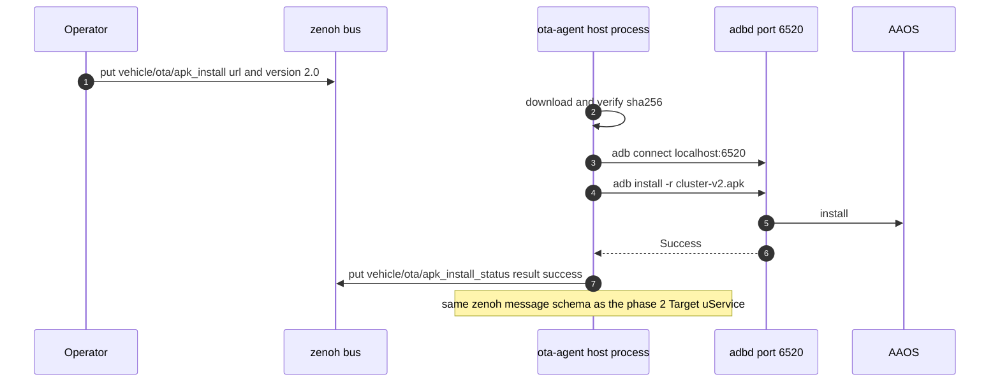

# Proposal: OTA update for the AAOS digital-cluster (APK install) on top of Eclipse SDV components (2026-10-03)

> Alternative without Eclipse components (self-built EOL backend + RTCU
> orchestrator ECU, C++, full container stack): see `OTA_RTCU_PROPOSAL.md`
> in this folder.

> Investigation only — no source code changed. Scope: find an Eclipse Foundation
> project that can perform an OTA update of the Android Automotive instance
> running in the cuttlefish container (`vecu/aaos_cuttlefish/`)
> and install the X-Verse digital-cluster APK through it, and define the best
> architecture for our autoverse stack.

## 1. Motivation

Today the APK is pushed once at container-creation time (`ctl.sh`:
`install_xverse_apk` → `adb connect localhost:6520` + `adb install`). There is no
update path: to change the app you have to rebuild the whole cuttlefish container
from scratch. We want an **over-the-air update story**: publish a new APK version
and have it installed into the running AAOS — consistent with the SDV
demo narrative (the same vehicle already demonstrates cruise-control DTC logic
via the zenoh⇄SOME/IP⇄S-Core chain).

## 2. Investigation result — what Eclipse projects actually offer

Checked open issues and PRs (GitHub API + search) across the Eclipse SDV
projects. **No Eclipse project installs APKs on Android** — every OTA asset is
Linux-container or ECU-firmware level. What exists:

| Project | OTA capability | Android/APK? | Status evidence (open issues/PRs) |
|---|---|---|---|
| **Eclipse Kanto** | Container Update Manager (desired-state via MQTT) | ❌ Linux edge only | Not archived (last push 2026-04) but open issues ["Is Eclipse Kanto still actively maintained?" #362](https://github.com/eclipse-kanto/kanto/issues/362) and ["Update Manager is not working" #354](https://github.com/eclipse-kanto/kanto/issues/354) |
| **Eclipse Leda** | Vehicle Update Manager (SOTA) + Self Update Agent (FOTA, RAUC) | ❌ Yocto Linux | [VUM **archived**](https://github.com/eclipse-leda/leda-contrib-vehicle-update-manager); [SUA](https://github.com/eclipse-leda/leda-contrib-self-update-agent) active but tiny |
| **Eclipse Ankaios** | Declarative workload orchestration: remote apply/delete of manifests → stop / restart / update / rollback containers ([fleet-management tutorial](https://eclipse-ankaios.github.io/ankaios/main/usage/tutorial-fleet-management/)) | ❌ container-level (Podman) | Active (~45 open issues, none about OTA/APK/Android) — [repo](https://github.com/eclipse-ankaios/ankaios) |
| **Eclipse Symphony** | Cloud update campaigns → MQTT → vehicle agent → update uService | ❌ | [commercial-sdv-stack blueprint](https://github.com/eclipse-sdv-blueprints/commercial-sdv-stack) composes Symphony+uProtocol+OpenSOVD; its ECU Updater only keeps state in memory (explicitly doesn't deploy firmware) |
| **Eclipse uProtocol** | No OTA uService spec (core specs: uSubscription/uDiscovery/uTwin), **but** [symphony-target-example-rust](https://github.com/eclipse-uprotocol/symphony-target-example-rust) realizes a Symphony **Target Provider uService** exposing a firmware-update (Get/Update/Delete) API **over zenoh or MQTT 5** | ❌ firmware only | Active; [up-spec PR/commit #326 (v4 usubscription rewrite)](https://github.com/eclipse-uprotocol/up-spec/commit/e49a6e3610d40399b2b5ae858ec5f3f136066915) recent |

Ecosystem proof that this composition is the intended one:
[Eclipse-SDV-Hackathon-Chapter-Three/MegaBosses](https://github.com/Eclipse-SDV-Hackathon-Chapter-Three/MegaBosses)
is exactly a Symphony (cloud campaign) → MQTT → **Ankaios** (in-vehicle
orchestrator) OTA demo with HMI approval and container re-deployment.

## 3. Best architecture (recommendation)

Two-layer design: an Eclipse-native OTA control plane, plus one thin APK
delivery shim — because the only legitimate way to install an APK into a
running AAOS is `adb install` (cuttlefish's adbd, already exposed on
`localhost:6520` by `ctl.sh`'s `--network host`).

Design decisions:

1. **Eclipse Ankaios** owns container-level OTA. The cuttlefish container,
   the S-Core vECU container (`docker_setup-adas_score-1`), the zenoh⇄SOME/IP
   bridge (`bridge-e2e`) and `run_autoverse.py` become Ankaios workloads.
   A new stack image or config is applied via a manifest
   (`apply_manifest` — the official Ankaios fleet pattern), with stop/restart,
   health checks and rollback included.
2. **Eclipse Symphony** is the remote campaign/control plane (register target,
   push update, monitor, web UI) — the same role as in the
   [commercial-sdv-stack blueprint](https://github.com/eclipse-sdv-blueprints/commercial-sdv-stack)
   and the MegaBosses hackathon demo.
3. **Zenoh stays the backbone**: the Target Provider uService contract
   (Get / Update / Delete) runs over *zenoh* per
   [symphony-target-example-rust](https://github.com/eclipse-uprotocol/symphony-target-example-rust)
   (zenoh or MQTT are both supported — zenoh is what we already run), so no
   new bus is introduced just for OTA.
4. **The APK piece is a deliberately thin `adb install` shim** wrapped as a
   Symphony Target Provider uService. This is the smallest bridging component
   and mirrors the blueprint's ECU-Updater pattern; no Eclipse project
   replaces or wraps this today (verified above).

Not chosen: **Eclipse Kanto** (Linux-only update manager, maintenance status
doubtful per issue #362/#354) and **Eclipse Leda** (archived VUM, Yocto-RAUC
specific) — right concepts, wrong target for an AAOS-in-container setup.

## 4. Sequence diagrams

### 4.1 Normal OTA campaign (full architecture, Symphony + Ankaios + zenoh)

### 4.2 Minimal demo variant (phase 1 — no Symphony/Ankaios yet)

Rollback (both variants) = publish the previous APK URL; `adb install -r`
 reinstalls the old version (AAOS keeps data of `com.…` between versions).

## 5. Fit into the current autoverse architecture

Current stack (verified running 2026-10-02):

| Existing element | Role now | Role in OTA architecture |
|---|---|---|
| zenoh backbone (vehicle topics, vcu, bridge) | vehicle signal bus | **OTA RPC transport** (uProtocol/CL1 over zenoh) — no change |
| `cuttlefish-orchestration-cont` (privileged, `--network host`, runtime bind) | AAOS VM host | stays; adbd `localhost:6520` = the install endpoint the shim talks to |
| `ctl.sh make` → `install_xverse_apk` | one-shot APK install at container creation | superseded for updates; kept for the initial bootstrap install (the OTA agent must not run before the VM is up) |
| `docker_setup-adas_score-1` (S-Core vECU) | cruise-control ECU (DTC demo) | future Ankaios workload; optionally can *subscribe to OTA status* to demo ECU reaction (e.g. cluster update notification on the SOME/IP side) |
| `bridge-e2e` (zenoh⇄SOME/IP) | signal bridge | unchanged; OTA control plane could be bridged to SOME/IP later (new mapping entries) if the ECU must receive OTA status events |
| `run_autoverse.py` (host processes: carla, vcu, manual control, monitor) | vehicle simulation | future Ankaios workloads; unchanged for the demo |
| host `adb` | used by `ctl.sh` only | reused by the ota-agent/installer |

**Verdict: it fits with zero changes to the verified signal path.** The OTA
plane is orthogonal: it adds (a) one host-side service (ota-agent / Target
uService) that only touches zenoh + adb, and (b) optionally an Ankaios
instance around the existing containers. Nothing in
`vehicle/status/*`, the bridge mapping, or the S-Core vECU changes.

## 6. Phased delivery plan

1. **Phase 1 — minimal, demo-ready (≈ a day):** implement `/tmp`-style
   `ota-agent` as in §4.2 (python, zenoh + adb + sha256 verify; status topic
   back). Install the running APK v2 from a URL; show the digital cluster in
   the browser after "OTA". No new dependencies.
2. **Phase 2 — Eclipse-native service shape:** wrap the agent as a Symphony
   Target Provider uService over zenoh, following
   [symphony-target-example-rust](https://github.com/eclipse-uprotocol/symphony-target-example-rust)
   (Get/Update/Delete). Same install endpoint; message contract now
   ecosystem-conformant.
3. **Phase 3 — full control plane:** add **Ankaios** around the containers
   (cuttlefish, vECU, bridge, run_autoverse) and the **Symphony** backend +
   agent ([commercial-sdv-stack pattern](https://github.com/eclipse-sdv-blueprints/commercial-sdv-stack));
   container-image OTA and APK OTA coexist (Ankaios for containers, Target
   uService for the APK).

## 7. Risks / open questions

- **adb stability over long sessions:** `adb connect localhost:6520` drops
  occasionally — the shim must re-connect per install (the `ctl.sh` double
  connect already shows the pattern) and treat "device offline" as retryable.
- **`adb install -r` while the app is foreground** reinstalls in place;
  safer demonstration ordering: status check → install → optionally
  relaunch activity (`am start`). Versioning needs care: same `applicationId`
  required for in-place update.
- **Who triggers OTA in the demo narrative:** manual zenoh publish (phase 1)
  vs Symphony portal (phase 3) — decide per demo; the Target contract makes
  both interchangeable.
- **Symphony is the heaviest dependency** (Java/Go control plane + agent +
  MQTT broker on the host). Phase 1–2 need none of it; evaluate after the
  first demo whether phase 3 is worth it for the story.
- **Cuttlefish container lifecycle:** Ankaios starting/stopping the
  privileged cuttlefish container must not conflict with `ctl.sh`'s
  stop/start paths (single source of truth per environment).

## 8. Sources

- [eclipse-ankaios/ankaios](https://github.com/eclipse-ankaios/ankaios) ·
  [fleet-management tutorial (remote manifest apply)](https://eclipse-ankaios.github.io/ankaios/main/usage/tutorial-fleet-management/)
- [eclipse-sdv-blueprints/commercial-sdv-stack](https://github.com/eclipse-sdv-blueprints/commercial-sdv-stack)
- [eclipse-uprotocol/symphony-target-example-rust](https://github.com/eclipse-uprotocol/symphony-target-example-rust)
- [eclipse-leda/leda-contrib-vehicle-update-manager (archived)](https://github.com/eclipse-leda/leda-contrib-vehicle-update-manager) ·
  [leda-contrib-self-update-agent](https://github.com/eclipse-leda/leda-contrib-self-update-agent) ·
  [Leda docs: update message flow](https://eclipse-leda.github.io/leda/docs/device-provisioning/vehicle-update-manager/message-flow/)
- [eclipse-kanto/kanto — "Update Manager is not working" #354](https://github.com/eclipse-kanto/kanto/issues/354) ·
  ["Is Eclipse Kanto still actively maintained?" #362](https://github.com/eclipse-kanto/kanto/issues/362)
- [Eclipse-SDV-Hackathon-Chapter-Three/MegaBosses (Symphony+Ankaios OTA demo)](https://github.com/Eclipse-SDV-Hackathon-Chapter-Three/MegaBosses)
- [up-spec usubscription v4 rewrite (#326)](https://github.com/eclipse-uprotocol/up-spec/commit/e49a6e3610d40399b2b5ae858ec5f3f136066915)